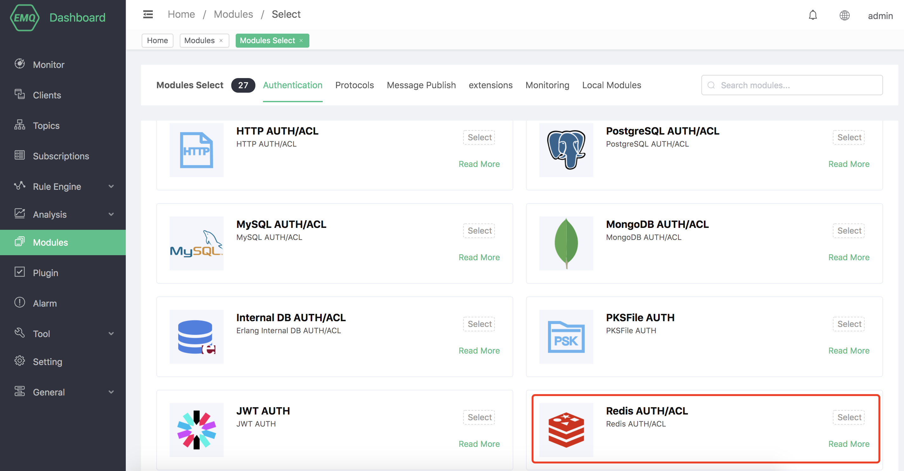
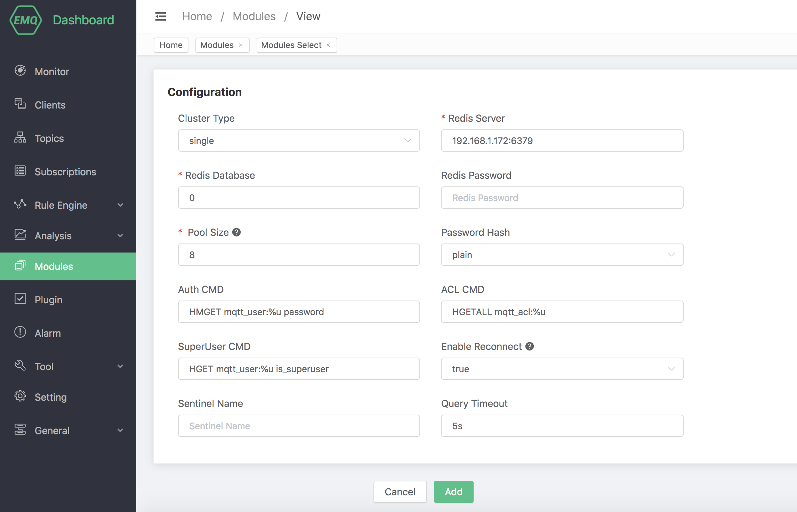
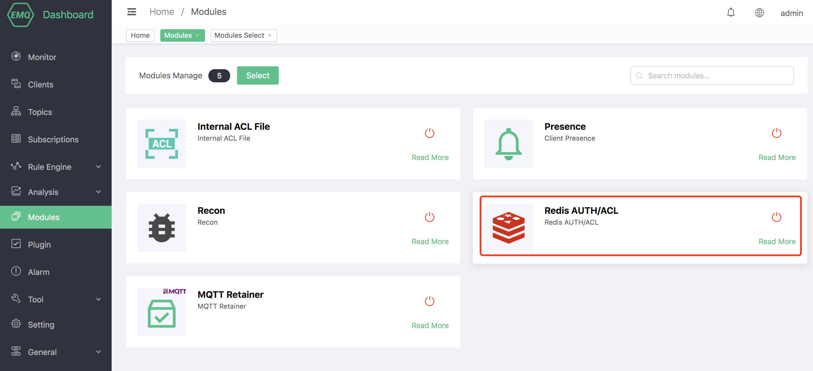

# Redis Authentication/ACL

Redis Authentication/ACL uses an external Redis database as a data source, which can store large amounts of data and facilitate integration with external device management systems.

Set up the Redis environment, taking MacOS X as an example:

```bash
 $ wget http://download.redis.io/releases/redis-4.0.14.tar.gz
$ tar xzf redis-4.0.14.tar.gz
$ cd redis-4.0.14
$ make && make install

# Start redis
$ redis-server
```

## Create module

Open [EMQ X Dashboard](http://127.0.0.1:18083/#/modules), click the "Modules" tab on the left, and choose to add:


Select Redis Authentication/ACL module



Configure related parameters



After clicking add, the module is added



## Authentication default data structure

In the default configuration of Redis authentication, a hash table is used to store authentication data, and `mqtt_user:` is used as the Redis key prefix. The data structure is as follows:

```
redis> hgetall mqtt_user:emqx
password public
```

The sample data in the default configuration is as follows:

```
HMSET mqtt_user:emqx password public
```

After enabling Redis authentication, you can connect via username: emqx and password: public.

::: tip

This is the data structure used by the default configuration. After you are familiar with the use of this module, you can use any data structure that meets the conditions for authentication.

:::

## Salting rules and hashing methods

```
## No salt, plain text
plain

## No salt, only hash processing
sha256

## salt prefix: use sha256 to encrypt salt + password concatenated string
salt,sha256

## salt suffix: use sha256 encrypted password + salt spliced ​​string
sha256,salt

## pbkdf2 with macfun iterations dklen
## macfun: md4, md5, ripemd160, sha, sha224, sha256, sha384, sha512
pbkdf2,sha256,1000,20
```

## Authentication query command (auth query cmd)

When performing identity authentication, EMQ X will use the current client information to fill in and execute the authentication query command configured by the user to query the authentication data of the client in Redis.

```
HMGET mqtt_user:%u password
```

You can use the following placeholders in the command, and EMQ X will automatically fill in the client information when executed:

-%u: username

-%c: Client ID

-%C: TLS certificate common name (domain name or subdomain name of the certificate), valid only when TLS connection

-%d: TLS certificate subject, valid only when TLS connection

You can adjust the authentication query command according to your business needs, and use any [Redis supported command](http://redisdoc.com/index.html), but in any case, the authentication query command needs to meet the following conditions:

1. The first data in the query result must be password. EMQ X uses this field to compare with the client password

2. If the salt configuration is enabled, the second data in the query result must be the salt field, and EMQ X uses this field as the salt value

## Access control default data structure

### ACL rule data

```
## Format
HSET mqtt_acl:[username clientid][topic] [access]

## Structure
redis> hgetall mqtt_acl:emqx
testtopic/1 1
```

Sample data in the default configuration:

```
HSET mqtt_acl:emqx # 1

HSET mqtt_acl:testtopic/2 2
```

## ACL query command (acl cmd)

When performing ACL authentication, EMQ X will use the current client information to fill in and execute the super user command configured by the user. If the super user command is not enabled or the client is not a super user, the ACL query command will be used to query the client’s database in the database. ACL rules.

```bash
HGETALL mqtt_acl:%u
```

You can use the following placeholders in ACL query commands, and EMQ X will automatically fill in client information when executed:

-%u: username

-%c: Client ID

You can adjust the ACL query command according to your business needs, but in any case, the ACL query command needs to meet the following conditions:

1. Use topic as the key and access as the value in the hash

## Super user query command (super cmd)

When performing ACL authentication, EMQ X will use the current client information to fill and execute the super user query command configured by the user to query whether the client is a super user. When the client is a super user, the ACL query command will be skipped.

```bash
HGET mqtt_user:%u is_superuser
```

You can use the following placeholders in the command, and EMQ X will automatically fill in the client information when executed:

-%u: username

-%c: Client ID

-%C: TLS certificate common name (domain name or subdomain name of the certificate), valid only when TLS connection

-%d: TLS certificate subject, valid only when TLS connection

You can adjust super user query commands according to business needs, such as adding multiple query conditions and using database preprocessing functions to implement more business-related functions. But in any case, the super user query command needs to meet the following conditions:

1. The first data in the query result must be is_superuser data

::: tip

If the super user function is not needed, commenting and disabling this option can effectively improve efficiency

:::