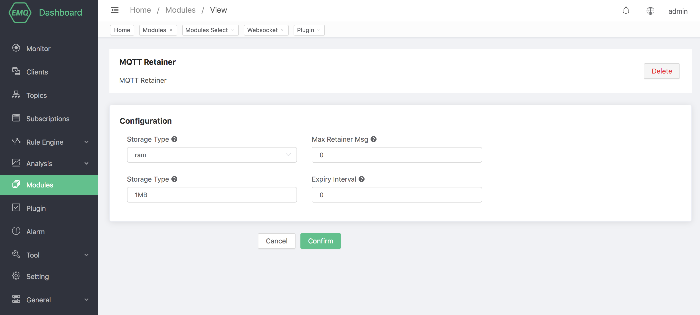

# MQTT retainer message

## Introduction

When the server receives a PUBLISH message with the Retain flag of 1, it will treat the message as a retainer message. In addition to being forwarded normally, the retainer message will be stored on the server. Only one retainer message can exist under each topic. , So if there is already a retainer message with the same topic, the retainer message is replaced.

When the client establishes a subscription, if there are retainer messages with matching topics on the server, these retainer messages will be sent to the client immediately. With the help of retained messages, new subscribers can immediately obtain the latest status without waiting for an unexpected time, which is very important in many scenarios.

## Create module

MQTT retainer message module started by default, and can be stopped and updated through the dashboard page.

Open [EMQ X Dashboard](http://127.0.0.1:18083/#/modules), click the "Modules" tab on the left:

Configure related parameters

## Introduction to reserved message configuration

| Configuration item       | Type  | Optional value      | Default value | Description                                               |
| ------------------------------ | -------- | ------------------------ | ------ | ------------------------------------------------------------ |
| Storage Type          | enum     | `ram`, `disc`, `disc_only` | ram |ram: only stored in memory;   disc: stored in memory and hard disk;   disc_only: only stored in hard disk|
| Max Retained Messages | integer  | \>= 0                    | 0      | The maximum number of retained messages, and 0 means no limit. After the number of retained messages exceeds the maximum limit, you can replace the existing retained messages, but cannot store retained messages for new topics. |
| Max Payload Size      | bytesize |                          | 1MB    | Retain the maximum Payload value of the message. After the Payload value exceeds the maximum value, the EMQ X broker will treat the retained reserved message as a normal message. |
| Expiry Interval       | duration |                          | ０     | The expiration time of retaining message, and 0 means never expire. If the message expiration interval is set in the PUBLISH packet, the message expiration interval in the PUBLISH packet shall prevail. |