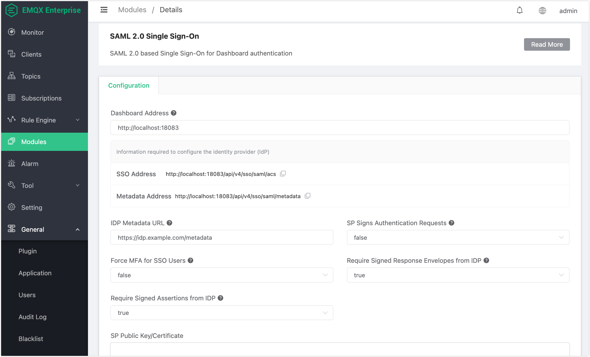

# SAML 2.0 Single Sign-On

SAML 2.0 Single Sign-On (SSO) is an enterprise-only feature that lets users log in to the EMQX Dashboard through their organization's Identity Provider (IDP), such as Keycloak, Okta, or Azure AD. Once authenticated at the IDP, users are automatically provisioned in EMQX and redirected to the Dashboard without entering a separate password.

## Prerequisites

Before configuring SAML SSO, make sure the following conditions are met:

- A SAML 2.0 compatible Identity Provider is available and accessible.
- You have the IDP metadata URL (typically an XML endpoint provided by the IDP).
- Network connectivity exists between the EMQX node(s) and the IDP host.

## Add the SAML SSO Module

1. In the left-hand navigation panel of the Dashboard, click **Modules**.
2. Click **Add Module**.
3. Select **SAML 2.0 Single Sign-On** from the module list and click **Select**.
4. Fill in the configuration fields described below.
5. Click **Add** to enable the module.

   

### Configuration Fields

| Field | Type | Default | Description |
|-------|------|---------|-------------|
| **Dashboard Address** | string | `https://127.0.0.1:18083` | The externally reachable base URL of the Dashboard. Do not include a path suffix. This address is used to construct the SP ACS URL and SP metadata URL that you register with your IDP. |
| **IDP Metadata URL** | string | required | The URL from which EMQX fetches the IDP's SAML metadata XML. For example, in Keycloak this is `http://<keycloak>/realms/<realm>/protocol/saml/descriptor`. |
| **SP Signs Authentication Requests** | boolean | `false` | When enabled, EMQX (acting as the SP) signs outgoing SAML `AuthnRequest` messages. Enabling this requires you to upload a valid SP certificate and private key. |
| **Force MFA for SSO Users** | boolean | `false` | When enabled, all users who log in via SAML SSO must configure TOTP-based Multi-Factor Authentication on their first login. |
| **Require Signed Response Envelopes from IDP** | boolean | `true` | When enabled, EMQX requires the IDP to sign the SAML `Response` envelope. Disabling this weakens security and should only be done for testing. |
| **Require Signed Assertions from IDP** | boolean | `true` | When enabled, EMQX requires the IDP to sign the SAML `Assertion` element inside the response. Disabling this weakens security and should only be done for testing. |
| **SP Public Key/Certificate** | file | — | The SP certificate in PEM format. Required when **SP Signs Authentication Requests** is enabled. |
| **SP Private Key** | file | — | The SP private key in PEM format. Required when **SP Signs Authentication Requests** is enabled. |

## Configure the IDP (Keycloak Example)

The following steps use Keycloak as an example. Steps for other IDPs will differ, but the key values (ACS URL, Entity ID, metadata URL) remain the same.

1. Log in to the Keycloak Admin Console.
2. Select your realm and navigate to **Clients**.
3. Click **Create client** and choose **SAML** as the client type.
4. Set the **Client ID** to the SP Entity ID, which EMQX publishes at:

   ```
   http://<dashboard-addr>/api/v4/sso/saml/metadata
   ```

5. Set the **Valid Redirect URIs** and **ACS URL** to:

   ```
   http://<dashboard-addr>/api/v4/sso/saml/acs
   ```

6. Save the client. Then copy your IDP metadata URL, which follows this pattern in Keycloak:

   ```
   http://<keycloak>/realms/<realm>/protocol/saml/descriptor
   ```

7. Paste this URL into the **IDP Metadata URL** field when adding the SAML SSO module in EMQX Dashboard.

::: tip

If you configured signing on either side, download the IDP signing certificate from Keycloak and ensure the SP certificate uploaded to EMQX is trusted by your IDP.

:::

## SP Metadata

After the module is enabled, EMQX publishes its Service Provider metadata at:

```
GET /api/v4/sso/saml/metadata
```

The response is a standard SAML metadata XML document. You can provide this URL directly to IDPs that support automatic SP metadata import, or download the XML and upload it manually.

The SP metadata includes:

- The Entity ID of the SP
- The ACS (Assertion Consumer Service) URL: `http://<dashboard-addr>/api/v4/sso/saml/acs`
- The SP signing certificate (if SP signing is enabled)

## SSO Login Flow

The end-to-end SAML SSO login sequence is as follows:

1. The user opens the Dashboard login page. The frontend calls `GET /api/v4/sso/status` to check whether SSO is enabled. If it is, a **Login with SSO** button is displayed.
2. The user clicks **Login with SSO**. The frontend sends `POST /api/v4/sso/saml/login`.
3. EMQX returns a `302` redirect to the IDP's authentication endpoint.
4. The user authenticates at the IDP (entering credentials, completing MFA at the IDP, etc.).
5. The IDP posts the `SAMLResponse` back to the EMQX ACS endpoint: `POST /api/v4/sso/saml/acs`.
6. EMQX validates the assertion, provisions the user if they do not already exist, and redirects the browser back to the Dashboard with a `login_meta` token.

### Automatic User Provisioning

New SSO users are provisioned automatically (Just-in-Time provisioning) on their first successful login:

- They are assigned the `viewer` role by default.
- Existing Dashboard users who match the SSO username keep their current role and settings.

To grant higher privileges to an SSO user, edit the user record in **Dashboard → Users** after their first login.

## Signature Configuration

EMQX provides three independent signature mechanisms, each controlled by a separate configuration option. They can be enabled or disabled individually.

| Mechanism | Option | Who signs | Direction |
|-----------|--------|-----------|-----------|
| SP signs `AuthnRequest` | **SP Signs Authentication Requests** | EMQX (SP) | SP → IDP |
| IDP signs `Response` envelope | **Require Signed Response Envelopes from IDP** | IDP | IDP → SP |
| IDP signs `Assertion` | **Require Signed Assertions from IDP** | IDP | IDP → SP |

::: warning

For production deployments, at least one of **Require Signed Response Envelopes from IDP** or **Require Signed Assertions from IDP** should be enabled. Disabling both removes all cryptographic verification of the identity assertion and should only be done in isolated test environments.

:::

When **SP Signs Authentication Requests** is enabled, you must upload both the SP certificate and SP private key. The certificate must be registered with the IDP so it can verify the signed requests.

## MFA Integration

When **Force MFA for SSO Users** is enabled, every user who logs in via SAML SSO is required to set up TOTP-based Multi-Factor Authentication on their first successful login. Subsequent logins require a valid TOTP code after the SAML assertion is accepted.

Administrators can disable MFA for individual SSO users even when **Force MFA for SSO Users** is globally enabled. To do this, find the user in **Dashboard → Users**, click the user, and toggle off the MFA option.

For full MFA configuration details, see the MFA documentation.

## API Reference

The following endpoints support the SAML SSO workflow. Endpoints marked as "public" do not require Dashboard authentication credentials.

### GET /api/v4/sso/status

Check whether SSO is currently enabled. This endpoint is public and does not require authentication.

**Response example:**

```json
{
  "code": 0,
  "data": {
    "enabled": true,
    "providers": [
      {
        "type": "saml",
        "enabled": true
      }
    ]
  }
}
```

### POST /api/v4/sso/saml/login

Initiate a SAML login. Returns a `302` redirect to the IDP's authentication page.

### POST /api/v4/sso/saml/acs

SAML Assertion Consumer Service endpoint. The IDP posts the `SAMLResponse` to this URL after the user authenticates. EMQX validates the response, provisions the user if needed, and redirects to the Dashboard.

::: tip

This endpoint is called by the IDP, not by the browser directly. Configure this URL in your IDP as the ACS URL for the EMQX SP client.

:::

### GET /api/v4/sso/saml/metadata

Return the SP metadata XML. Use this URL when configuring automatic SP metadata import in your IDP, or download the XML for manual upload.
