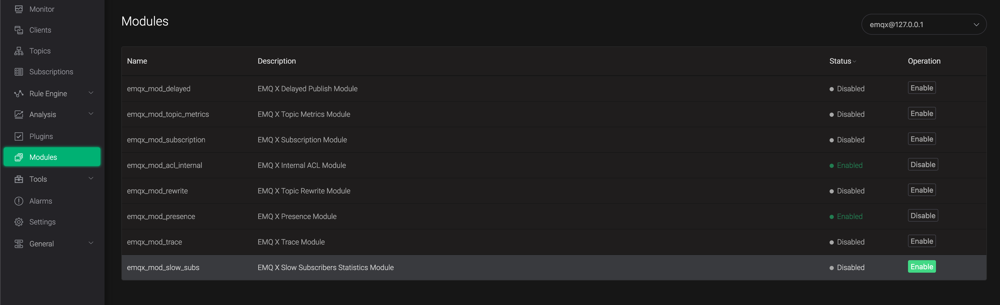
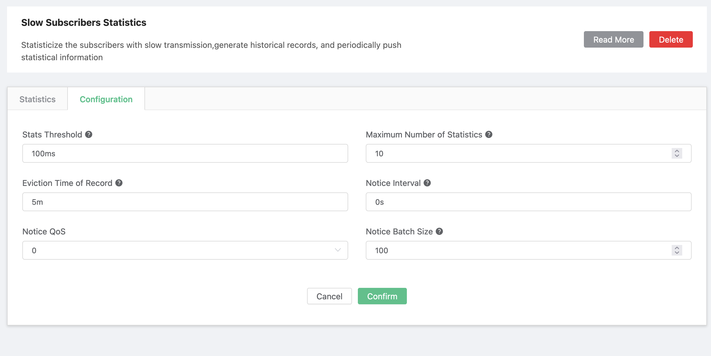
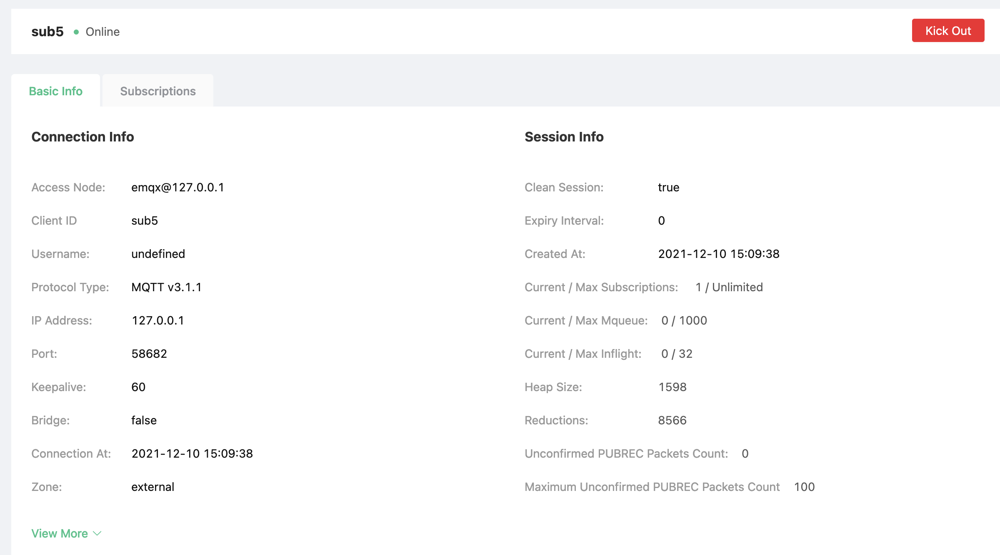

# Table of Contents

1.  [Slow subscribers statistics](#org0a58d32)
    1.  [open module](#org7939dfc)
    2.  [Implementation note](#org417d240)
    3.  [Configuration description](#orgf0feb6e)
    4.  [Slow subscribers record](#orga6267c1)

# Slow subscribers statistics

This module ranks subscribers and topics in descending order according to the latency of message transmission

## Open module

Open EMQ X Dashboard, click on the "Module" on the left. 

Then, select the **Slow Subscribers Statistics** module, and then click *Enable*

## Implementation note

This function will track the time consumption of the entire message transmission process after the QoS1 and QoS2 messages arrive at EMQX, and then calculate the message transmission latency according to the options in the configuration.
Afterwards, the subscribers and topics are ranked according to the latency.

## Configuration description

-   threshold

    *threshold* is used to determine whether subscribers can participate in statistics. If the latency of subscribers is lower than this value, they will not be counted

-   top\_k\_num

    This field determines the upper limit of the number in the statistical record table

-   expire\_interval

	*expire interval* controls the effective time of each piece of data in the statistical record. If the data has not been updated within this time range, it will be removed. (For example, after a message is sent, it is added to the statistics record because of the long latency. If the message is not sent again for a long time that exceeds this value, it will be cleared)

-   stats\_type

    The ways to calculate the latency are as follows:

    1.  whole

        From the time the message arrives at EMQX until the message completes transmission

    2.  internal

        From when the message arrives at EMQX until when EMQX starts delivering the message

    3.  response

        From the time EMQX starts delivering the message, until the message completes transmission

    Definition of message completion transmission:

    1.  QoS0

        When EMQX starts to deliver

    2.  QoS1

        When EMQX receives *puback* from the client

    3.  Qos2

        When EMQX receives *pubcomp* from the client

## Slow subscribers record

Under this tab, the subscriber information will be displayed in descending order according to the time latency. After Clicking *Client ID*, it will display the subscriber details, where you can analyze and find the problem.

