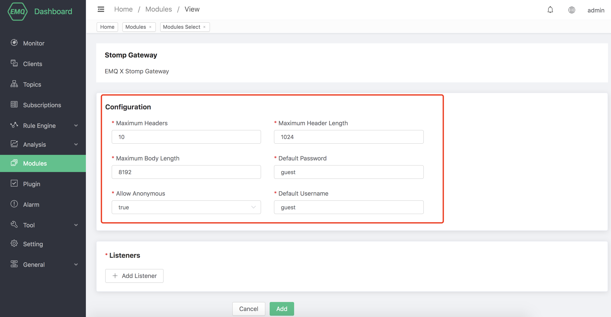
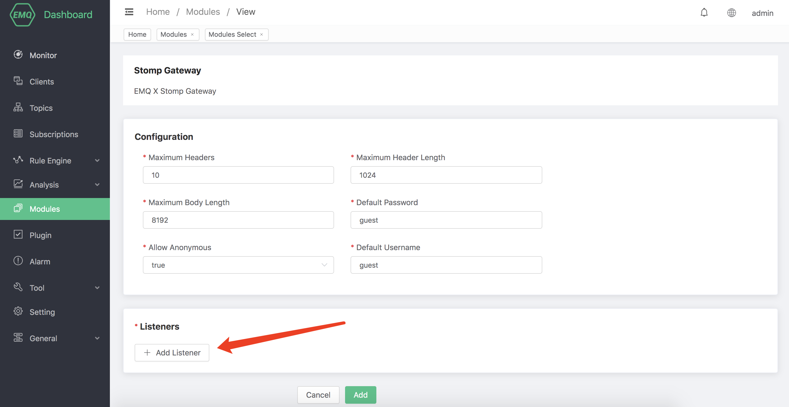
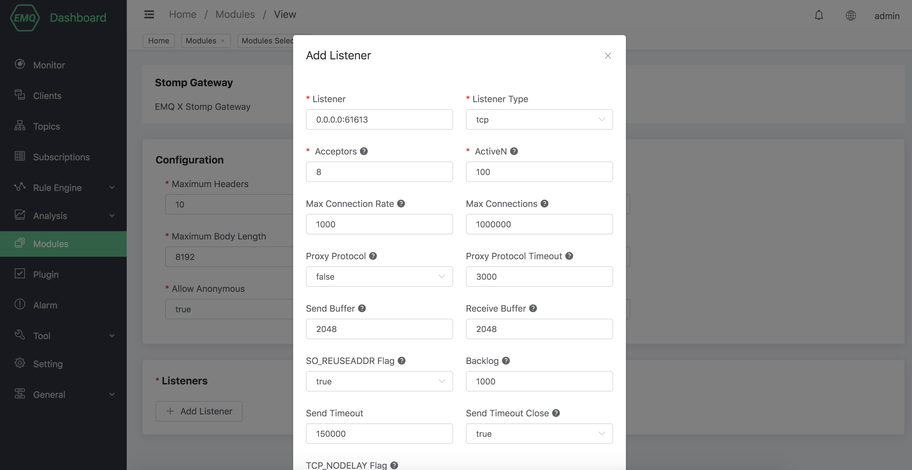
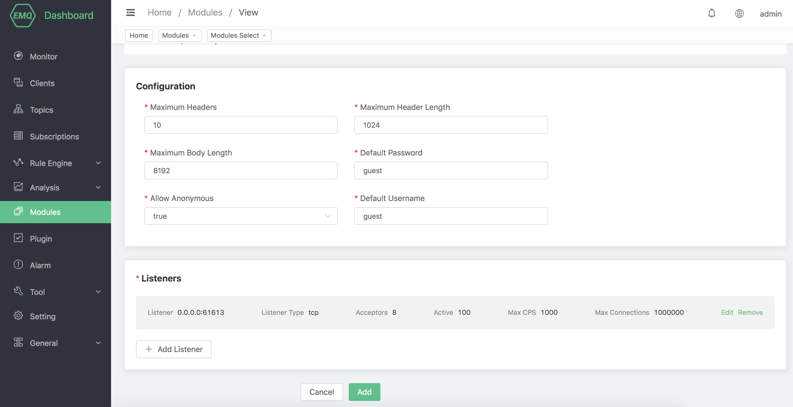

# Stomp Protocol Gateway

The Stomp protocol gateway provides EMQX with the access capability of the Stomp protocol.

## Create module

Open [EMQX Dashboard](http://127.0.0.1:18083/#/modules), click the "Modules" tab on the left, and choose to add:

Click "Select", and then select "Stomp Access Gateway":

Configure related basic parameters:

Add listening port:

Configure monitoring parameters:

Click "OK" to complete the configuration of the listener, and then click "Add" to complete the creation of the module:

### Configuration parameters

| Configuration item                | Description                                         |
| --------------------------------- | --------------------------------------------------- |
| Allow anonymous                   | Whether to allow anonymous login                    |
| Default Username                  | Specify the Username used for login in Stomp module |
| Default password                  | Specify the password used for Stomp module login    |
| Maximum Headers                   | Maximum number of Stomp frame headers               |
| Max Header Length                 | Maximum length of Stomp frame headers               |
| Max Body Length                   | Maximum length of Stomp frame body                  |
