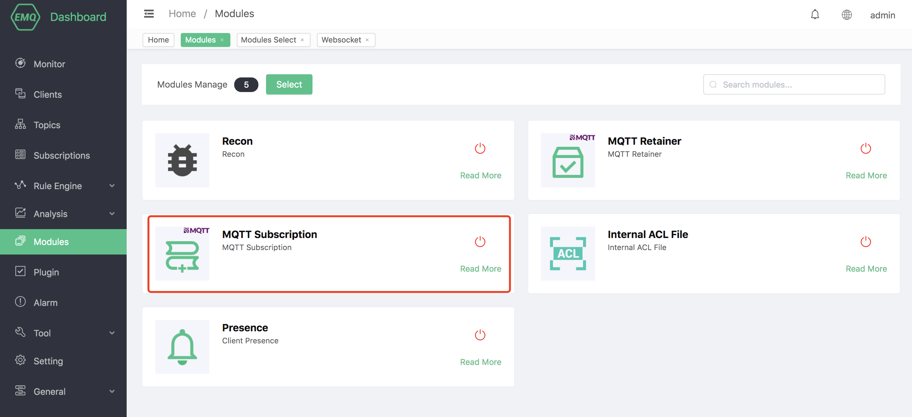

# MQTT proxy subscription

The proxy subscription function of EMQX enables the client to automatically establish the user's preset subscription relationship without sending additional SUBSCRIBE messages when the connection is established.

## Create module

Open [EMQX Dashboard](http://127.0.0.1:18083/#/modules), click the "Modules" tab on the left, and choose to add:

Select MQTT broker subscription module

Configure related parameters

After clicking add, the module is added

## Subscription options

+ Quality of Service (QoS)

    The maximum QoS level of application messages that the server can send to the client.

+ NL (No Local)

    Whether application messages can be forwarded to the client that posted this message.

    -When the NL value is 0, it means that the application message can be forwarded to the client that published the message.

    -When the NL value is 1, it means that the application message cannot be forwarded to the client that published the message.

+ RAP (Retain As Published)

    When forwarding application messages to this subscription, whether to keep the RETAIN flag set when the message is published.

    -When the RAP value is 0, it means that the reserved flag is set to 0 when forwarding application messages to this subscription.

    -When the RAP value is 1, it means to keep the reserved flag set when the message is published when the application message is forwarded to this subscription.

+ RH (Retain Handling)

    Whether to send a hold message when the subscription is established

    -0: Send a reserved message when the subscription is established

    -1: When the subscription is established, if the subscription does not currently exist, a reserved message will be sent

    -2: Do not send reserved messages when the subscription is established

## Agent subscription rules

When configuring the topic subscribed by the agent, EMQX provides two placeholders `%c` and `%u` for users to use. EMQX will configure the `%c` and `%u` `Replaced with the client's `Client ID` and ʻUsername` respectively. It should be noted that `%c` and `%u` must occupy an entire topic level.

For example, after adding the rules in the above figure: configure two clients A and B, the `Client ID` of client A is `testclientA`, the `Username` is `testerA`, and the `Client ID` of client B is `testclientB`, ʻUsername` is `testerB`.

The client A uses the MQTT V3.1.1 protocol to connect to EMQX. According to the above configuration rules, the proxy subscription function will actively help the client subscribe to the two `client/testclientA` with QoS 1 and ʻuser/testerA` with QoS 2. For this topic, because the connection protocol is MQTT V3.1.1, No Local, Retain As Published, and Retain Handling in the configuration are not effective.

Client B uses the MQTT V5 protocol to connect to EMQX. According to the configuration rules above, the proxy subscription function will actively help the client to subscribe to the two topics `client/testclientB` and ʻuser/testerB`, among which `client/testclientB` The subscription options are Qos = 1, No Local, Retain As Published, and Retain Handling are all 0; the subscription options of ʻuser/testerB` are Qos = 2, No Local = 1, Retain As Published = 1 and Retain Handling = 1.