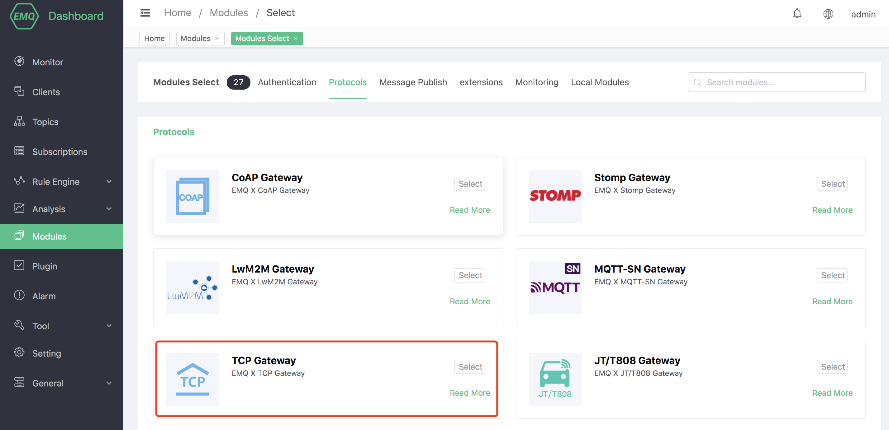

# TCP protocol gateway

## Protocol Introduction

EMQX provides the **emqx-tcp** module as an access module close to the end side. According to the relationship between its functional logic and the entire system, the entire message exchange process can be divided into three parts: terminal side, platform side and Other side:

```bash
|<-- Terminal -->|<--------- Broker Side --------->|<---  Others  --->|
|<-    Sid e   ->|                                 |<--    Side    -->|

+---+                                                PUB  +-----------+
| D |  INCOMING  +----------+    PUB     +---------+   -->| subscriber|
| E |----------->|          |----------->|         |--/   +-----------+
| V |            | emqx-tcp |            |  EMQX  |
| I |<-----------|          |<-----------|         |<--   +-----------+
| C |  OUTGOING  +----------+    PUB     +---------+   \--| publisher |
| E |                                                PUB  +-----------+
+---+
```

1. On the terminal side, access through the TCP private protocol defined by this module, and then implement data reporting or receive downlink messages.
2. On the platform side, the main body is the emqx-tcp module and the EMQX system. emqx-tcp is responsible for the encoding and decoding of messages, and the agent subscribes to downlink topics. Realize to convert the uplink message into the MQTT message PUBLISH in the EMQX system to the entire system; convert the downlink MQTT message into the message structure of the TCP private protocol, and send it to the terminal.
3. The other side can subscribe to the topic of the upstream PUBLISH message appearing in 2 to receive the upstream message. Or to publish a message to a specific downlink topic to send data to the terminal side.

## Create module

Open [EMQX Dashboard](http://127.0.0.1:18083/#/modules), click the "Modules" tab on the left, and choose to add:


Select TCP private protocol to access the gateway:



Configure related basic parameters:


Add listening port:


Configure monitoring parameters:


Click to confirm to the configuration parameter page:


After clicking Add, the module is added:


### Configuration parameters


| Configuration         | Description                                                  |
| --------------------- | ------------------------------------------------------------ |
| Idle Timeout          | Idle time. If the CONNECT frame is not received after this time, the TCP connection will be closed directly |
| Uplink Topic          | Up topic. Uplink message to the message subject in the EMQ system%c: ClientId of the access client, %u: Username of the access client |
| Downlink Topic        | Down topic. Uplink message to the message subject in the EMQ system%c: ClientId of the access client, %u: Username of the access client |
| Max Packet Size       | Maximum processing size of a single TCP private protocol message |
| Force GC Policy       | Mandatory GC, when the process has processed 1000 messages or sent more than 1M data |
| Force Shutdown Policy | Forced to close the connection, when the process accumulates 8000 messages or the stack memory exceeds 800M |