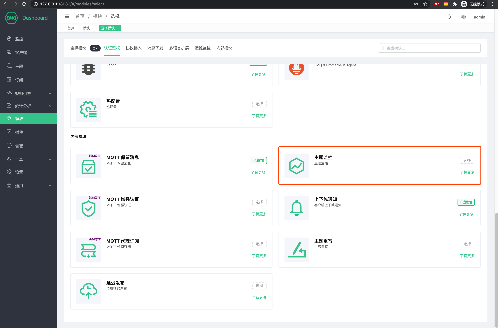

# Topic Metrics

EMQX provides a topic indicator statistics function, which can count the number of messages sent and received, rate and other indicators under a specified topic.

## Create module

Open [EMQX Dashboard](http://127.0.0.1:18083/#/modules), click the "Modules" tab on the left, and choose to add:

Select the topic metrics module, no need to configure parameters, directly open

## How to use topic metrics

The topic metrics page is located under the statistical analysis tab of Dashboard. After the theme indicator statistics function is enabled, you can click the *Create* button in the upper right corner of the page to create a new theme indicator statistics. The following is the page after you have created the subject indicator statistics of ʻa/c` and ʻa/b`. You will be able to see the total number of messages flowing in and out, discarded, and the current rate under these two topics.

> For overall performance considerations, the current theme indicator statistics function only supports theme names, that is, theme filters with `+` or `#` wildcards, such as ʻa/+`, etc. are not supported. Maybe one day in the future we will implement it, if we solve the performance problem.

### HTTP API

<!-- Update links to include a link to {{ your-emqx-dashboard-endpoint }}  -->
We provide you with an HTTP API consistent with Dashboard operations so that you can integrate with your application. For the specific usage of the related HTTP API, please refer to HTTP API-Subject Index Statistics.