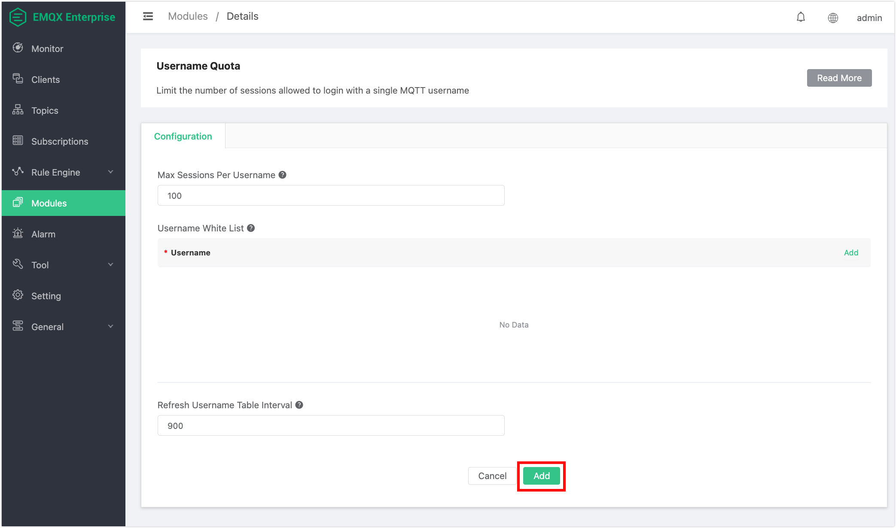
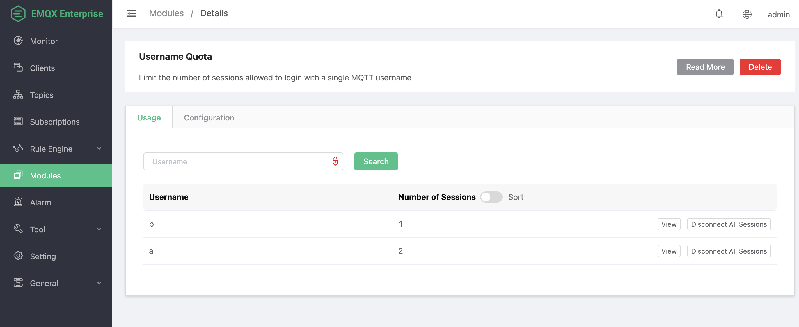

# Username Quota

Starting from version 4.4.25, a new username quota module has been added to limit the maximum number of sessions for a single MQTT username.

When a username exceeds its quota, new session connections will be rejected, and the corresponding CONNACK return code will be sent: "0x97 Quota Exceeded" (MQTT 5.0) or "0x03 Service Unavailable" (MQTT 3.1.1).

::: tip Note
Starting from Enterprise 4.4.38, the username quota module uses a new cross-node synchronization mechanism to improve performance and stability in clusters. The `refresh_username_tab_interval` configuration item, shown as **Refresh Username Interval** in the Dashboard, has been removed.
:::

## Add Username Quota Module

1. Click **Modules** from the left navigation menu on the Dashboard.

2. Click the **Add Module** button on the page.

3. Navigate to **Username Quota** under the **Authentication** tab on the module select page, and click **Select**.

4. Configure the following options for the username quota module.

   - **Max Sessions Per Username**: Defines the maximum number of MQTT sessions allowed for each username. Note that if the MQTT client logs in using a persistent session, the session will remain on the server even after the client disconnects, until the session expires and is cleared.
   - **Username White List**: You can add username entries by clicking the **Add** button on the right. Usernames in the whitelist are not subject to session limits. For example, clients connecting to a cluster using the MQTT bridge should bypass the quota limitation, you can add the usernames used by the MQTT bridge to the whitelist.

5. Click **Add** to complete the settings.

   

## Manage Username Quota

On the Modules page, navigate to the **Username Quota** module you have added. Click **Manage** on the right.



### View Username Sessions

Under the **Usage** tab, you can view all active usernames in the EMQX cluster along with the number of active sessions for each.

- Click **View** next to a username to see detailed session information.
- Click **Disconnect All Sessions** to forcibly disconnect all client sessions associated with that username.
- To sort the list by the number of sessions, toggle the **Sort** switch next to **Number of Sessions**.


### Configure Quota Limits

Go to the **Configuration** tab to edit the session limit settings for MQTT usernames. This allows you to control how many concurrent sessions are permitted per username.

### Delete Username Quota Module

To remove the Username Quota module, click **Delete** in the top-right corner of the page.

## HTTP API

In addition to viewing the username quota module on the Dashboard, you can also retrieve username usage details using the HTTP API.

### GET /api/v4/quota/usernames

Get the list of usernames in the cluster, sorted in descending order by the number of sessions for each username.

**Success Response Body (JSON):**

| Name | Type    | Description |
| ---- | ------- | ----------- |
| code | Integer | 0 indicates success   |
| data | Array   | List of username details   |
| data[0].username | String   | Username |
| data[0].used | Integer   | Number of sessions for the username |
| data[0].clientids | Array | List of client IDs |

**Examples**

```shell
curl -u admin:public 'http://localhost:18083/api/v4/quota/usernames' | jq .

{
  "meta": {
    "page": 1,
    "limit": 10000,
    "count": 1
  },
  "data": [
    {
      "username": "a",
      "used": 1,
      "clientids": [
        "mqttjs_6916e2ae"
      ]
    }
  ],
  "code": 0
}
```

### GET /api/v4/quota/usernames/:username

Get the sessions for a specific username.

**Success Response Body (JSON):**

| Name | Type    | Description |
| ---- | ------- | ----------- |
| code | Integer | 0 indicates success   |
| data | Object  | User details   |
| data.username | String   | Username |
| data.used | Integer   | Number of sessions for the username |
| data.clientids | Array | List of client IDs |

**Examples**

```shell
curl -u admin:public 'http://localhost:18083/api/v4/quota/usernames/a' | jq .

{
  "data": {
    "username": "a",
    "used": 1,
    "clientids": [
      "mqttjs_6916e2ae"
    ]
  },
  "code": 0
}
```

### DELETE /api/v4/quota/usernames/:username

Forcefully disconnect all sessions associated with a specific username.

**Success Response Body (JSON):**

| Name | Type    | Description |
| ---- | ------- | ----------- |
| code | Integer | 0 indicates success   |
| data | Object  | Details of disconnected sessions   |
| data.kicked | Integer   | Number of disconnected sessions |

**Examples**

```shell
curl -X DELETE -u admin:public 'http://localhost:18083/api/v4/quota/usernames/a' | jq .

{
  "data": {
    "kicked": 1
  },
  "code": 0
}
```
