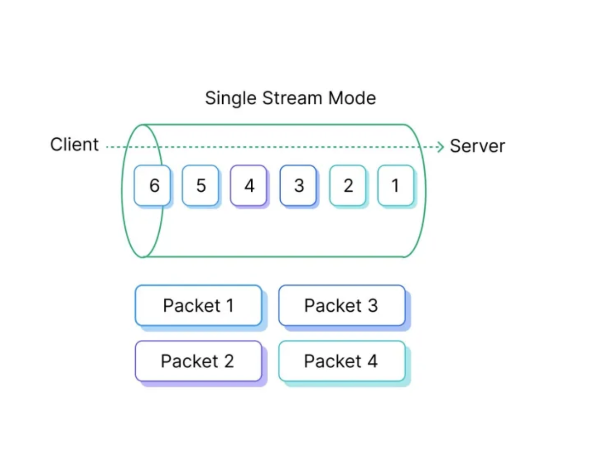
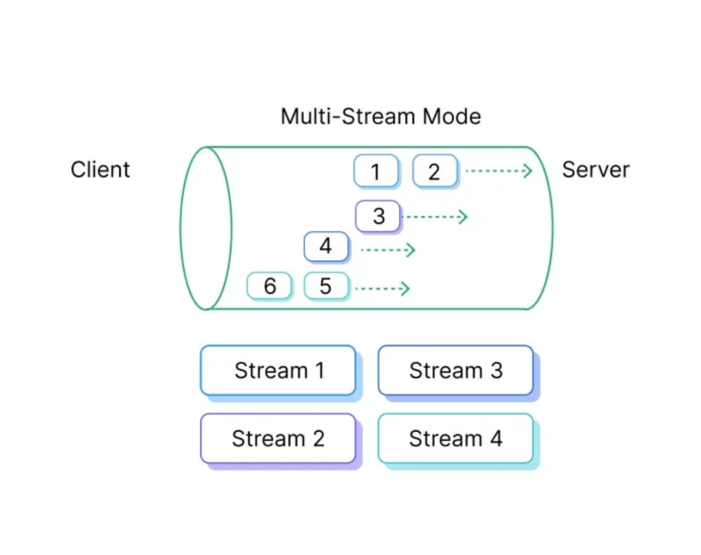

# Features and Benefits

EMQX designs a unique message transmission mechanism and management method for MQTT over QUIC, providing a more efficient and secure way to transmit MQTT messages over modern complex networks, thus improving the performance of MQTT in certain scenarios. 

This page introduces the advantages of MQTT over QUIC, and the benefits of each QUIC operation mode along with use cases. 

## Advantages of MQTT over QUIC

QUIC combines the functionalities of both TCP and UDP while introducing additional improvements to address latency issues in modern networks. The advantages of QUIC include:

- **Reduced Latency**: QUIC is explicitly designed to minimize connection establishment time. Traditional MQTT over TCP requires a separate TLS handshake after the TCP handshake, leading to delays, especially in mobile networks or unstable connections. QUIC combines transport and TLS handshakes, potentially allowing MQTT connections to be established more quickly.
- **Multiplexing without Head-of-Line Blocking**: QUIC supports multiplexing multiple streams over a single connection. In TCP, the loss of a packet in one stream can block other streams due to head-of-line blocking. In contrast, QUIC ensures that individual streams are independent. This can be advantageous for MQTT applications handling multiple topics or message streams simultaneously.
- **Better Performance in Unstable Networks**: QUIC's design is more adept at handling packet loss and network fluctuations compared to TCP (e.g., switching between Wi-Fi and cellular networks). For MQTT applications running in environments with frequent network interruptions or on mobile devices, QUIC can provide more resilient connections.
- **Built-in Security**: QUIC inherently includes security features equivalent to TLS. This means MQTT over QUIC will always be encrypted and authenticated without requiring additional configuration.
- **Connection Migration**: QUIC can seamlessly handle changes in client IP addresses or ports without the need for connection restarts. This is particularly beneficial for MQTT devices in motion, ensuring persistent connections even when the underlying network changes.
- **Improved Congestion Control**: While TCP's congestion control algorithms have stood the test of time, QUIC introduces new and more flexible methods, allowing for experimentation with novel algorithms. This may improve MQTT message throughput and responsiveness, especially in congested networks.

## Operation Modes of QUIC

The current implementation of EMQX replaces the transport layer with a QUIC stream, where the client initiates the connection and creates a bi-directional stream. EMQX and the client interact on this stream. Considering the complex network environment, if the client fails to perform QUIC handshake for some reason, it will automatically fall back to traditional TCP to avoid communication failure with the server. The interaction between EMQX and the client has two modes: [single-stream mode](#single-stream-mode) and [multi-streams mode](#multi-streams-mode). The following sections introduce the features and benefits of each mode.

### Single-Stream Mode

The single-stream mode is a basic mode that encapsulates the MQTT packets in a single bi-directional QUIC stream. It offers fast handshakes, ordered data delivery, connection resumption, 0-RTT, client address migration, and enhanced loss detection and recovery. This mode can make communication between clients and EMQX faster and more efficient while maintaining order, quickly recovering connections, and allowing clients to migrate their local addresses without significant disruption.

#### Features and Benefits

The single-Stream mode has the following features and benefits

- Fast handshake

  QUIC connection between the Client and the EMQX can be established within one round trip.

- Ordered data delivery

  Like TCP, the delivery of MQTT packets also follows the order of the messages sent in the stream, even if the underlying UDP datagram packets are received in the wrong order.

- Connection resumption, 0-RTT

  Using the 0-RTT method, the client is able to resume a connection and send application data to the server in the first QUIC packet or immediately after. There is no need to wait for the EMQX's reply to complete a round trip.
  This feature is particularly useful for quickly recovering a closed connection caused by network disturbances and bringing the application businesses back online.

- Client address migration

  Without disconnecting and establishing a new QUIC connection, the client is enabled to actively or passively migrate its local address to a new address due to Network Address Translation (NAT) rebinding. The QUIC connection could be kept without major disturbances, so to MQTT layer and above.

- Package loss detection and recovery

  QUIC is more responsive compared to other protocols in detecting packet loss and recovery. The behaviors can be tuned specifically for each use case.

### Multi-Streams Mode

Multi-stream mode utilizes QUIC's stream multiplexing capability, allowing MQTT packets to be transmitted through multiple streams. This enables a single MQTT connection to carry data from multiple topics and provides several improvements, such as decoupling connection control and MQTT data exchange, avoiding head-of-line blocking, splitting uplink and downlink data, distinguishing the priority of different data, improving parallelism, enhancing robustness, allowing traffic control of data streams, and reducing subscription latency.

The initial stream that is established from the client to EMQX is referred to as the control stream. Its purpose is to handle the maintenance or update of the MQTT connection. Following this, the client can initiate one or multiple data streams to publish topics or subscribe to topics, per stream.

The client is free to choose how to map the stream, for example:

   - Use one stream per topic.
   - Use one stream for QoS 1 and another for QoS 0.
   - Use one stream for publishing and another for subscriptions. (Publish/Subscribe over the control stream is also allowed.)

 As the broker, EMQX does stream packet bindings:

   - It sends PUBACK packets over the stream where it receives the PUBLISH for QoS 1, so to the QoS 2 packets.
   - It sends PUBLISH packets over the stream where it gets the topic subscription and also expects PUBACK for QoS1 from the same stream.

::: tip

The order of data is maintained per stream, hence, if there are two topics whose data is correlated and ordering is crucial, they should be mapped to the same stream.
:::

#### Features and Benefits

The multi-streams mode has the following features and benefits

   - Decouple connection control and MQTT data exchange

     The MQTT connection control packets, such as CONNECT, CONNACK, and PING, are handled over the control stream, while data exchanges such as publishing and subscription are done over the data stream. Even if the data stream is slow, the connection can still be kept alive in terms of handling PINGREQ and PINGRESP.

   - Avoid head-of-line blocking issues among the topics

     MQTT over QUIC allows for multiple data streams for different topics, enabling the messages of different topics to be delivered independently.

   - Split uplink (publishing) and downlink (subscribe) data

     For example, a client can use one stream to publish QoS1 messages and handle PUBACK over that same stream, while receiving QoS 0 messages from its subscriptions on another stream from the broker.

   - Prioritize different data
     MQTT over QUIC also provides the ability to prioritize data from different MQTT topics through multi-streams. This means that topic data can be prioritized and delivered accordingly, improving the overall performance and responsiveness of the connection. 

   - Improve the parallelism of processing on the client and EMQX side

     With the use of data streams, EMQX and clients are able to process multiple streams in parallel, improving the overall efficiency and resource utilization of the system, resulting in lower latency and improved application layer response speed.

   - Reduce overhead for error handling

     If a single data stream is aborted due to an application error, it will not cause the entire connection to close. Instead, the application is free to recreate the stream and recover the data. This allows for more reliable and resilient MQTT communication.

   - Flow control data streams

     Flow control can be applied per data stream, allowing for different flow control policies for different topics or QoS levels.

   - Reduce subscription latency

     A client does not need to wait for MQTT CONNACK before sending the subscribe or publish packets.

     However, EMQX will only begin processing them after the client has established a connection and while the connection is allowed.