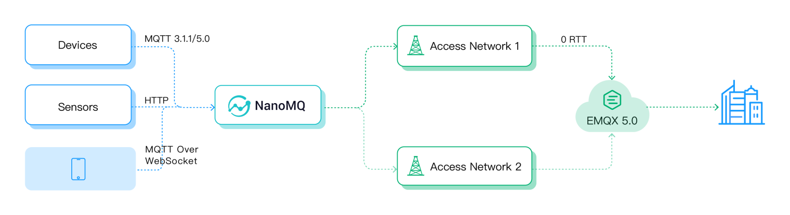

# Use MQTT over QUIC

In EMQX 5.0, we introduce the MQTT over QUIC listener to help IoT users benefit from MQTT over QUIC. This section gives you a step-by-step guide on how to use MQTT over QUIC. 

:::tip
Prerequisites:

- Knowledge of [MQTT over QUIC](./introduction.md).
  :::

## Environment

MQTT over QUIC is an experimental function currently not supported in CentOS 6, macOS, and Windows systems.


To test this listener in these systems, you can [install EMQX from the source code](../deploy/install-source.md) and specify the environment variable `BUILD_WITH_QUIC=1` before compiling.


You can follow the standard procedure for the other operating systems and platforms.

To test the MQTT over QUIC listener, you are recommended to use the Docker image and use the command below to  enable the listener on port 14567:

```bash
docker run -d --name emqx \
  -p 1883:1883 -p 8083:8083 \
  -p 8084:8084 -p 8883:8883 \
  -p 18083:18083 \
  -p 14567:14567/udp \
  -e EMQX_LISTENERS__QUIC__DEFAULT__keyfile="etc/certs/key.pem" \
  -e EMQX_LISTENERS__QUIC__DEFAULT__certfile="etc/certs/cert.pem" \
  -e EMQX_LISTENERS__QUIC__DEFAULT__ENABLED=true \
emqx/emqx:5.0.19
```

For more information on running EMQX via Docker container, see [Deploy with Docker](../deploy/install-docker.md).

## Enable MQTT over QUIC

MQTT over QUIC is disabled by default, you need to enable this listener with the following steps manually:

1. Open the configuration file `etc/emqx.conf`, uncomment the `listeners.quic.default` configuration group (if there is no such configuration group, please add it manually):

   ```bash
   # etc/emqx.conf
   listeners.quic.default {
     enabled = true
     bind = "0.0.0.0:14567"
     max_connections = 1024000
     keyfile = "etc/certs/key.pem"
     certfile = "etc/certs/cert.pem"
   }
   ```

​	This configuration indicates that the QUIC listener is enabled on port `14567`. Save the changes and restart EMQX to apply the configuration.

2. Execute `emqx_ctl listeners` in CLI, and we can see that the MQTT over QUIC listener is enabled:

```bash
 > emqx_ctl listeners
 quic:default
   listen_on       : :14567
   acceptors       : 16
   proxy_protocol  : undefined
   running         : true
 ssl:default
   listen_on       : 0.0.0.0:8883
   acceptors       : 16
   proxy_protocol  : false
   running         : true
   current_conn    : 0
   max_conns       : 512000
```

So far, we have enabled the MQTT over QUIC listener on EMQX, and then we will continue to connect the clients.

## Client SDK and tools

Compared with EMQX's support to MQTT, MQTT over QUIC still needs complete client library and toolchain support.

EMQX plans to provide client libraries in multiple languages such as C, Java, Python, and Golang for MQTT over QUIC by priority, to help our users take the lead in using QUIC, for example, embedded hardware and other businesses that fit the scenario.

### Client SDKs

- [NanoSDK](https://github.com/nanomq/NanoSDK/): MQTT SDK in C language released by EMQ NanoMQ team, also supports protocols such as WebSocket and nanomsg/SP.
- [NanoSDK-Python](https://github.com/wanghaEMQ/pynng-mqtt): Python binding of NanoSDK.
- [NanoSDK-Java](https://github.com/nanomq/nanosdk-java): Java JNA binding of NanoSDK.
- [emqtt](https://github.com/emqx/emqtt): MQTT client library in Erlang, supporting QUIC.

Besides the client library, EMQ provides MQTT over QUIC bridging with the edge computing product NanoMQ. You can use NanoMQ to bridge edge data to the cloud through QUIC, so you can use the MQTT over QUIC listener without needing too much development and integration effort. 

### Support to fallback

As QUIC is based on the UDP protocol, many operators still have special routing strategies for UDP packets, often leading to QUIC connection failures or packet losses.

Therefore, MQTT over QUIC clients are designed with the fallback feature: the API layer can use unified operations to write services, and the transport layer can switch in real time according to network conditions. When QUIC is unavailable, it automatically switches to TCP/TLS 1.2 to ensure services under various network environments.

## MQTT over QUIC through NanoSDK

[NanoSDK](https://github.com/nanomq/NanoSDK/) is based on the   MsQuic

[NanoSDK](https://github.com/nanomq/NanoSDK/) is based on MsQuic, and it is the first Software Development Kit (SDK) to implement MQTT over QUIC in C language, which is seamlessly compatible with EMQX 5.0. It adopts a fully asynchronous IO design, binds the QUIC Stream and MQTT connection mapping, realizes the built-in function of 0 RTT fast handshake reconnection, and supports multi-core task parallelism.

NanoSDK API works similarly to MQTT over TCP, you can create the MQTT client based on QUIC with one command line:

```bash
## Create MQTT over Quic client with NanoSDK
nng_mqtt_quic_client_open(&socket, url);
```

For message sample code, see  https://github.com/nanomq/NanoSDK/tree/main/demo/quic 。

After compiling, you can use the following command to connect to EMQX 5.0 on port 14567 for testing.

```bash
quic_client sub/pub mqtt-quic://127.0.0.1:14567 topic msg
```

NanoSDK also provides bindings for Java) and Python:

- [Java MQTT over QUIC Client](https://github.com/nanomq/nanosdk-java/blob/main/demo/src/main/java/io/sisu/nng/demo/quicmqtt/MqttQuicClient.java)
- [Python MQTT over QUIC Client](https://github.com/wanghaEMQ/pynng-mqtt/blob/master/examples/mqttsub.py)


## MQTT over QUIC bridging via NanoMQ 

[NanoMQ](https://nanomq.io/) is an ultra-lightweight and blazing-fast service for IoT edge, featuring cross-platform support, multi-threading, and support to MQTT over QUIC bridging. 

It can convert the data from traditional MQTT clients into QUIC packets and send them to EMQX in the cloud, thus providing an option for end-side IoT devices that are hard to integrate or lack a suitable MQTT over QUIC SDK to use the QUIC protocol. 



### NanoMQ bridging example

Download and install NanoMQ:

```bash
git clone https://github.com/emqx/nanomq.git
cd nanomq ; git submodule update --init --recursive

mkdir build && cd build
cmake -G Ninja -DNNG_ENABLE_QUIC=ON ..
sudo ninja install
```

After the installation, we can configure the MQTT over QUIC bridging function and the related topics in the configuration file `/etc/nanomq.conf`. The URL prefix `mqtt-quic` indicates that it is using QUIC as the MQTT transmission layer:

```bash
## Bridge address: host:port .
##
## Value: String
bridge.mqtt.emqx.address=mqtt-quic://127.0.0.1:14567
```

### MQTT over QUIC CLI tool

NanoMQ also provides the test tool `nanomq_cli`, which contains MQTT over QUIC client tools so users can test the MQTT over QUIC function in EMQX 5.0:

```bash
nanomq_cli quic --help
Usage: quic conn <url>
       quic sub  <url> <qos> <topic>
       quic pub  <url> <qos> <topic> <data>

## subscribe example
nanomq_cli quic sub mqtt-quic://54.75.171.11:14567 2 msg
```

To sum up, you can directly integrate NanoSDK into your project or use it with NanoMQ to realize QUIC access from the device side to the cloud.
