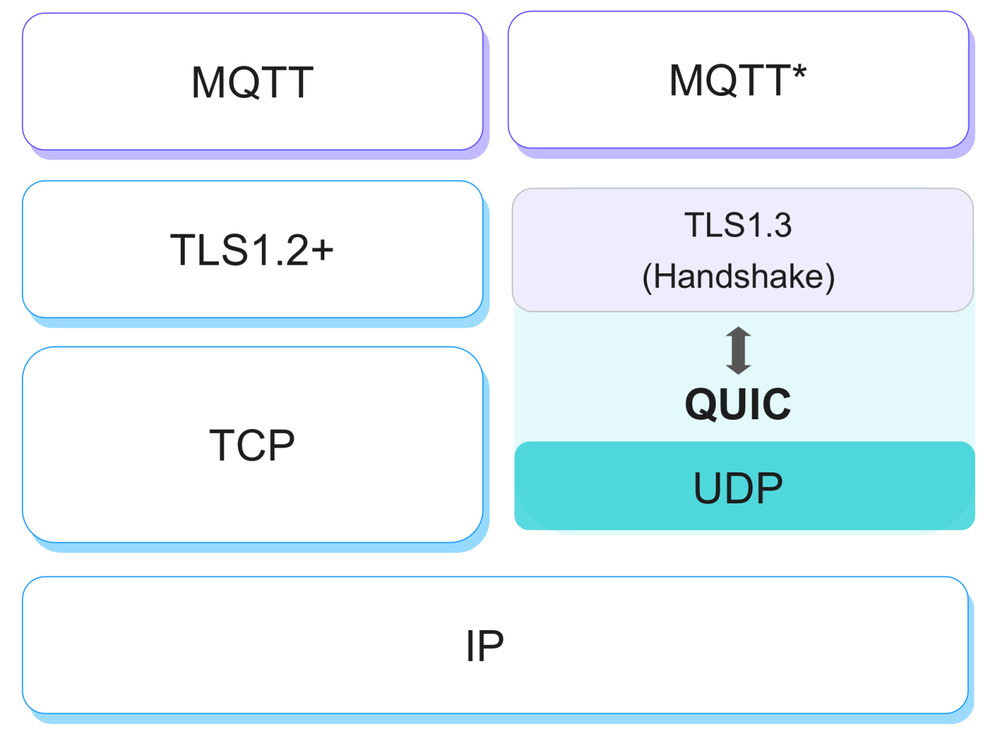

# MQTT over QUIC

QUIC is the underlying transport protocol of the next-generation Internet protocol HTTP/3, which provides connectivity for the modern mobile Internet with less connection overhead and message latency compared to TCP/TLS protocols.

Based on the advantages of QUIC, which make it highly suitable for IoT messaging scenarios, EMQX 5.0 introduces QUIC support (MQTT over QUIC) and designs a unique messaging mechanism and management approach.

:::tip

For now, MQTT over QUIC is still an experimental feature, EMQ are preparing a draft proposal about MQTT over QUIC for submission to the OASIS MQTT Technical Committee.

:::

## Scenarios for MQTT over QUIC

The MQTT protocol has inherent drawbacks in certain complex network environments due to underlying TCP transport protocol limitations.

- requent connection interruptions due to network switching
- Difficult to re-establish connection after disconnection: the operating system is slow to release resources after disconnection, and the application layer cannot sense the disconnection status in time, and the Server/Client overhead is high when reconnecting
- In a weak spotty network environment, data transmission is blocked by congestion, packet loss, and retransmission

For example, connected vehicle users usually face similar problems: vehicles may run in mountainous areas, mines, tunnels, etc., which can cause connection interruptions when entering signal dead zones or passively switching base stations(also referred to as spotty network). 

Frequent connection interruptions and slow connection establishment can lead to poor user experience. In some services with high requirements for real-time data transmission and stability, such as the L4 driverless vehicle, it costs a lot for customers to mitigate this problem.

In these scenarios, the low connection overhead and multi-path support of QUIC shows its strengths. After deeper exploration, we believe that MQTT over QUIC is a great solution to this dilemma - based on QUIC's 0 RTT/1 RTT reconnect/new capability and migration support, it can effectively improve user experience in weak networks and irregular network paths.

## Features and implementation

The current implementation of EMQX replaces the transport layer with a QUIC Stream, where the client initiates the connection and creates a bi-directional Stream. EMQX and the client interact on it.

Considering the complex network environment, if for some reason the client fails to complete QUIC connection handshake, it is recommended that the client automatically fall back to a traditional TCP connection to ensure connectivity.

MQTT protocol can benefit from using QUIC as its transport as follows:

- Keep connection alive even after network switch, NAT rebinding.
- Fast connection establishment, reduces handshake latency.
- Mitigating frequent connect/reconnect
- Quick connection recovery
- **More advanced congestion control:** effectively reduces packet loss and enables continuous and stable data transmission despite network fluctuations in tests
- **Operationally and maintenance friendly:** reduce overhead (time overhead, client/server performance overhead) caused by massive reconnection, reduce system overload caused by unnecessary application layer state migration (0 RTT)
- **More flexible architectural innovations:** e.g., Direct server return (DSR, direct server return mode), where only ingress/request traffic passes through the LB and egress and response traffic bypasses the LB and goes directly back to the client, reducing bottlenecks in the L
- **Multi-path support for smooth connection migration:** handover from 4G to WIFI, or if the quintet changes due to NAT Rebinding, QUIC can maintain a connection on the new quintet, especially for mobile devices where the network changes frequently
- **More agile development and deployment:** It is suggested to implement the QUIC protocol stack in the userspace, enabling fast iterations, quic bugfix rollout and reduce the lead time from PoC to production.
- **End-to-end encryption:** QUIC packet leaves minimal information unencrypted in the headers to make communication secure and uninterceptable by middleboxes.

There are also more opportunities to be explored:

- **Streams with different topics:** We could use parallel streams in the same connection to carry different topics to make sending/receiving process parallelized with different priorities and mitigate the HOL (Head Of Line) blocking issue.
- **Streams with different QoS:** For example, in "Flow Control", QoS 0 messages should give way to high QoS message.
- **Separate control messages into different streams:** MQTT control messages can be sent in one or two directions. For example, the client can send UNSUBSCRIBE requests asynchronously through a short-lived unidirectional stream to request the server to stop sending data that is no longer of interest.
- **Finer-grained send and receive collaborative flow control:** Flow control is performed on a per-flow basis or across the entire connection, enabling finer-grained flow control.

## QUIC vs TCP/TLS Test Comparisons

In comparison with TCP/TLS testing, MQTT over QUIC performs as follows.

1. when network latency is high, QUIC is able to establish connections and subscribe faster.
2. after disconnecting, it takes less latency to re-establish the connection and reconnect to QUIC.
3. QUIC is better than TLS for both server CPU and memory usage when connecting/reconnecting on a large scale.
4. when NAT rebinding, client reconnection response under TCP/TLS is very slow and the message transmission is broken, while QUIC handles it more smoothly and the messages are sent without any impact.
5. In a weak network packet loss and packet transmission disorder environment, TLS shows message congestion and loss due to a poor network environment, while the QUIC server receives slightly jittery data but does not lose messages.

## Future work

As of now, the MQTT over QUIC is ready for production, users are already testing it in depth and giving good feedback, see [Getting Started](./getting-started.md) to experience it now.

Still, EMQX has not utilized all the features provided by QUIC, such as multi streams, stream prioritization, flow control and
unreliable datagram...

These features will be addressed in the later releases and, hopefully, become an OASIS standard.
