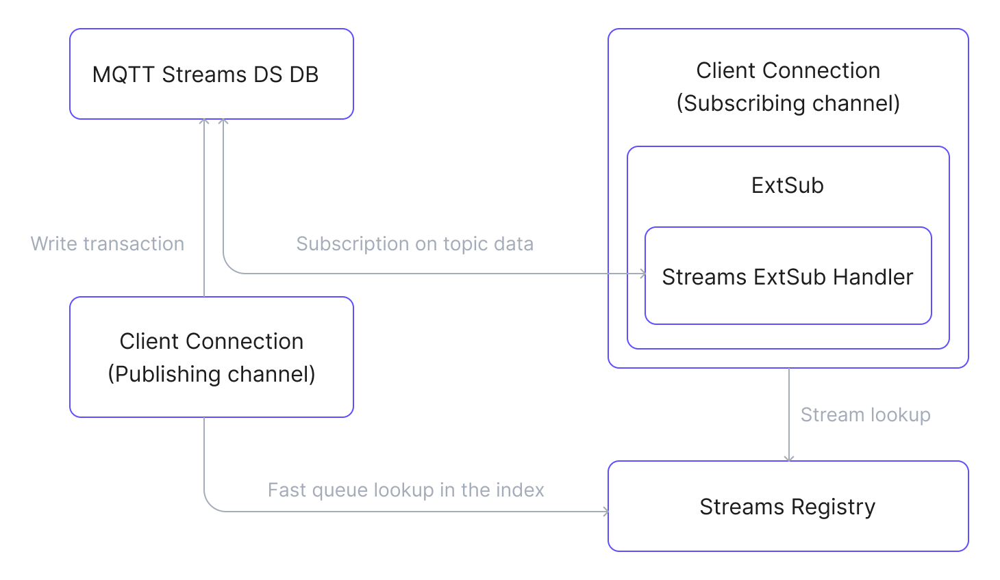

# MQTT Streams

EMQX 6.1 introduces the MQTT Streams, a streaming and replay feature that extends MQTT’s real-time publish/subscribe model with persistent, replayable message streams. It enables Kafka-like streaming capabilities while preserving MQTT semantics.

This page provides a complete overview of the MQTT Streams feature in EMQX, covering its design motivation, key concepts, internal architecture, message flow, and real-world application scenarios.

::: warning Incompatible with Listener Mountpoint
Stream replay does not work for clients connected through a listener with a [mountpoint](../configuration/listener.md#mountpoint) configured. EMQX applies the mountpoint before it matches the `$stream/` prefix, so a subscription to `$stream/<name>` is treated as an ordinary subscription to the mounted literal topic. No error is reported to the client. Message ingestion is also affected: published topics carry the mountpoint prefix, so they only match streams whose topic filter includes that prefix.
:::

## What Is an MQTT Stream?

An MQTT Stream is a named logical resource that continuously collects MQTT messages matching its configured topic filter. Messages are stored durably according to the stream’s retention policy and can later be replayed by subscribing clients.

Streams are identified by a unique name. The topic filter is part of the stream’s configuration but is not its identifier.

Each stream has:

- A unique name
- A configured topic filter
- A retention policy (time-based and/or size-based)
- Optional Last-Value semantics
- An explicit lifecycle (create, update, delete)

## Why Use MQTT Streams?

MQTT is optimized for real-time messaging, but it has inherent limitations:

- Messages are typically delivered only to online subscribers.
- Historical data replay is not natively supported.
- Reprocessing past data requires external systems.
- Maintaining an ordered, replayable message history is difficult.

MQTT Streams extends MQTT with durable message storage and replay. It allows consumers to read historical messages and retrieve the latest state of devices without changing how MQTT clients publish or subscribe.

## MQTT Streams Key Concepts

- **MQTT Stream**

  A logical resource identified and addressed by name, and managed with an explicit lifecycle. While active, it continuously stores matching messages within configured time or size limits. Stored messages can be replayed by subscribing consumers, without requiring any changes on the publishing side.

  Stream names can contain only:

  - Alphanumeric characters (`A–Z`, `a–z`, `0–9`)
  - Underscores (`_`)
  - Hyphens (`-`)
  - Dots (`.`)

  Two stream types are supported:

  - **Regular Stream**: A regular stream stores all matching messages without overwriting historical data. Consumers can replay messages starting from a specified timestamp or offset using the `stream-offset` subscription property.
  - **Last-Value Stream**: A last-value stream enables [Last-Value semantics](#last-value-semantics). For messages with the same stream key, newer messages overwrite older ones, and the stream retains only the latest message associated with each key. See the [Stream Key Expression](./mqtt-stream-task.md#stream-key-expression) section for more details about how to use this feature.

- **Topic Filter**

  An MQTT topic filter, such as `sensors/+/data`, that determines which published messages are captured into a stream. Only matching messages are ingested, and a single message may belong to multiple streams.

  ::: tip

  The topic filter is not the stream identifier. It is the configuration metadata of a named stream.

  :::

- **Stream Subscription**

  A special MQTT subscription used to consume messages from a stream. Clients subscribe using one of the following formats:

    ```
  SUBSCRIBE $stream/<name>
  SUBSCRIBE $stream/<name>/<topic_filter>
    ```

   Where:

    - `<name>` is the stream name (required).
    - `<topic_filter>` is optional when subscribing to an existing stream.
    - When auto-creation is enabled, `$stream/<name>/<topic_filter>` allows EMQX to create the stream using the provided topic filter if it does not already exist.

  Stream subscriptions operate independently of regular MQTT subscriptions and are delivered through the External Subscription mechanism.

- **Stream Offset (Replay Starting Point)**

  The replay starting point is provided using the MQTT 5 User Subscription Property `stream-offset`, rather than being specified in the topic path.

  The `stream-offset` property determines from where the replay begins. For example:

  - A timestamp
  - A logical offset
  - Special positions such as earliest or latest (if supported)

  This design removes offset parsing from the topic string and aligns replay control with MQTT 5 properties.

- **Key Expression**

  A user-defined expression evaluated on each incoming message to extract a key. The expression may reference message content or metadata. The extracted key is used to guarantee message ordering within a storage partition. When Last-Value semantics are enabled for the stream, the key also defines the overwrite scope: newer messages with the same key replace older ones.

## MQTT Streams Architecture

MQTT Streams are implemented as a standalone EMQX application that is loosely coupled with the broker core and reuses existing infrastructure. Integration with EMQX is achieved through internal hooks and the External Subscription framework.

::: tip

External Subscription is an EMQX mechanism that connects external message sources (messages originating outside the live MQTT publish path) to MQTT client sessions, allowing those messages to be delivered to MQTT clients through standard MQTT subscriptions without changing client behavior.

:::

### Main Components

- **Streams Registry**: Manages the lifecycle of MQTT streams and maintains stream metadata such as stream name, topic filter, retention policy, and key expression. It uses a Mnesia table to look up streams efficiently.
- **Streams Message Database**: Provides durable storage for stream messages and is built on top of EMQX [Durable Storage](../design/durable-storage.md). It persists messages, enforces retention limits, applies Last-Value semantics when enabled, and supports efficient message retrieval until messages expire according to retention policies.
- **Streams ExtSub Handler**: Integrates message streams with MQTT client sessions. It retrieves messages from Durable Storage and delivers them to subscribing clients through the External Subscription framework.

### MQTT Streams Data Flow Diagram

The following diagram shows the data flow between the MQTT Streams components:



### Publishing Flow

1. A client publishes a message to an MQTT topic.
2. An MQTT Streams hook is triggered to process the publication.
3. The hook queries the Streams Registry to identify streams whose topic filters match the message topic.
4. For each matching stream, the message is written to the stream and persisted in Durable Storage.

### Subscribing and Consuming Flow

1. A client subscribes to a stream topic (`$stream/<name>`, or `$stream/<name>/<topic_filter>`), optionally including the `stream-offset` subscription property.

   ::: warning Deprecated

   The legacy format `$s/<offset>/<topic_filter>` is supported for backward compatibility but is deprecated. For details, see [Compatibility Notes](#compatibility-notes).

   :::

2. The External Subscription framework handles the subscription and initializes a Streams ExtSub handler for the stream topic.

3. The handler retrieves messages from Durable Storage according to the specified `stream-offset` and retention rules.

4. Retrieved messages are passed to the External Subscription framework.

5. The ExtSub application delivers messages to the client via standard MQTT delivery.

## MQTT Streams Core Features

MQTT Streams provide a set of core capabilities that define how messages are stored, ordered, retained, and delivered for replay-based consumption.

- **Offset-Based Replay**

  Replay starting position is specified using the `stream-offset` subscription property, not in the topic path. Messages published before the specified offset are skipped.

- **Retention**

  The stream’s retention policy limits the message replay. Messages are retained for a limited time or size. Expired messages are removed automatically, regardless of whether they have been consumed.

- **Per-Key Ordering**

  MQTT streams do not guarantee a single global delivery order. Messages that share the same key are always delivered in the order in which they were published. Messages with different keys may be delivered in any order.

- **Last-Value Semantics**

  A stream may enable Last-Value semantics. Messages with the same key overwrite earlier messages. Only the latest value is retained. Messages without a resolved key are stored normally.

- **MQTT-Native Delivery**

  Stream messages are delivered using standard MQTT mechanisms. Publishers do not need to change their behavior. Message delivery to subscribers is integrated through External Subscription.

## Security Considerations

EMQX authorizes a stream subscription against the full topic, including the `$stream/` prefix and the stream name. Write authorization rules for that full topic. A stream subscription can also replay messages that the stream stored before the subscription was created.

### Stream Subscriptions Need Their Own Rules

Rules written for a plain topic space do not cover the corresponding stream subscriptions:

- A rule for `t/#` does not apply to `$stream/events/t/#`. EMQX treats the two as different topics.
- A wildcard rule never matches a topic that starts with `$`. A rule that denies `#`, including the `{eq, "#"}` rule in the default `acl.conf`, does not deny `$stream/events/#`.

A client that is denied `#` can therefore still subscribe to `$stream/events/#` and replay every message the stream holds. Add explicit rules for the `$stream/` namespace, and keep them at least as strict as the rules for the topics the stream ingests:

```erlang
%% Allow one consumer to replay one stream.
{allow, {username, "event_reader"}, subscribe, ["$stream/events", "$stream/events/#"]}.

%% Deny all other stream subscriptions, including the deprecated prefix.
{deny, all, subscribe, ["$stream/#", "$s/#"]}.
```

Keep the deprecated `$s/` prefix in the rules while any client still uses it. See [Deprecated Prefix](#deprecated-prefix).

This behavior differs from [shared subscriptions](../messaging/mqtt-shared-subscription.md). For `$share/<group>/t/#`, EMQX removes the prefix and authorizes `t/#`. For `$stream/<name>/t/#`, EMQX authorizes the full topic.

### Auto-Creation Grants Control over the Ingested Topics

When stream auto-creation is enabled, the subscribing client chooses the topic filter of the new stream. EMQX takes the filter from `$stream/<name>/<topic_filter>` and does not check whether the client may subscribe to that filter directly. A client that is allowed to subscribe to `$stream/+/#` can create a stream over `#` and read the whole topic space through it.

Auto-creation of last-value streams is enabled by default. On deployments that accept untrusted clients, restrict the `$stream/` namespace as shown above, or disable auto-creation and create streams from the Dashboard or the REST API. See [Automatically Create Streams via Dashboard](./mqtt-stream-task.md#automatically-create-streams-via-dashboard).

## Compatibility Notes

This section describes compatibility considerations for existing deployments.

### Named Streams

- All streams are now explicitly named resources.
- Stream names must follow the allowed character set rules.

### Legacy Streams

Previously created unnamed streams are automatically assigned names derived from their topic filters.

The derived name is `/<topic_filter>`.

### Deprecated Prefix

The `$s` prefix for subscribing to streams is still supported for backward compatibility, but is deprecated.

New deployments should use `$stream/<name>`.

## Typical Use Cases

- **Historical Data Replay**: Reprocess past MQTT events for debugging or new business logic.
- **Time-Series Analysis**: Store and replay sensor data for analytics and predictive maintenance.
- **Event Sourcing**: Persist all state changes as an immutable event log.
- **IoT Digital Twins**: Maintain the latest state of physical devices in digital form.
- **Configuration Synchronization**: Ensure devices always receive the most recent configuration.

## Next Steps

Now that you understand the MQTT Streams fundamentals, explore how to put them into practice:

- [Create and Configure a Stream](./mqtt-stream-task.md): Learn how to declare streams via Dashboard or REST API, and set last-value semantics and retention policies.
- [Quick Start Tutorial](./mqtt-stream-quick-start.md): Follow a step-by-step guide using MQTTX to simulate real-world publisher and subscriber scenarios.
