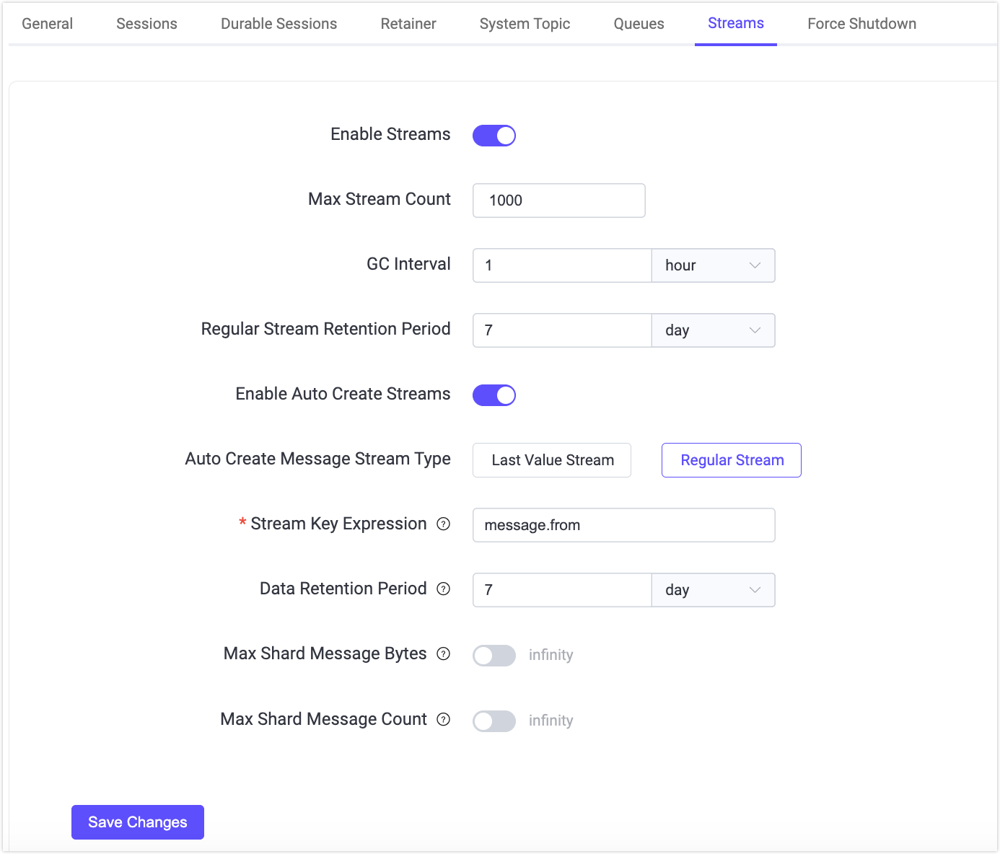
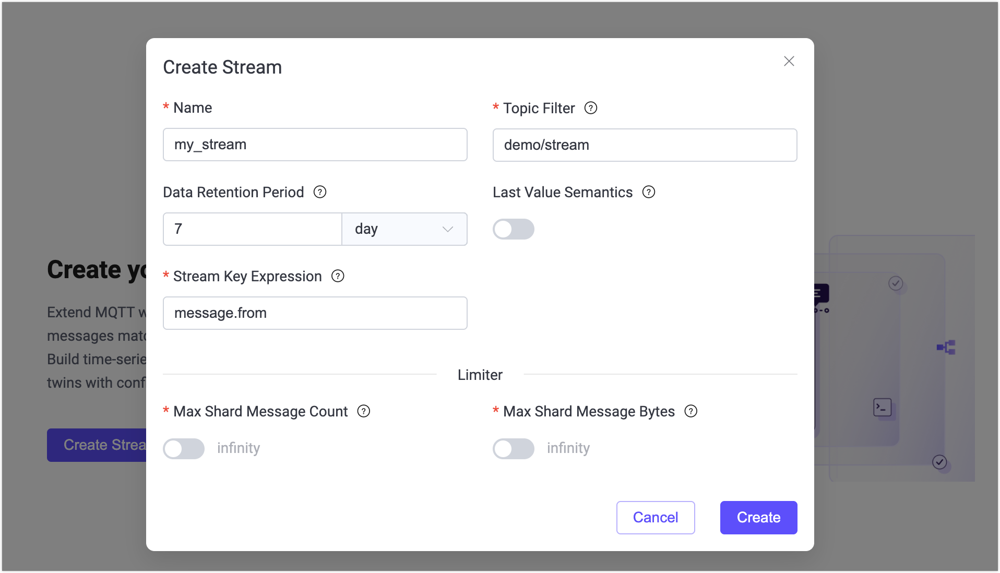

# MQTT Streams Quick Start

This page walks you through how to use the MQTT Streams feature in EMQX 6.1. You’ll use MQTTX to simulate clients, create and manage streams from the EMQX Dashboard, and experience how messages can be stored, replayed, and compacted.

## Objectives

This quick start demonstrates how EMQX MQTT Streams can:

- Persist messages independently of subscriber availability
- Support timestamp-based replay
- Enable Last-Value semantics for state-oriented messaging
- Automatically create streams on demand through `$stream/` subscriptions

## Prerequisites

Before starting, ensure you have:

- EMQX 6.1+ running
- [MQTTX](https://mqttx.app/) (or any MQTT 5.0-capable client)
- Access to the EMQX Dashboard (default: `http://localhost:18083`)

## Test MQTT Streams Basic Features (Regular Stream)

This section demonstrates how MQTT Streams stores messages and allows consumers to replay historical data.

### Prerequisite

Before starting, ensure that the MQTT Streams feature is enabled and that the auto-creation behavior will not interfere with this example.

1. Go to **Streams** in the left menu.

2. If Message Stream is disabled, click **Settings**. You will be redirected to the **Management** -> **MQTT Settings** -> **Streams** page.

3. Toggle the **Enable Streams** switch on.

4. Verify the auto-create settings to ensure a **Regular Stream** is used:

   - **Enable Auto Create Streams** is disabled, or

   - **Auto Create Stream Type** is set to **Regular Stream**.

   > This prevents the stream from being auto-created as a Last-Value Stream, which would retain only the most recent message per key.

4. If you make any changes, click **Save Changes** to apply them.

   

### Step 1: Create a Named Stream

1. Navigate to **Streams** in the left menu.

2. Click **Create Stream** on the page, or click **Create** in the upper-right corner.

3. In the **Create Stream** dialog, configure the following settings:
   - **Name**: `my_stream`
   - **Topic Filter**: `demo/stream`
   - **Last-Value Semantics**: Disabled
   - **Stream Key Expression**: `message.from`

   Leave all other options at their default value.

4. Click **Create**.

   

### Step 2: Publish Messages

Use MQTTX CLI to simulate a publisher client.

1. Ensure MQTTX CLI is installed. For more information, see [Installation](https://mqttx.app/docs/cli/downloading-and-installation).

2. Connect to EMQX:

   ```bash
   mqttx conn -h '118.31.55.229' -p 1883
   ```

3. Publish several messages to the topic `demo/stream` with QoS 1.

   Example commands:

   ```bash
   mqttx pub -t 'demo/stream' -h '118.31.55.229' -p 1883 -q 1 -m '{"value": 1}'
   mqttx pub -t 'demo/stream' -h '118.31.55.229' -p 1883 -q 1 -m '{"value": 2}'
   mqttx pub -t 'demo/stream' -h '118.31.55.229' -p 1883 -q 1 -m '{"value": 3}'
   ```

   Expected output:

   ```bash
   ✔ Connected
   ✔ Message published
   ```

Since this is a regular stream, all published messages are stored in the stream according to its retention policy.

### Step 3: Replay All Messages from the Stream

Now use MQTTX CLI to subscribe to the stream and replay messages from the beginning by setting the MQTT 5 subscription user property `stream-offset`.

```bash
mqttx sub -t \$stream/my_stream  -q 1  -h 118.31.55.229 -up "stream-offset: 0"
```

**Expected Behavior**:

You should receive all previously published messages in publish order:

```bash
topic: demo/stream, qos: 0, size: 10B, userProperties: [
  { key: 'key', value: 'mqttx_28c50267' },
  { key: 'ts', value: '1772161077594532' }
]
{"value": 1}

topic: demo/stream, qos: 0, size: 10B, userProperties: [
  { key: 'key', value: 'mqttx_1989d120' },
  { key: 'ts', value: '1772161084921509' }
]
{"value": 2}

topic: demo/stream, qos: 0, size: 10B, userProperties: [
  { key: 'key', value: 'mqttx_085ea00d' },
  { key: 'ts', value: '1772161094020511' }
]
{"value": 3}
```

This confirms that:

- The stream is a regular stream.
- The `stream-offset` subscription property works correctly.
- No messages were compacted or overwritten.

## Replay Messages from Different Positions

MQTT Streams allow consumers to control where message replay starts by specifying a `stream-offset` value when subscribing.

This example demonstrates how to replay only messages published after a specific point in time.

### Step 1: Get the Current Timestamp

Before publishing new messages, record the current Unix timestamp in microseconds.

You can obtain the current timestamp in milliseconds using:

- **Linux / macOS**:

  ```bash
  date +%s000
  ```

- **JavaScript**:

  ```javascript
  Date.now()
  ```

Example output:

```
1772162409000
```

Multiply this value by 1000 to get the microseconds. Save this value. It will be used as the replay starting position.

### Step 2: Publish New Messages

Publish more messages to the stream:

```bash
mqttx pub -t 'demo/stream' -h '118.31.55.229' -p 1883 -q 1 -m '{"value": 4}'
mqttx pub -t 'demo/stream' -h '118.31.55.229' -p 1883 -q 1 -m '{"value": 5}'
```

### Step 3: Replay from the Recorded Timestamp

Subscribe to the stream using the saved timestamp as the `stream-offset`:

```bash
mqttx sub -t \$stream/my_stream  -q 1  -h 118.31.55.229 -up "stream-offset: 1772162409000000"
```

**Expected Behavior**:

Only messages published **at or after** this time are delivered to the subscriber:

```bash
topic: demo/stream, qos: 1, size: 12B, userProperties: [
  { key: 'key', value: 'mqttx_a5508c54' },
  { key: 'ts', value: '1772163340159513' }
]
{"value": 4}

topic: demo/stream, qos: 1, size: 12B, userProperties: [
  { key: 'key', value: 'mqttx_e0848366' },
  { key: 'ts', value: '1772163350666523' }
]
{"value": 5}
```

Different consumers can independently replay the same stream from different positions:

- One consumer can replay from the beginning (`earliest`)
- Another can replay from a specific timestamp
- Another can receive only new messages (`latest`)

Each consumer’s replay position is independent and does not affect other subscribers.

This demonstrates consumer-controlled replay in MQTT Streams.

## Test Last-Value Semantics

This section demonstrates how Last-Value MQTT streams keep only the latest message per key, which is useful for representing state.

### Step 1: Delete the Existing Stream

1. Navigate to **Streams** in the Dashboard.
2. Locate the stream `my_stream`.
3. Click **Delete** and confirm.

### Step 2: Create a Last-Value Message Stream

1. Click **Create** on the **Streams** page.
2. Configure the following settings:
   - **Name**: `device_stream`
   - **Topic Filter**: `device/state`
   - **Data Retention Period**: `7` day
   - **Last-Value Semantics**: Enabled
   - **Stream Key Expression**: `message.from`
3. Click **Create**.

Since the key expression is `message.from`, the stream is now configured to retain only the latest message in streams with the same key.

### Step 3: Publish State Updates

Now publish messages from the same client ID `-i device-1`.

```bash
mqttx pub -t 'device/state' -h '118.31.55.229' -p 1883 -q 1 -i device-1 -m '{"status": "online"}'

mqttx pub -t 'device/state' -h '118.31.55.229' -p 1883 -q 1 -i device-1 -m '{"status": "offline"}'
```

Since the stream key expression is set to `message.from`, which extracts the client ID from the message metadata as the stream key, both messages share the same stream key. The second message overwrites the first.

### Step 4: Subscribe to the Stream

Now subscribe to the stream and replay from the earliest position:

```bash
mqttx sub -t '$stream/device_stream/device/state' -h '118.31.55.229' -p 1883 -q 1 -up "stream-offset: 0"
```

**Expected Behavior**:

Only the most recent message is delivered:

```bash
topic: device/state, qos: 1, size: 21B, userProperties: [
  { key: 'key', value: 'device-1' },
  { key: 'ts', value: '1772173666097076' }
]
{"status": "offline"}
```

This demonstrates how MQTT Streams support state-oriented messaging patterns using Last-Value semantics.

# Auto-Create Streams

MQTT Streams in EMQX can be automatically created when a client subscribes to a `$stream/`-prefixed topic. This allows streams to be provisioned dynamically without manually creating them in the Dashboard.

This section demonstrates how to enable and test auto-created streams.

1. Go to **Management** -> **MQTT Settings** -> **Streams** in the Dashboard.

2. Make sure that **Enable Auto Create Streams** is switched on.

3. Select the stream type:

   - **Regular Stream**
   - **Last-Value Stream**

   > Only one type can be active for auto-creation at a time.

4. Leave other options as the default.

5. Click **Save Changes**.

6. Subscribe to trigger auto-creation using the following command:

   ```bash
   mqttx sub -h 118.31.55.229 -p 1883 -q 1 -t '$stream/auto_stream/demo/auto' -up "stream-offset: earliest"
   ```

   Unlike manually created streams, auto-created streams require the topic filter (`demo/auto` in this example) in the subscription.

   If the stream does not already exist, EMQX will:

   - Create a new stream named `auto_stream`
   - Set its Topic Filter to `demo/auto`
   - Apply the configured auto-create type (Regular or Last-Value)

7. Verify the auto-creation in the **Streams** page of the Dashboard. You should see a new stream named "auto_stream" in the Streams list.

   

   
