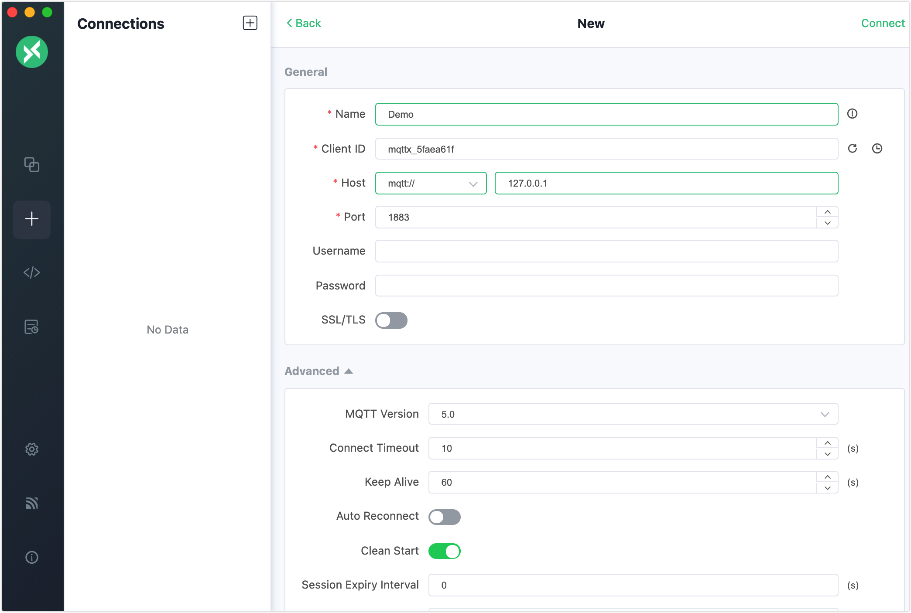
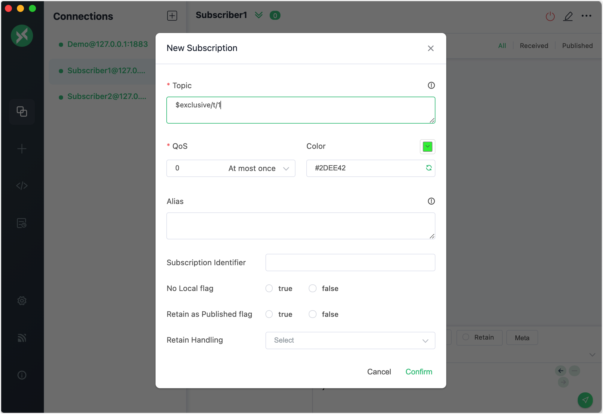

# Exclusive Subscription

Exclusive subscription is an extended MQTT feature supported by EMQX. It allows mutually exclusive subscriptions to topics. Only one subscriber is allowed to subscribe to a topic at a time. Other subscribers will not be able to subscribe to the corresponding topic until the current subscriber unsubscribe the subscription.

To make a subscription exclusive, you need to add a prefix to the topic heading. The table below show an example:

| Example | Prefix | Real Topic Name |
| --------------- | ----------- | ------------ |
| $exclusive/t/1 | $exclusive/ | t/1 |

When client **A** subscribes to `$exclusive/t/1`, other clients will fail to subscribe to `$exclusive/t/1` until **A** cancels the subscription to `$exclusive/t/1` .

::: tip Note

Exclusive subscriptions must be prefixed with `$exclusive/`, in the above example, other clients can still successfully subscribe via `t/1`.

:::

## Configure Exclusive Subscription in Dashboard

## Subscription Error Code

| Code | Reason                                                  |
| ---- | ------------------------------------------------------- |
| 0x8F | use `$exclusive/` without exclusive subscription enable |
| 0x97 | A client has already subscribed to this topic           |

## Try Exclusive Subscription with MQTT X Client

You can use the [MQTT X Client](https://mqttx.app/) and [MQTT X CLI](https://mqttx.app/cli) to test this messaging service in EMQX.

::: tip Prerequisite

- Basic publishing and subscribing operations using [MQTT X](./messaging/mqtt-publish-and-subscribe.md/#mqtt-x) 

:::

1. Start the MQTT X Client. Click the **New Connection** to create an MQTT connection named "Demo".

   ::: tip Tip

   For detailed instructions on creating an MQTT connection, see [MQTT X Client](./messaging/publish-and-subscribe.md/#mqtt-x-client).

   :::

   

2. Create another 2 MQTT connections. Configure them as "Subscriber1" and "Subscriber2" respectively.

3. Select the connection named "Subscriber1" in the **Connections** pane. Click the **New Subscription** button to create a subscription.  Type `$exclusive/t/1` in **Topic** textbox to subscribe to this topic. Click **Confirm**.

   

5. Select the connection named "Subscriber2" in the **Connections** pane. Click the **New Subscription** button to create a subscription.  Type `$exclusive/t/1` in **Topic** textbox to subscribe to this topic. Click **Confirm**.

   - An error message "" pops up.

   

6. 

