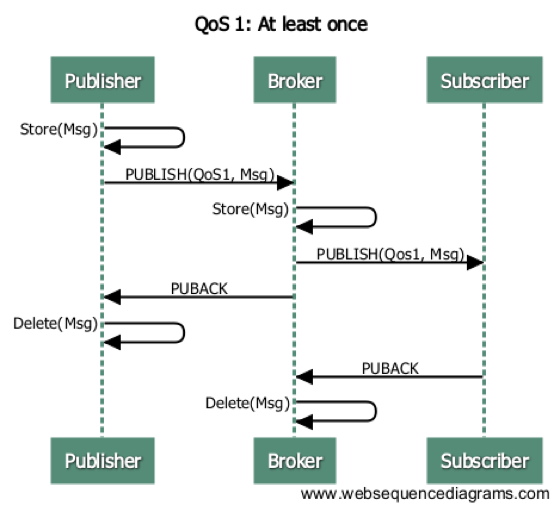

---
# 编写日期
date: 2020-02-07 17:15:26
# 作者 Github 名称
author: wivwiv
# 关键字
keywords:
# 描述
description:
# 分类
category: 
# 引用
ref: 
---

# MQTT Protocol Overview

MQTT is a lightweight publish-subscribe pattern message transport protocol specifically designed for IoT applications in low-bandwidth and unreliable network environments.

MQTT Official Website: [http://mqtt.org](http://mqtt.org/)

MQTT v3.1.1 Protocol Specification: http://docs.oasis-open.org/mqtt/mqtt/v3.1.1/os/mqtt-v3.1.1-os.html

MQTT v5.0 Protocol Specification: https://docs.oasis-open.org/mqtt/mqtt/v5.0/mqtt-v5.0.html

## Features

- Open messaging protocol, easy to implement
- Publish-subscribe pattern for one-to-many message publishing
- Based on TCP/IP network connections
- 1-byte fixed header, 2-byte keep-alive message, compact message structure
- Message Quality of Service (QoS) support for reliable message delivery

## Applications

MQTT protocol is widely used in various domains, including IoT, mobile internet, smart hardware, connected vehicles, and power and energy industries.

- IoT M2M communication and IoT data collection
- Android and web-based message push
- Mobile instant messaging (e.g., Facebook Messenger)
- Smart devices, home automation, and appliances
- Vehicle-to-vehicle communication and electric vehicle charging stations
- Smart cities, remote healthcare, and remote education
- Power, petroleum, and energy sectors

## MQTT Message Routing Based on Topics

MQTT protocol relies on topics for message routing. Topics resemble URL paths, such as:

```bash
chat/room/1
sensor/10/temperature
sensor/+/temperature
$SYS/broker/metrics/packets/received
$SYS/broker/metrics/#
```

Topics are divided into levels using `/`, and they support two wildcards:

- `+`: Matches one level, e.g., a/+, matches a/x, a/y
- `#`: Matches multiple levels, e.g., a/#, matches a/x, a/b/c/d

Subscribers and publishers communicate using topic-routed messages. For instance, using the mosquitto command-line tool to publish and subscribe:

```bash
mosquitto_sub -t a/b/+ -q 1
mosquitto_pub -t a/b/c -m hello -q 1
```

Subscribers can subscribe to topics with wildcards, but publishers are not allowed to publish to topics with wildcards.

## MQTT V3.1.1 Protocol Messages

### Message Structure

- Fixed Header
- Variable Header
- Message Payload

### Fixed Header

```
luaCopy code
+----------+-----+-----+-----+-----+-----+-----+-----+-----+
| Bit      |  7  |  6  |  5  |  4  |  3  |  2  |  1  |  0  |
+----------+-----+-----+-----+-----+-----+-----+-----+-----+
| byte1    |   MQTT Packet type    |         Flags         |
+----------+-----------------------+-----------------------+
| byte2... |   Remaining Length                            |
+----------+-----------------------------------------------+
```

### Message Types

| Type Name   | Type Value | Message Description         |
| ----------- | ---------- | --------------------------- |
| CONNECT     | 1          | Initiate connection         |
| CONNACK     | 2          | Connection acknowledgment   |
| PUBLISH     | 3          | Publish message             |
| PUBACK      | 4          | Publish acknowledgment      |
| PUBREC      | 5          | QoS2 message acknowledgment |
| PUBREL      | 6          | QoS2 message release        |
| PUBCOMP     | 7          | QoS2 message completion     |
| SUBSCRIBE   | 8          | Subscribe to topics         |
| SUBACK      | 9          | Subscribe acknowledgment    |
| UNSUBSCRIBE | 10         | Unsubscribe from topics     |
| UNSUBACK    | 11         | Unsubscribe acknowledgment  |
| PINGREQ     | 12         | PING request                |
| PINGRESP    | 13         | PING response               |
| DISCONNECT  | 14         | Disconnect                  |

### PUBLISH - Publish Message

The PUBLISH message carries bidirectional published messages between the client and server. PUBACK message is used for the acknowledgment of QoS1 messages, and PUBREC/PUBREL/PUBCOMP messages are used for QoS2 message flow.

### PINGREQ/PINGRESP - Heartbeat

Clients send PINGREQ heartbeat messages to the server at regular intervals when no messages are being sent. The server responds with a PINGRESP message. Both PINGREQ and PINGRESP messages are 2 bytes in size.

## MQTT Message QoS

MQTT message QoS guarantees are not end-to-end but exist between the client and the server. The QoS level received by a subscriber depends on both the QoS of the published message and the QoS of the subscribed topic.

| Published Message QoS | Subscribed Topic QoS | Received Message QoS |
| --------------------- | -------------------- | -------------------- |
| 0                     | 0                    | 0                    |
| 0                     | 1                    | 0                    |
| 0                     | 2                    | 0                    |
| 1                     | 0                    | 0                    |
| 1                     | 1                    | 1                    |
| 1                     | 2                    | 1                    |
| 2                     | 0                    | 0                    |
| 2                     | 1                    | 1                    |
| 2                     | 2                    | 2                    |

### QoS0 Message Publish-Subscribe


### QoS1 Message Publish-Subscribe



### QoS2 Message Publish-Subscribe


## MQTT Session (Clean Session)

When a MQTT client initiates a CONNECT request to the server, it can set up a session using the `Clean Session` flag.

`Clean Session` set to 0 means creating a persistent session, where the session persists and offline messages are saved even when the client disconnects until a session timeout occurs.

`Clean Session` set to 1 means creating a new temporary session, which is automatically destroyed when the client disconnects.

## MQTT Connection Keep-Alive Heartbeat

When a MQTT client sends a CONNECT request to the server, it sets the keep-alive period using the KeepAlive parameter.

If the client doesn't send any messages within the keep-alive period, it periodically sends a 2-byte PINGREQ heartbeat message. The server responds with a 2-byte PINGRESP message.

If the server doesn't receive any publish-subscribe messages or PINGREQ heartbeat messages from the client within 1.5 times the keep-alive period, it proactively disconnects the client's TCP connection due to a heartbeat timeout.

The EMQX message server defaults to a maximum of 2.5 times the keep-alive period for timeouts.

## MQTT Last Will Message

When a MQTT client sends a CONNECT request to the server, it can set a Will flag and specify the Will Message topic and payload.

If a MQTT client goes offline unexpectedly (without sending a DISCONNECT message), the MQTT message server publishes the Will Message.

## MQTT Retained Message

When a MQTT client publishes a message to the server (PUBLISH), it can set the RETAIN flag. A retained message is stored on the message server and is still delivered to later subscribers of the topic.

For example, using the mosquitto command-line tool to publish a retained message to the `a/b/c` topic:

```bash
mosquitto_pub -r -q 1 -t a/b/c -m 'hello'
```

Subsequent MQTT clients connecting and subscribing to the `a/b/c` topic will still receive this message:

```bash
$ mosquitto_sub -t a/b/c -q 1
hello
```

Retained messages can be cleared in two ways:

1. The client publishes an empty message to a topic with a RETAIN flag:

```bash
mosquitto_pub -r -q 1 -t a/b/c -m ''
```

2. The message server sets a retention expiry time for the retained message.

## MQTT WebSocket Connection

In addition to supporting TCP transport, MQTT protocol also supports WebSocket as a transport layer. WebSocket allows browsers to connect directly to MQTT message servers, enabling publish-subscribe communication with other MQTT clients.

For MQTT protocol over WebSocket connections, binary mode must be used, along with the following subprotocol header:

```
Sec-WebSocket-Protocol: mqttv3.1 or mqttv3.1.1
```

## MQTT vs. XMPP Protocol Comparison

In the realm of mobile internet and IoT messaging, MQTT protocol, known for its simplicity and flexibility in routing, is set to replace the PC-era Extensible Messaging and Presence Protocol (XMPP) protocol in following ways:

- MQTT employs a 1-byte fixed header and 2-byte keep-alive message, resulting in smaller and easier-to-parse message structures compared to XMPP, which relies on heavy XML for message encoding.
- MQTT utilizes topic-based publish-subscribe message routing, offering more flexibility than XMPP's JID-based point-to-point routing.
- MQTT does not define message content formats, making it versatile for carrying various types of payloads like JSON and binary data. In contrast, XMPP relies on XML for message content, requiring additional processing such as Base64 encoding for binary data.
- MQTT supports message acknowledgment and QoS guarantees, while XMPP's core protocol lacks similar mechanisms, providing MQTT with better message reliability.

