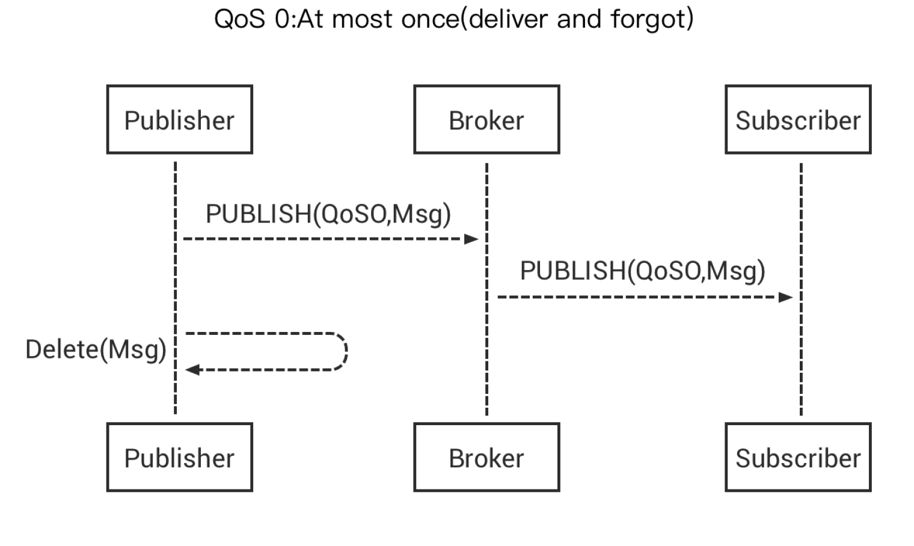
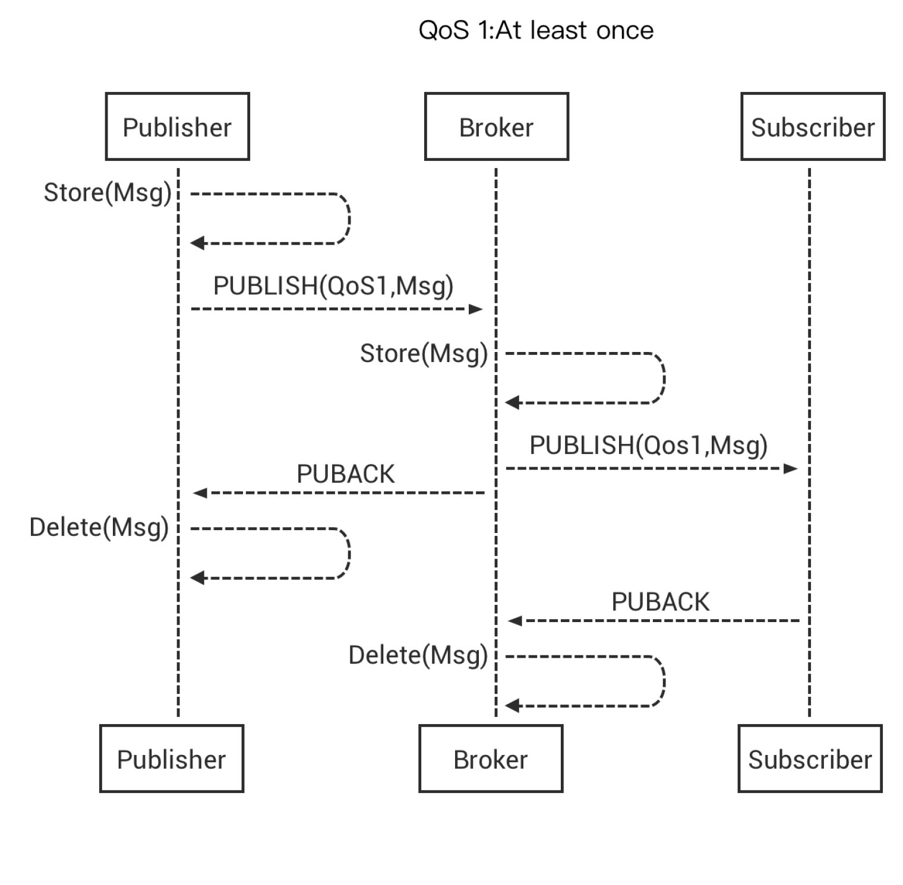
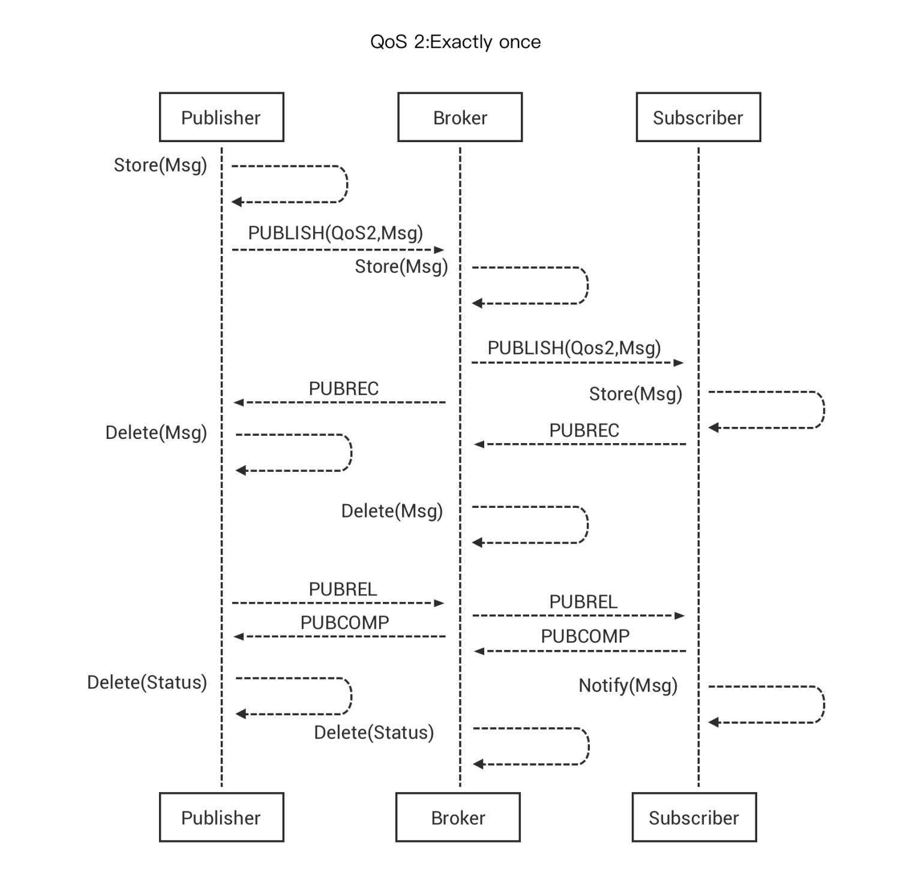

# MQTT QoS
In MQTT protocol, Quality of Service (QoS) ensures the reliability of message delivery under different network conditions. The design of QoS is the focus of the MQTT protocol.

## QoS0 - At Most Once (Not Guaranteed)

## QoS1 Once - At Least Once (Guaranteed)

## QoS 2 Exactly Once (Guaranteed)

## Select the Applicable QoS

In MQTT, the message publishing QoS is about the communication between the client and broker, rather than from end to end. The QoS level of the message that the subscriber receives depends on that of the message published and that of the topic subscribed.

| QoS (published message) | QoS (subscribed topic) | QoS (received message) |
| ----------------------- | ---------------------- | ---------------------- |
| 0                       | 0                      | 0                      |
| 0                       | 1                      | 0                      |
| 0                       | 2                      | 0                      |
| 1                       | 0                      | 0                      |
| 1                       | 1                      | 1                      |
| 1                       | 2                      | 1                      |
| 2                       | 0                      | 0                      |
| 2                       | 1                      | 1                      |
| 2                       | 2                      | 2                      |

::: tip

For more information, you may read [*Introduction to MQTT QoS (Quality of Service)*](https://www.emqx.com/en/blog/introduction-to-mqtt-qos).

:::
