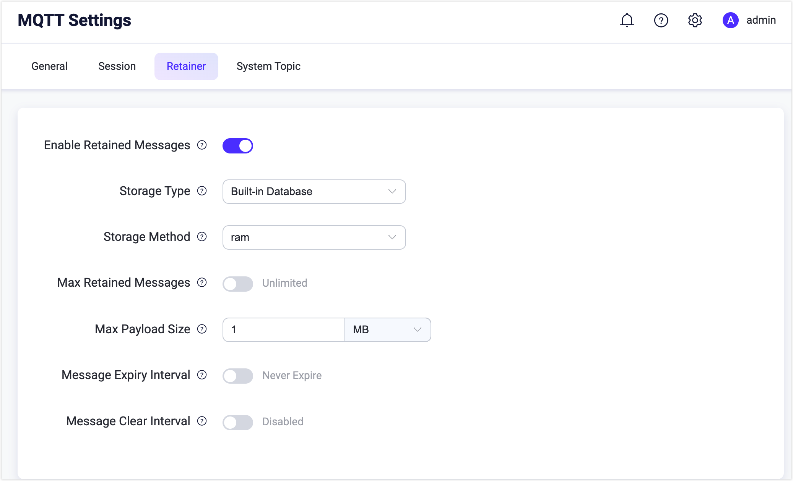

# Retained Messages

## Introduction

When the broker receives a PUBLISH packet with a Retain flag of 1, it will treat the message as a retained message.
In addition to being normally forwarded, the retained message will be stored on the server.
There can only be one (and only one) retained message under each topic.
Therefore, if there is already a retained message of the same topic, the previously retained message is replaced with the new one.

When a client establishes a subscription, and there are retained messages with matching topics in the broker,
these retained messages will be sent to the client immediately.

With retained messages, new subscribers can immediately get the latest status without waiting for an undetermined amount of time,
which is very important in many scenarios. For instance sensors may only publish readings every few minutes, but the
subscribers may need get the latest reading immediately after subscribed, without having to wait for the next publish.

EMQX enables the capability and service of retain messages by default. You can modify `mqtt.retain_available` to `false` in `etc/emqx.conf` to disable the ability to retain messages.
In this way, the client will be prohibited from sending PUBLISH packets with the Retain flag set to 1. Otherwise, the client will receive a DISCONNECT packet with a reason code of 0x9A (Retain not supported).

The service stores and manages retained messages sent by clients and sends them to the corresponding subscribers.

## Quick Start 

### Setup

Open the Dashboard, select the `MQTT` item in the `Configuration`, and then select the `Settings` in the `Retainer` page.



## Configuration

| Configuration item       | Type  | Optional value      | Default value | Description                                               |
| ------------------------------ | -------- | ------------------------ | ------ | ------------------------------------------------------------ |
| Storage         | enum     | `ram`, `disc` | ram |ram: only stored in memory; <br /> disc: stored in memory and hard disk. |
| Max Retained Messages | integer  | \>= 0                    | 0      | The maximum number of retained messages, and 0 means no limit. After the number of retained messages exceeds the maximum limit, you can replace the existing retained messages, but cannot store retained messages for new topics. |
| Max Payload Size      | bytesize |                          | 1MB    | Retain the maximum Payload value of the message. After the Payload value exceeds the maximum value, the EMQX broker will treat the retained reserved message as a normal message. |
| Expire       | duration |                          | 0    | The expiration time of retaining message, and 0 means never expire. If the message expiration interval is set in the PUBLISH packet, the message expiration interval in the PUBLISH packet shall prevail. |
| Clean Interval  | duration |                          | 0    | Interval to clean up expired messages. |


## Flow Control

The message read and deliver rate can be controlled.

When a client subscribes to a wildcard topic, it may match a large number of topics having messages retained.
Without flow control, the all matched messages will be copied into the subscriber's process memory space,
this may cause the subscriber Erlang process (the actor) to allocate excessive amount of RAM and risk at
shutdown forced by the `force_shutdown` policy.

To make it less aggressive, `retainer.flow_control` settings can be used, e.g:

```
# Each session subscribed to retain messages will load 10 messages and deliver 10 messages at each time, the total delivery rate of all these sessions is limited to 100/s, and the dispatch rate of each worker process in the retained module is limited to 20/s (in most cases, it is not necessary to configure the client level)
retainer {
  enable = true
  flow_control {
    batch_read_number = 10
    batch_read_deliver = 10
    batch_read_limiter {
      rate = "100/s"
      capacity = 100
      client {
        rate = "20/s"
        capacity = 20
      }
    }
  }
}
```

Configuration Options:

| Options               | Type    | Default   | Description                                               |
|:----------------------|:--------|:----------|:----------------------------------------------------------|
| batch_read_number     | int     | 0         | number of messages to read each time (0 means all)        |
| batch_deliver_number  | int     | 0         | number of messages to deliver each time (0 means all)     |
| batch_deliver_limiter | limiter | undefined | message delivery rate limiter                             |

For detailed settings of rate limiter, please see the `Listener Level` and `Connection Level` in [Hierarchical Rate Limiter](../reliability/rate-limit.md)
