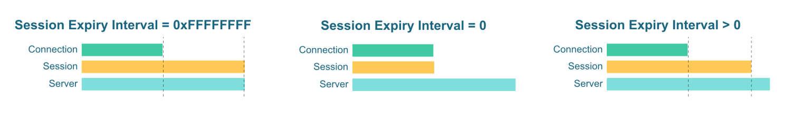

# Session and Message Expiration
## MQTT session

According to the MQTT protocol, messages of QoS 1 and QoS 2 will first be stored on the client and the broker, and will not be deleted until it is confirmed that the message is successfully delivered to the subscriber. This process, where the Broker needs to associate the state with the client, is called a session state. Session state is composed of the message storage and subscription information (a topic list that the client subscribes to). 

When there is a session in the Broker, messages will be continuously published to the session. But when the corresponding client is disconnected or lacks the message processing capability, messages will be accumulated in the session.

Session state at the client side includes:

- QoS 1 and QoS 2 messages have already been published to the broker, but have not been confirmed yet
- QoS 2 messages already published by the broker have already been received, but have not been confirmed yet

Session state at the broker side includes:

- Existence of the session, even if the session is empty
- Subscription information of the clients
- QoS 1 and QoS 2 messages have already been published to the client, but have not been confirmed yet
- QoS 0 (optional), QoS 1, and QoS 2 messages to be published to the client 
- QoS 2 messages received from the client but not confirmed yet, Will Message, and Will Delay Interval

<!-- TODO 补充链接：
For advanced EMQX session design guide, you may refer to:

- EMQX session design: Message publish flow, low-level message sequence, message ID, and message ID format design
- Message queue and flight window: store part of session data, session length, and message discard decision mechanism.
- Message queue and inflight window: for storing some of the session data, specify the session length and message discard mechanism
- Priority design
-->

## MQTT persistent sessions

To minimize the impact of network disconnection on communications, the MQTT protocol provides a persistent session function. You can set whether to enable persistent sessions with Clean Session (MQTT v3.1.1) or Clean Start + session expiration interval (MQTT v5.0) of the client. 

With persistent session enabled, **during the session validity period**, the session from the client with the same ClientID can still be maintained even if the client is disconnected multiple times, which can:

- Avoid additional overhead brought by repeated subscription needs due to network outages. 
- Avoid missing messages during offline periods.
- Ensure that QoS 1 and QoS 2 messages will not be affected by network outages.

MQTT 3.1.1 does not give the option to specify when a Persistent Session will expire. But considering the resource consumed by sessions, EMQX offers a global configuration item for the session expiration duration, and the relation between session lifecycle and Clean Session is as follows:

MQTT 5.0 gives the option to use Clean Start and Session Expiry Interval to decide whether to enable session persistence and session expiration time. The relationship between the session life cycle and the two is as follows:

In the current version, EMQX's persistent session is based on memory, which can bring better performance in throughput and message latency. This also means that session data may be lost when EMQX is restarted or is unexpectedly shut down, which will have a certain impact on data reliability.

EMQX Enterprise Edition provides a data persistence solution with external databases. Users with a higher requirement for data reliability can choose the Enterprise Edition. In the upcoming versions, EMQX will also provide a disk-based session persistence  capability.

::: tip

For more information, please read:

- [*MQTT Persistent Session and Clean Session Explained*](https://www.emqx.com/en/blog/mqtt-session)
- [*Clean Start and Session Expiry Interval - MQTT 5.0 new features*](https://www.emqx.com/en/blog/mqtt5-new-feature-clean-start-and-session-expiry-interval)

:::
