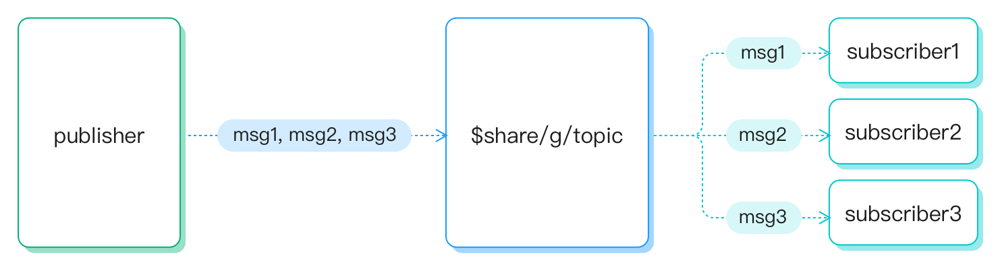

# Shared Subscription

Shared subscription is a subscription mode to implement load balancing among multiple subscribers. EMQX has supported shared subscriptions since MQTT 3.1.1, and now it has become part of the MQTT 5.0 protocol.  

Use cases: 

1. In cluster mode: If the node where the subscriber is located malfunctions, the publisher's messages will be lost (QoS 0 messages) or accumulated in the node (QoS 1 and QoS 2 messages). Though we can solve this problem by adding subscription nodes, this may affect the performance with lots of repeated messages and increase the complexity of the business.
2. When the publisher's production capacity is strong, the subscriber's consumption capacity may not be able to keep up in time. In this case, we have to rely on the load-balancing capability of the subscriber, which again increases the development cost.

## Mechanism

We can add a `$share` prefix to the original topic to enable shared subscriptions for a group of subscribers.



In the above diagram, three subscribers subscribe to the same topic `$share/g/topic` using a shared subscription method,
where ` topic` is the real topic name they subscribed to, and `$share/g/` is a shared subscription prefix.

| Example         | Prefix      | Topic Name |
| --------------- | ----------- | ---------- |
| $share/abc/t/1  | $share/abc/ | t/1        |

## Shared subscriptions in group

Shared subscriptions prefixed with `$share/<group-name>` are shared subscriptions with groups.
The group name can be any string.
Subscribers who belong to the same group will receive messages with load balancing,
but EMQX will broadcast messages to different groups at the same time.

For example, if subscribers `s1`, `s2`, and `s3` are members of group `g1`, subscribers `s4` and `s5` are members of group `g2`, and all subscribers subscribe to topic `t1`.
When EMQX publishes a message `msg1` to topic `t1`:

- EMQX will send `msg1` to both groups `g1` and `g2`
- Only one of `s1`, `s2`, `s3` will receive `msg1`
- Only one of `s4` and `s5` will receive `msg1`


## Load Balancing Policy and Dispatch ACK Configuration

In MQTT specification, balancing strategy is not covered.
EMQX supports a few different balancing strategies with the help from configuration.

Balancing strategies can be specified globally or per-group.

- Global strategy can be set in `broker.shared_subscription_strategy` configuration.
- Configure `broker.shared_subscription_group.$group_name.strategy` for per-group strategy

```txt
# etc/emqx.conf

# Load Balance
broker.shared_subscription_strategy = random

# When the client is offline, or the message level is QoS1 or QoS2, and the device does not reply to the ACK for any reason, the message will send to the other devices in the group.
broker.shared_dispatch_ack_enabled = false
```

| Load Balance | Description                                 |
| :----------  | :------------------------------------------ |
| random       | Random selection among all subscribers      |
| round_robin  | In order of subscription                    |
| sticky       | Always send to the last selected subscriber |
| hash         | Hash by publisher ClientID                  |

### Discussion on message loss

EMQX sends messages to subscribers' sessions.

When session is persisted (clean_session=false) the subscriber can recover the data stream
right after reconnecting without losing messages.

This is a bit contradicting with the 'load balancing' idea, since often when shared subscription
is in use, if a subscriber is offline, the other subscribers in the group are expected to take
over the data stream. Otherwise if the subscriber is offline for long enough the session
message buffer will eventually overflow and result in message loss.

Due to the above reasons, persisted sessions are usually not common for shared subscribers, but you can still use it. 

The configuration `broker.shared_dispatch_ack_enabled` is introduced to improve
load sharing in case of persisted sessions. When set to `true`, EMQX will try to dispatch messages to other members in the group if one is offline.

More on exceptional flows.

- Once a message is dispatched to a subscriber session, the message will stay in the session
  buffer, will be not re-dispatched immediately.
- The pending messages in a session are re-dispatched to other members of the group when
  a session terminates.
- When all members are offline, the message is dispatched to the configured strategy
- When there is no live session in a shared group, the message is discarded

::: tip

For more information, you may read: 

- [*Shared subscription - MQTT 5.0 new features*](https://www.emqx.com/en/blog/introduction-to-mqtt5-protocol-shared-subscription)

:::
