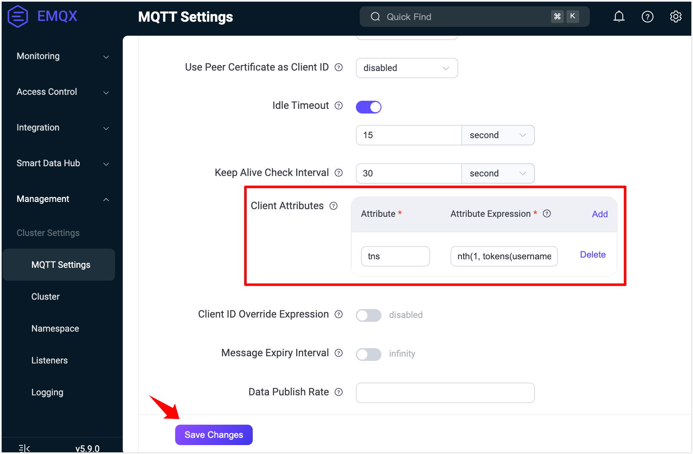
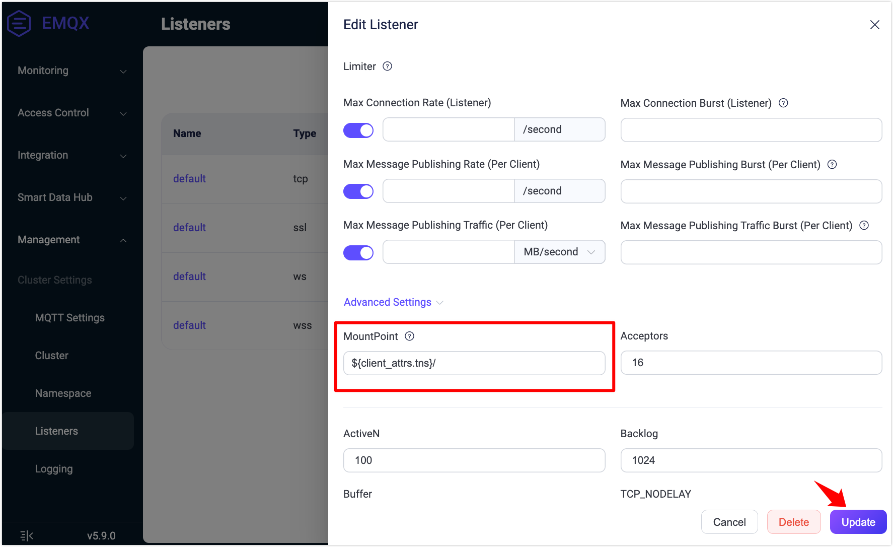

# Quick Start: Experience Namespaces

This section guides you through using the [MQTTX client](https://mqttx.app) to connect to EMQX and quickly experience the core capabilities of the namespace feature: tenant identification, client isolation, and topic isolation.

## Enable the `tns` Attribute for Namespace Identification

1. First, configure a client attribute in `emqx.conf` to extract the namespace (tenant identifier) from the username:

   ```
   mqtt.client_attrs_init = [{expression = "nth(1, tokens(username, '-'))", set_as_attr = tns}]
   ```

   > Example: If a client connects with the username `tenantA-user1`, EMQX will extract `tenantA` as the namespace (`tns`).

   Alternatively, you can configure this in the Dashboard:

   

2. Create an MQTT client connection using MQTTX, simulating tenant `tenantA`, and set the username to `tenantA-user1`. Connect the client to EMQX.

3. Go to the **Namespace** page in the Dashboard and disable the **View Explicitly Created Namespace Only** toggle. You should see the automatically created namespace `tenantA`.

   Click **Clients** in the **Actions** column to view the client connected to this namespace.

   

## Configure and Verify Namespace Isolation

1. To isolate client IDs and topics between namespaces, add the following configuration to `emqx.conf`:

   ```
   mqtt.clientid_override = "concat([client_attrs.tns, '-', clientid])"
   listener.tcp.default.mountpoint = "${client_attrs.tns}/"
   ```

   This configuration will:

   - Automatically prepend the tenant prefix to the client ID to avoid conflicts.
   - Automatically prepend the namespace prefix to topic names for topic-level isolation between tenants.

   You can also set this up in the Dashboard:

   
   
   

2. Use MQTTX to create two MQTT client connections to simulate two tenants: `tenantA` and `tenantB`.

   **Client A (Tenant: tenantA)**:

   | Parameter | Value           |
   | --------- | --------------- |
   | Client ID | `client1`       |
   | Username  | `tenantA-user1` |
   | Subscribe | `test/topic`    |

   **Client B (Tenant: tenantB)**:

   | Parameter | Value           |
   | --------- | --------------- |
   | Client ID | `client1`       |
   | Username  | `tenantB-user2` |
   | Publish   | `test/topic`    |

3. Use Client B to publish a message. Verify the result in MQTTX and the EMQX Dashboard:

   - Although both clients use the same client ID (`client1`), due to the prefix rule, they connect as `tenantA-client1` and `tenantB-client1`, avoiding conflicts.
   - Even though both clients use the same topic (`test/topic`), Client A will **not receive** messages published by Client B because they are isolated by namespace.
   - In the **Monitoring** -> **Clients** page:
     - Client A's subscribed topic appears as `tenantA/test/topic`.
     - Client B's published topic appears as `tenantB/test/topic`.