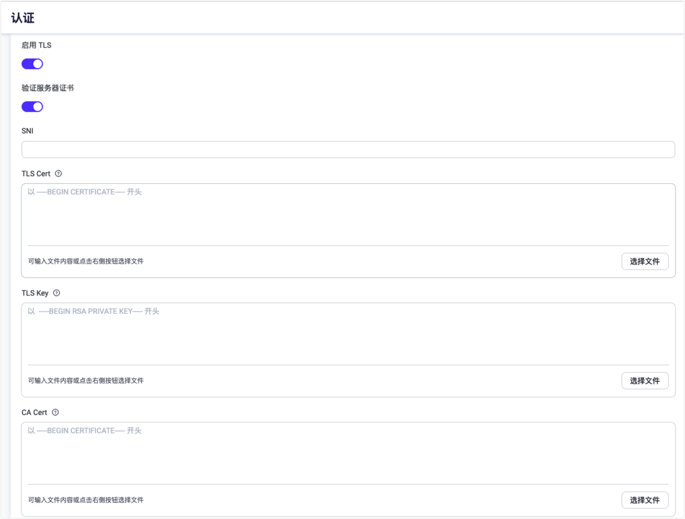

# SSL/TLS

When accepting a MQTT Client or connecting to external resources like a database,
EMQX can establish secure connections via SSL/TLS.

## SSL Listener for MQTT

### TLS Authentication

To enable TLS authentication for clients, one may add an `ssl` listener
and set its `ssl_options.verify` option to `verify_peer`.

The default `ssl` MQTT listener runs on the 8883 port:

```
listeners.ssl.default {
  bind = "0.0.0.0:8883"

  access_rules = [
    "allow all"
  ]

  proxy_protocol = false
  proxy_protocol_timeout = 3s

  ssl_options.keyfile = "etc/certs/key.pem"
  ssl_options.certfile = "etc/certs/cert.pem"
  ssl_options.cacertfile = "etc/certs/cacert.pem"

  # to verify client certs
  ssl_options.verify = verify_peer

  ssl_options.versions = ["tlsv1.3", "tlsv1.2", "tlsv1.1", "tlsv1"]
  tcp_options.backlog = 1024
  tcp_options.buffer = 4KB
}
```

::: tip
The `key.pem`,` cert.pem`, and `cacert.pem` under the default directory of `etc/certs` are self-signed certificates generated by EMQX Broker. Therefore, when testing with a client that supports TLS, you need to configure the above CA certificate `etc/certs/cacert.pem` to the client.
:::

::: warning
For production use, securely issued certificates must be used.
:::

### PSK Authentication

To enable PSK authentication, one should enable `psk_authentication` section in `emqx.conf`:

```
psk_authentication {
    ## Whether to enable the PSK feature.
    enable = true

    ## If init file is specified, emqx will import PSKs from the file
    ## into the built-in database at startup for use by the runtime.
    ##
    ## The file has to be structured line-by-line, each line must be in
    ## the format: <PSKIdentity>:<SharedSecret>
    init_file = "data/init.psk"

    ## Specifies the separator for PSKIdentity and SharedSecret in the init file.
    ## The default is colon (:)
    separator = ":"

    ## The size of each chunk used to import to the built-in database from psk file
    ## chunk_size = 50
}
```

File with psk identities and keys (`data/init.psk`) should be created:

```
myclient1:8c701116e9127c57a99d5563709af3deaca75563e2c4dd0865701ae839fb6d79
myclient2:d1e617d3b963757bfc21dad3fea169716c3a2f053f23decaea5cdfaabd04bfc4
```

`ssl` listener should be configured to use PSK ciphers:

```
listeners.ssl.default {
  ...
  ssl_options.versions = ["tlsv1.2"]
  ssl_options.ciphers = "PSK-AES256-GCM-SHA384,PSK-AES128-GCM-SHA256,PSK-AES256-CBC-SHA384,PSK-AES256-CBC-SHA,PSK-AES128-CBC-SHA256,PSK-AES128-CBC-SHA,RSA-PSK-AES256-GCM-SHA384,RSA-PSK-AES256-CBC-SHA384,RSA-PSK-AES128-GCM-SHA256,RSA-PSK-AES128-CBC-SHA256,RSA-PSK-AES256-CBC-SHA,RSA-PSK-AES128-CBC-SHA,RSA-PSK-RC4-SHA"
  ...
}

```

**Notice**:

If the `RSA-PSK` cipher suites are used, the `RSA` certificate is still required, see [RFC4279](https://www.rfc-editor.org/rfc/rfc4279#section-4) for details.


## SSL Client for external resources

Apart from allowing to receive a two-way SSL MQTT client, EMQX also provides access to external resources via SSL.

For example, to access a web server via HTTPS:



When creating any connection to an external resource, you can choose to enable TLS and configure its SSL certificate. As shown above:

- When **TLS Verify** is enabled, the **CA Cert** field must be filled in to verify the legitimacy of the server certificate.
- When the server needs to verify the client certificate, then **TLS Cert** and **TLS Key** must be filled in.
- **SNI** meanings Server Name Indication, indicates whether the server domain name and certificate are verified to be the same; A null value means no validation.

In addition, it is also can be configured in the `emqx.conf`:

```
authentication {
  url = "https://127.0.0.1:8080"
  backend = "http"

  ...

  ssl {
    enable = true
    cacertfile = "etc/certs/cacert.pem"
    certfile = "etc/certs/cert.pem"
    keyfile = "etc/certs/key.pem"
    ## `verify_peer` means turn on verification for server certificate
    verify = verify_peer
  }
}
```

## SSL Options

Complete SSL listener option refer to: [broker:listener_ssl_opts](../admin/cfg.md#broker-listener-ssl-opts)
SSL Client options can refer to: [broker:ssl_client_opts](../admin/cfg.md#broker-ssl-client-opts)

### Ciphers

As a SSL listener or SSL client, the ciphers can be configured by the following suites:

```
# TLS 1.3:
TLS_AES_256_GCM_SHA384
TLS_AES_128_GCM_SHA256
TLS_CHACHA20_POLY1305_SHA256
TLS_AES_128_CCM_SHA256
TLS_AES_128_CCM_8_SHA256

# TLS 1.2 and below:
ECDHE-ECDSA-AES256-GCM-SHA384
ECDHE-RSA-AES256-GCM-SHA384
ECDHE-ECDSA-AES256-SHA384
ECDHE-RSA-AES256-SHA384
ECDH-ECDSA-AES256-GCM-SHA384
ECDH-RSA-AES256-GCM-SHA384
ECDH-ECDSA-AES256-SHA384
ECDH-RSA-AES256-SHA384
DHE-DSS-AES256-GCM-SHA384
DHE-DSS-AES256-SHA256
AES256-GCM-SHA384
AES256-SHA256
ECDHE-ECDSA-AES128-GCM-SHA256
ECDHE-RSA-AES128-GCM-SHA256
ECDHE-ECDSA-AES128-SHA256
ECDHE-RSA-AES128-SHA256
ECDH-ECDSA-AES128-GCM-SHA256
ECDH-RSA-AES128-GCM-SHA256
ECDH-ECDSA-AES128-SHA256
ECDH-RSA-AES128-SHA256
DHE-DSS-AES128-GCM-SHA256
DHE-DSS-AES128-SHA256
AES128-GCM-SHA256
AES128-SHA256
ECDHE-ECDSA-AES256-SHA
ECDHE-RSA-AES256-SHA
DHE-DSS-AES256-SHA
ECDH-ECDSA-AES256-SHA
ECDH-RSA-AES256-SHA
ECDHE-ECDSA-AES128-SHA
ECDHE-RSA-AES128-SHA
DHE-DSS-AES128-SHA
ECDH-ECDSA-AES128-SHA
ECDH-RSA-AES128-SHA

# PSK ciphers:
RSA-PSK-AES256-GCM-SHA384
RSA-PSK-AES256-CBC-SHA384
RSA-PSK-AES128-GCM-SHA256
RSA-PSK-AES128-CBC-SHA256
RSA-PSK-AES256-CBC-SHA
RSA-PSK-AES128-CBC-SHA
```
