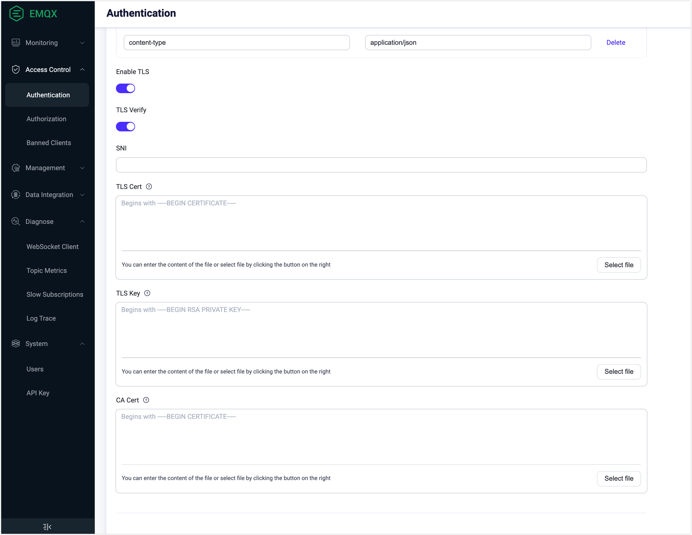

# Enable SSL/TLS Connection

EMQX can establish secure connections via SSL/TLS when accepting the access of an MQTT Client or connecting to external resources such as a database. It provides comprehensive SSL/TLS capability support, including support for one-way/two-way authentication, and X.509 certificate authentication. You can enable SSL/TLS encrypted connections for all connections, including MQTT, to ensure the security of access and message transmission.

For client SSL/TLS connections, you can choose one of the following two modes based on your usage scenario:

| Usage Mode                                                   | Advantages                                                   | Disadvantages                                                |
| ------------------------------------------------------------ | ------------------------------------------------------------ | ------------------------------------------------------------ |
| Directly establish SSL/TLS connection between the client and EMQX. | Easy to use, no additional components required               | It will increase EMQX's resource consumption, and if the number of connections is huge, it may lead to high CPU and memory consumption. |
| Terminate TLS connection through a proxy or load balancer.   | No impact on EMQX performance, and provides load balancing capabilities. | Only a few cloud vendors' load balancers support TCP SSL/TLS termination. In addition, users need to deploy software such as HAProxy themselves. |

This chapter introduces how to directly establish an SSL/TLS connection between the client and EMQX. For information on how to terminate TLS connections through a proxy or load balancer, please refer to [Cluster Load Balancing](../deploy/cluster/lb.md).

## Safety Benefits

Enabling SSL/TLS connection provides the following safety benefits.

1. **Strong Authentication**: Both communicating parties will mutually verify each other's identities, such as by checking the X.509 digital certificate held by the other party. These types of digital certificates are usually issued by trusted Certificate Authorities (CAs) and cannot be forged.
2. **Confidentiality**: Each session will be encrypted using the session key negotiated by both parties. No third party can know the communication content, so even if the session key is compromised, it does not affect the security of other sessions.
3. **Integrity**: The possibility of data being tampered with in encrypted communication is extremely low.

## Enable SSL/TLS Connection via Configuration File

::: tip Prerequisite

SSL/TLS certificates are available.

EMQX only provides a set of SSL/TLS certificates (located in the `etc/certs` directory of the installation package) for testing purposes and enables SSL/TLS connections on port `8883`. When used in a production environment, reliable certificates signed by a trusted CA should be used. For information on how to apply for relevant certificates, see [Extended Reading: Obtain SSL/TLS Certificates](#Extended-reading-obtain-ssl-tls-certificates).

:::

1. Move the SSL/TLS certificate file to the `etc/certs` directory of EMQX.

2. Open the configuration file `emqx.conf` (located in either the `./etc` or `/etc/emqx/etc` directory depending on your installation method). Modify the `listeners.ssl.default` configuration group, replace the certificate with your own certificate, and add `verify = verify_none`:

   ```bash
   listeners.ssl.default {
     bind = "0.0.0.0:8883"
     max_connections = 512000
     ssl_options {
       # keyfile = "etc/certs/key.pem"
       keyfile = "etc/certs/server.key"
       # certfile = "etc/certs/cert.pem"
       certfile = "etc/certs/server.crt"
       # cacertfile = "etc/certs/cacert.pem"
       cacertfile = "etc/certs/rootCA.crt"
   
       # Peer verification not enabled
       verify = verify_none
     }
   }
   ```

   Now you have completed the SSL/TLS one-way authentication configuration on EMQX. One-way authentication only ensures that the communication is encrypted but cannot verify the client's identity.

   If you need to enable two-way authentication, add the following configuration to the `listeners.ssl.default` configuration group:

   ```bash
   listeners.ssl.default {
     ...
     ssl_options {
       ...
       # Peer verification enabled
       verify = verify_peer
       # Forced two-way authentication. If the client cannot provide a certificate, the SSL/TLS connection will be rejected.
       fail_if_no_peer_cert = true
     }
   }
   ```

3. Restart EMQX to apply the configuration.

## Enable TLS for External Resource Access

Apart from allowing to receive a two-way SSL MQTT client, EMQX also provides access to external resources via SSL. For example, when using password-based authentication, enable access to a web server via HTTPS. The following example shows how to enable TSL via Dashboard and configuration file.



As shown above, when connecting to an external resource, you can enable TLS and configure its SSL certificate. 

- **SNI** means Server Name Indication, indicating whether the server domain name and certificate are verified to be the same; A null value means no validation.
- When the server needs to verify the client certificate, then **TLS Cert** and **TLS Key** must be filled in.
- When **TLS Verify** is enabled, the **CA Cert** field must be filled in to verify the legitimacy of the server certificate.

In addition, you can also configure the `authentication` group in the `emqx.conf` by adding the following statement:

```
authentication {
  url = "https://127.0.0.1:8080"
  backend = "http"

  ...

  ssl {
    enable = true
    cacertfile = "etc/certs/cacert.pem"
    certfile = "etc/certs/cert.pem"
    keyfile = "etc/certs/key.pem"
    ## `verify_peer` means turn on verification for server certificate
    verify = verify_peer
  }
}
```

## Enable PSK Authentication

You can enable TLS PSK support in EMQX. This feature uses a pre-shared key to establish a secure connection. The client and EMQX negotiate a shared key during their previous interaction, which is then used to encrypt and decrypt data in TLS connections and subsequent communications, allowing both the client and EMQX to authenticate each other and establish a secure connection without the need for certificates or certificate authorities.

You can enable `psk_authentication` in the `emqx.conf` configuration file.

```bash
psk_authentication {
    ## Whether to enable the PSK feature.
    enable = true

    ## If init file is specified, emqx will import PSKs from the file
    ## into the built-in database at startup for use by the runtime.
    ##
    ## The file has to be structured line-by-line, each line must be in
    ## the format: <PSKIdentity>:<SharedSecret>
    init_file = "data/init.psk"

    ## Specifies the separator for PSKIdentity and SharedSecret in the init file.
    ## The default is colon (:)
    separator = ":"

    ## The size of each chunk used to import to the built-in database from psk file
    ## chunk_size = 50
}
```

The file `data/init.psk` containing the identity of the pre-shared key and secret value of the pre-shared key should be created:

```bash
myclient1:8c701116e9127c57a99d5563709af3deaca75563e2c4dd0865701ae839fb6d79
myclient2:d1e617d3b963757bfc21dad3fea169716c3a2f053f23decaea5cdfaabd04bfc4
```

`ssl` listener should be configured to use PSK ciphers:

```bash
listeners.ssl.default {
  ...
  ssl_options.versions = ["tlsv1.2"]
  ssl_options.ciphers = "PSK-AES256-GCM-SHA384,PSK-AES128-GCM-SHA256,PSK-AES256-CBC-SHA384,PSK-AES256-CBC-SHA,PSK-AES128-CBC-SHA256,PSK-AES128-CBC-SHA,RSA-PSK-AES256-GCM-SHA384,RSA-PSK-AES256-CBC-SHA384,RSA-PSK-AES128-GCM-SHA256,RSA-PSK-AES128-CBC-SHA256,RSA-PSK-AES256-CBC-SHA,RSA-PSK-AES128-CBC-SHA,RSA-PSK-RC4-SHA"
  ...
}

```

::: tip

If the `RSA-PSK` cipher suites are used, the `RSA` certificate is still required, see [RFC4279](https://www.rfc-editor.org/rfc/rfc4279#section-4) for details.

:::

## Ciphers

### TLS ciphers



Starting from v5.0.6, EMQX no longer pre-populates the ciphers list with a default set of cipher suite names. Instead, the default ciphers are applied at runtime when starting the listener for servers, or when establishing a TLS connection as a client.





Starting from 5.0, EMQX no longer pre-populates the ciphers list with a default set of cipher suite names. Instead, the default ciphers are applied at runtime when starting the listener for servers, or when establishing a TLS connection as a client.



Below are the default ciphers selected by EMQX.

For tlsv1.3:

```bash
ciphers =
  [ "TLS_AES_256_GCM_SHA384",
  	"TLS_AES_128_GCM_SHA256",
    "TLS_CHACHA20_POLY1305_SHA256",
    "TLS_AES_128_CCM_SHA256",
    "TLS_AES_128_CCM_8_SHA256"
  ]
```

For tlsv1.2 or earlier

```bash
ciphers =
  [ "ECDHE-ECDSA-AES256-GCM-SHA384",
    "ECDHE-RSA-AES256-GCM-SHA384",
    "ECDHE-ECDSA-AES256-SHA384",
    "ECDHE-RSA-AES256-SHA384",
    "ECDH-ECDSA-AES256-GCM-SHA384",
    "ECDH-RSA-AES256-GCM-SHA384",
    "ECDH-ECDSA-AES256-SHA384",
    "ECDH-RSA-AES256-SHA384",
    "DHE-DSS-AES256-GCM-SHA384",
    "DHE-DSS-AES256-SHA256",
    "AES256-GCM-SHA384",
    "AES256-SHA256",
    "ECDHE-ECDSA-AES128-GCM-SHA256",
    "ECDHE-RSA-AES128-GCM-SHA256",
    "ECDHE-ECDSA-AES128-SHA256",
    "ECDHE-RSA-AES128-SHA256",
    "ECDH-ECDSA-AES128-GCM-SHA256",
    "ECDH-RSA-AES128-GCM-SHA256",
    "ECDH-ECDSA-AES128-SHA256",
    "ECDH-RSA-AES128-SHA256",
    "DHE-DSS-AES128-GCM-SHA256",
    "DHE-DSS-AES128-SHA256",
    "AES128-GCM-SHA256",
    "AES128-SHA256",
    "ECDHE-ECDSA-AES256-SHA",
    "ECDHE-RSA-AES256-SHA",
    "DHE-DSS-AES256-SHA",
    "ECDH-ECDSA-AES256-SHA",
    "ECDH-RSA-AES256-SHA",
    "ECDHE-ECDSA-AES128-SHA",
    "ECDHE-RSA-AES128-SHA",
    "DHE-DSS-AES128-SHA",
    "ECDH-ECDSA-AES128-SHA",
    "ECDH-RSA-AES128-SHA"
  ]
```

For PSK-enabled listeners

```bash
ciphers =
  [ "RSA-PSK-AES256-GCM-SHA384",
    "RSA-PSK-AES256-CBC-SHA384",
    "RSA-PSK-AES128-GCM-SHA256",
    "RSA-PSK-AES128-CBC-SHA256",
    "RSA-PSK-AES256-CBC-SHA",
    "RSA-PSK-AES128-CBC-SHA"
  ]
```


## Extended Reading: Obtain SSL/TLS Certificates

You can obtain the SSL/TLS certificate in the following two ways:

1. Self-signed certificate: It means using a certificate that is issued by yourself. However, self-signed certificates have many security risks and are only recommended for testing and verification environments.
2. Apply or purchase a certificate: You can apply for a free certificate from [Let's Encrypt](https://letsencrypt.org) or cloud vendors such as Huawei Cloud and Tencent Cloud, or purchase a paid certificate from organizations such as [DigiCert](https://www.digicert.com/). For enterprise users, it is generally recommended to apply for paid OV or above certificates to obtain a higher level of security protection.

### Create Self-Signed Certificate

::: tip Prerequisite

[OpenSSL](https://www.openssl.org/) is installed.

:::

1. Run the following command to generate a key pair. The command will prompt you to enter a password to protect the key, which will be required for generating, issuing, and verifying the certificate. Keep the key and password secure.

   ```bash
   openssl genrsa -des3 -out rootCA.key 2048
   ```

2. Run the following command to generate a CA certificate using the private key from the key pair. The command will prompt you to set the certificate's Distinguished Name (DN).

   ```bash
   openssl req -x509 -new -nodes -key rootCA.key -sha256 -days 3650 -out rootCA.crt
   ```

3. Use the CA certificate from step 2 to issue a server certificate, which is used to verify the identity of the server owner. The server certificate is usually issued to the hostname, server name, or domain name (such as [www.emqx.com](http://www.emqx.com/)). We need to use the CA key (rootCA.key), CA certificate (rootCA.crt), and server CSR (server.csr) to generate the server certificate.

   - Run the following command to generate a key pair for the server certificate:

     ```bash
     openssl genrsa -out server.key 2048
     ```

   - Run the following command to create a CSR using the server key pair. After the CSR is signed by the CA root certificate private key, a certificate public key file can be generated and issued to the user. This command will also prompt you to set the Distinguished Name (DN) for the certificate.

     ```bash
     openssl req -new -key server.key -out server.csr
     ```

   - The system will prompt the following information, with corresponding meanings explained as below:

     ```bash
     You are about to be asked to enter information that will be incorporated
     into your certificate request.
     What you are about to enter is what is called a Distinguished Name or a DN.
     There are quite a few fields but you can leave some blank
     For some fields there will be a default value,
     If you enter '.', the field will be left blank.
     -----
     Country Name (2 letter code) [AU]: # country/region
     State or Province Name (full name) [Some-State]: # state/province
     Locality Name (eg, city) []: # The city or locality
     Organization Name (eg, company) [Internet Widgits Pty Ltd]: # The full name of the organization (or company name), e.g. EMQ
     Organizational Unit Name (eg, section) []: # The name of the department or division within the organization，e.g. EMQX
     Common Name (e.g. server FQDN or YOUR name) []: # The fully-qualified domain name (FQDN) of the server that will use the certificate, e.g. mqtt.emqx.com
     ...
     ```

   - Generate the server certificate and specify the validity period of the certificate, which is set to 365 days in this case:

     ```bash
     openssl x509 -req -in server.csr -CA rootCA.crt -CAkey rootCA.key -CAcreateserial -out server.crt -days 365
     ```

   You now have a set of certificates.

   ```bash
   .
   ├── rootCA.crt
   ├── rootCA.key
   ├── rootCA.srl
   ├── server.crt
   ├── server.csr
   └── server.key
   ```
