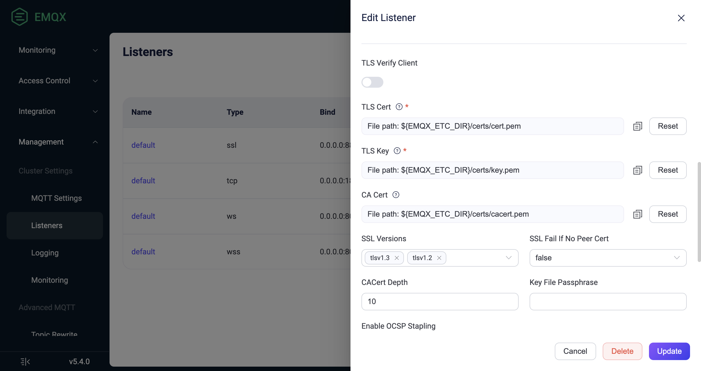

# Enable SSL/TLS Connection

EMQX can establish secure connections via SSL/TLS when accepting the access of an MQTT Client. You can enable SSL/TLS encrypted connections for all connections, including MQTT connection, to ensure the security of access and message transmission.

EMQX provides comprehensive SSL/TLS capability support, including support for one-way/two-way authentication and X.509 certificate authentication. One-way authentication only ensures that the communication is encrypted but cannot verify the client's identity. Two-way authentication also verifies the client's identity. If the client cannot provide a certificate, the SSL/TLS connection will be rejected. 

For client SSL/TLS connections, you can choose one of the following two modes based on your usage scenario:

| Usage Mode                                                   | Advantages                                                   | Disadvantages                                                |
| ------------------------------------------------------------ | ------------------------------------------------------------ | ------------------------------------------------------------ |
| Directly establish SSL/TLS connection between the client and EMQX. | Easy to use, no additional components required               | It will increase EMQX's resource consumption, and if the number of connections is huge, it may lead to high CPU and memory consumption. |
| Terminate TLS connection through a proxy or load balancer.   | No impact on EMQX performance, and provides load balancing capabilities. | Only a few cloud vendors' load balancers support TCP SSL/TLS termination. In addition, users need to deploy software such as HAProxy themselves. |

This page introduces how to directly establish an SSL/TLS connection between the client and EMQX via EMQX Dashboard and configuration file. For information on how to terminate TLS connections through a proxy or load balancer, refer to [Cluster Load Balancing](../deploy/cluster/lb.md).

## Safety Benefits

Enabling SSL/TLS connection provides the following safety benefits.

1. **Strong Authentication**: Both communicating parties will verify each other's identities by checking the X.509 digital certificate held by the other party. These types of digital certificates are usually issued by trusted Certificate Authorities (CAs) and cannot be forged.
2. **Confidentiality**: Each session will be encrypted using the session key negotiated by both parties. No third party can know the communication content, so even if the session key is compromised, it does not affect the security of other sessions.
3. **Integrity**: The possibility of data being tampered with in encrypted communication is extremely low.

## Prerequisite

Before you start, you need to prepare the SSL/TLS certificates. EMQX only provides a set of SSL/TLS certificates (located in the `etc/certs` directory of the installation package) for testing purposes. When used in a production environment, reliable certificates signed by a trusted CA should be used. For information on how to apply for relevant certificates, see [Obtain SSL/TLS Certificates](./reference.md#obtain-ssl-tls-certificates).

## Enable SSL/TLS Connection via Dashboard

The SSL listener enabled on port `8883` is used to encrypt the transmission data between a client and EMQX. You can enable the SSL/TLS connection by editing the settings of the SSL listener in the EMQX Dashboard. 

1. Place your private SSL/TLS certificate files in the `etc/certs` directory of EMQX.

2. Go to EMQX Dashboard. Click **Management** -> **Listeners** from the left navigation menu.

3. On the **Listeners** page, click **default** from the **Name** column of the SSL listener. 

   - **TLS Verify**: Disabled by default. If peer verification is required to verify the client's identity, click the toggle switch to enable the option. 

   - **TLS Cert**, **TLS Key** and **CA Cert**: Replace the current certificate files with your private certificate files by clicking the **Reset** button.
   - **SSL Versions**: All TLS/DTLS versions are supported by default. If PSK cipher suits are used for PSK authentication, make sure to configure `tlsv1.2` , `tlsv1.1` and `tlsv1` here. For more information on PSK authentication, see [Enable PSK Authentication](./psk-authentication.md).
   - **Fail If No Peer Cert**: Used together with **TLS Verify** is enabled. Set to `false` by default.
     - If set to `true`, verification of the client's identity fails if the client sends an empty certificate. The SSL/TLS connection will be rejected.
     - If set to `false`, verification of the client's identity fails only if the client sends an invalid certificate (An empty certificate is considered to be valid). The SSL/TLS connection will be rejected.
   
   - **Intermediate Certificate Depth**: The allowed maximum depth of certification path; the default value is `10`.
   - **Key Password**: Type the password if the private key file is password-protected.
   
   

4. After you complete the editing, click the `Update` button.

## Enable SSL/TLS Connection via Configuration File

You can also enable the SSL/TLS connection by modifying the `listeners.ssl.default` configuration group in the configuration file.

1. Place your private SSL/TLS certificate files in the `etc/certs` directory of EMQX.

2. Open the configuration file `emqx.conf` (located in either the `./etc` or `/etc/emqx/etc` directory depending on your installation method). 

3. Modify the `listeners.ssl.default` configuration group. Replace the certificate files with your own certificate files.

   If you need to enable one-way authentication, add `verify = verify_none`:

   ```bash
   listeners.ssl.default {
     bind = "0.0.0.0:8883"
     max_connections = 512000
     ssl_options {
       # keyfile = "etc/certs/key.pem"
       keyfile = "etc/certs/server.key"
       # certfile = "etc/certs/cert.pem"
       certfile = "etc/certs/server.crt"
       # cacertfile = "etc/certs/cacert.pem"
       cacertfile = "etc/certs/rootCA.crt"
   
       # Peer verification not enabled
       verify = verify_none
     }
   }
   ```

   If you need to enable two-way authentication, add the following configuration to the `listeners.ssl.default` configuration group:

   ```bash
   listeners.ssl.default {
     ...
     ssl_options {
       ...
       # Peer verification enabled
       verify = verify_peer
       # Forced two-way authentication. If the client cannot provide a certificate, the SSL/TLS connection will be rejected.
       fail_if_no_peer_cert = true
     }
   }
   ```

3. Restart EMQX to apply the configuration.


