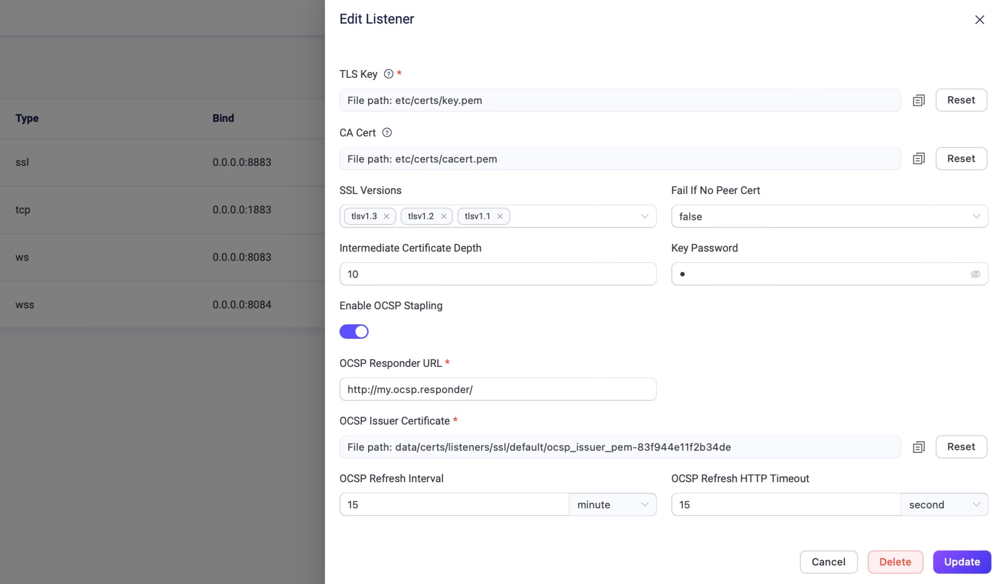

### OCSP Stapling



OCSP (Online Certificate Status Protocol ) is an Internet protocol used to obtain the revocation status of SSL/TLS certificates, ensuring secure communication. EMQX, as a prominent MQTT broker in IoT applications, places a strong emphasis on security. From version 5.0.23 onwards, EMQX supports OCSP Stapling for MQTT SSL listeners to bolster security.





OCSP (Online Certificate Status Protocol) is an Internet protocol used to obtain the revocation status of SSL/TLS certificates, ensuring secure communication. EMQX, as a prominent MQTT broker in IoT applications, places a strong emphasis on security. From version 5.0.3 onwards, EMQX supports OCSP Stapling for MQTT SSL listeners to bolster security.



Note: Secure WebSocket for QUIC listeners is currently not supported.

To enable OCSP stapling in a listener, activate the respective option within the listener's settings and provide the necessary OCSP Issuer certificate and OCSP Responder URL. EMQX then fetches and caches the OCSP response for its own server certificate, ensuring a secure and efficient SSL/TLS connection.

EMQX supports enabling OCSP for SSL listeners via both the Dashboard and configuration files. 

::: tip Prerequisites

OCSP Issuer Certificate should be ready before the configuration.

:::

## Configure with Dashboard

In the EMQX Dashboard, navigate to **Management** -> **Listeners** to access the **Listener** page. To enable the OCSP feature for the default SSL listener, click its name to open the **Edit Listener** page. Scroll to the bottom of the dialog that appears on the right and find the **Enable OCSP Stapling** toggle switch. 



Configure the fields as follows: 

- **OCSP Responder URL**: Enter the URL of the OCSP responder service. You can find this URL in the SSL/TLS certificate's Authority Information Access (AIA) extension.
- **OCSP Issuser Certificate**: Set the certificate of the Certificate Authority (CA) that issued your SSL/TLS certificate. EMQX uses this certificate to verify the OCSP response's authenticity.
- **OCSP Refresh Interval**: Set the time interval for EMQX to fetch a new OCSP response. Default: 5 minutes.
- **OCSP Refresh HTTP Timeout**: Set the timeout period before EMQX considers the OCSP request failed. Default: 15 seconds.

Click **Update** to confirm the changes. 

## Configure with Configuration File

EMQX also provides the option to enable OCSP Stapling through configuration files `emqx.conf`. 

To activate this feature, simply append the relative configuration items to the end of the `emqx.conf` file. Restart EMQX for changes to take effect.

**Example Code**:

```hcl
listeners.ssl.default {
  bind = "0.0.0.0:8883"
  max_connections = 512000
  ssl_options {
    keyfile = "/etc/emqx/certs/server.key"
    certfile = "/etc/emqx/certs/server.pem"
    cacertfile = "/etc/emqx/certs/ca.pem"
    ocsp {
      enable_ocsp_stapling = true
      issuer_pem = "/etc/emqx/certs/ocsp-issuer.pem"
      responder_url = "http://ocsp.responder.com:9877"
      refresh_interval = 15m
      refresh_http_timeout = 15s
    }
  }
}
```

Be sure to change the certificate/private key paths above with your corresponding files and set your OCSP Responder URL accordingly.

