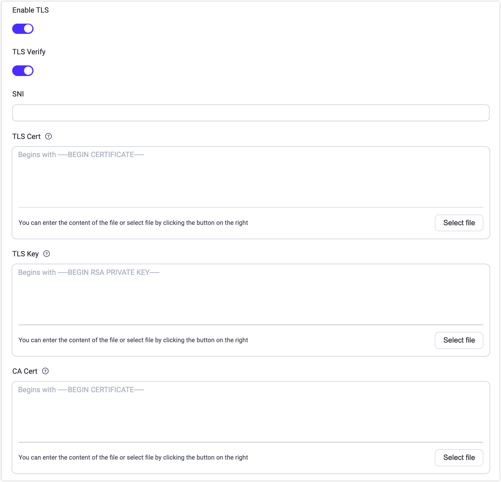

# Network and TLS

Security is essential for end-to-end encrypted communication in IoT scenarios. Secure Sockets Layer (SSL) and Transport Layer Security (TLS) protocols are often adopted in network communications to ensure that the data transmission remains confidential and cannot be intercepted or modified by an attacker. The SSL/TLS encryption function encrypts network connections at the transport layer and involves the use of digital certificates to authenticate the identity of the parties involved and to establish a secure communication channel.

EMQX adopts SSL and TLS cryptographic protocols to ensure secure network communication when:

- Establishing a connection between MQTT clients and EMQX
- Connecting to external resources, such as a database
- Different EMQX nodes in a cluster communicate with each other

EMQX provides comprehensive support for SSL/TLS capabilities, including support for one-way/two-way authentication and X.509 certificate authentication.

## TLS for Client Connection

The [Enable SSL/TLS Connection](./emqx-mqtt-tls.md) section in this chapter introduces how to enable an SSL/TLS connection between the MQTT client and EMQX in detail. The [Obtain SSL/TLS Certificates](./tls-certificate.md) page provides you with instructions on creating self-signed certificates. To further enhance the security with the SSL/TLS enabled, you can also enable the [CRL check](./crl.md) for certificate verification and [OCSP stapling](./ocsp.md) for revocation status checking of the SSL/TLS certificate. The [Client TLS](./mqtt-client-tls.md) section provides information on the sample MQTT client code and project. The TLS use guide is included in these samples.

## TLS for External Resource Access

EMQX also offers you the option of enabling TLS when there is a need to access external resources. For example, when using password-based authentication with access to a web server via HTTPS or connecting to a database for data integration. You can switch on the **Enable TLS** when configuring these features on the EMQX Dashboard.

- **SNI** means Server Name Indication, indicating whether the server domain name and certificate are verified to be the same; A null value means no validation.
- When the server needs to verify the client certificate, the **TLS Cert** and **TLS Key** must be filled in.
- When **TLS Verify** is enabled, the **CA Cert** field must be filled in to verify the legitimacy of the server certificate.



In addition, you can add `ssl` options when you configure the features in the configuration file. For example, you can configure the `authentication` group in the `emqx.conf` by adding the following statement:

```bash
authentication {
  url = "https://127.0.0.1:8080"
  backend = "http"

  ...

  ssl {
    # PEM format file containing the trusted CA (certificate authority) certificates that the HTTP client uses to verify the authenticity of the HTTP server.
    cacertfile = "etc/certs/cacert.pem"
    # PEM format file containing the SSL/TLS certificate chain for the HTTP client to send. If the certificate is not directly issued by a root CA, the intermediate CA certificates should be appended after the listener certificate to form a chain.
    certfile = "etc/certs/cert.pem"
    # PEM format file containing the private key corresponding to the certificate
    keyfile = "etc/certs/key.pem"
    ## Set 'verify_peer' to verify the authenticity of the server's certificate chain, otherwise 'verify_none'
    verify = verify_peer
  }
}
```

## TLS for Nodes Communication

Instructions on how to enable SSL/TLS for cluster connections are not covered in this chapter, and you can refer to [Cluster Security](../deploy/cluster/security.md) for details.
