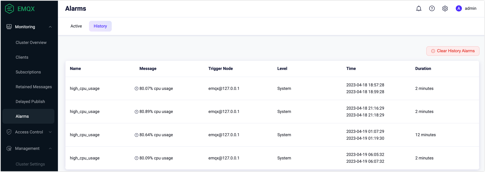
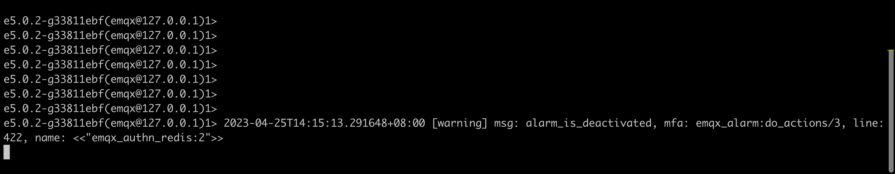
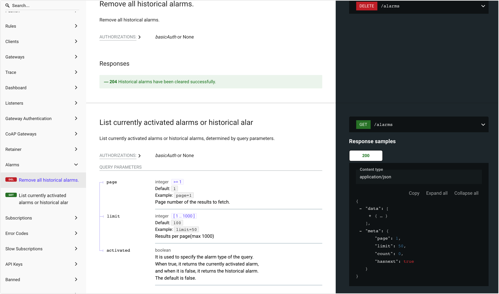
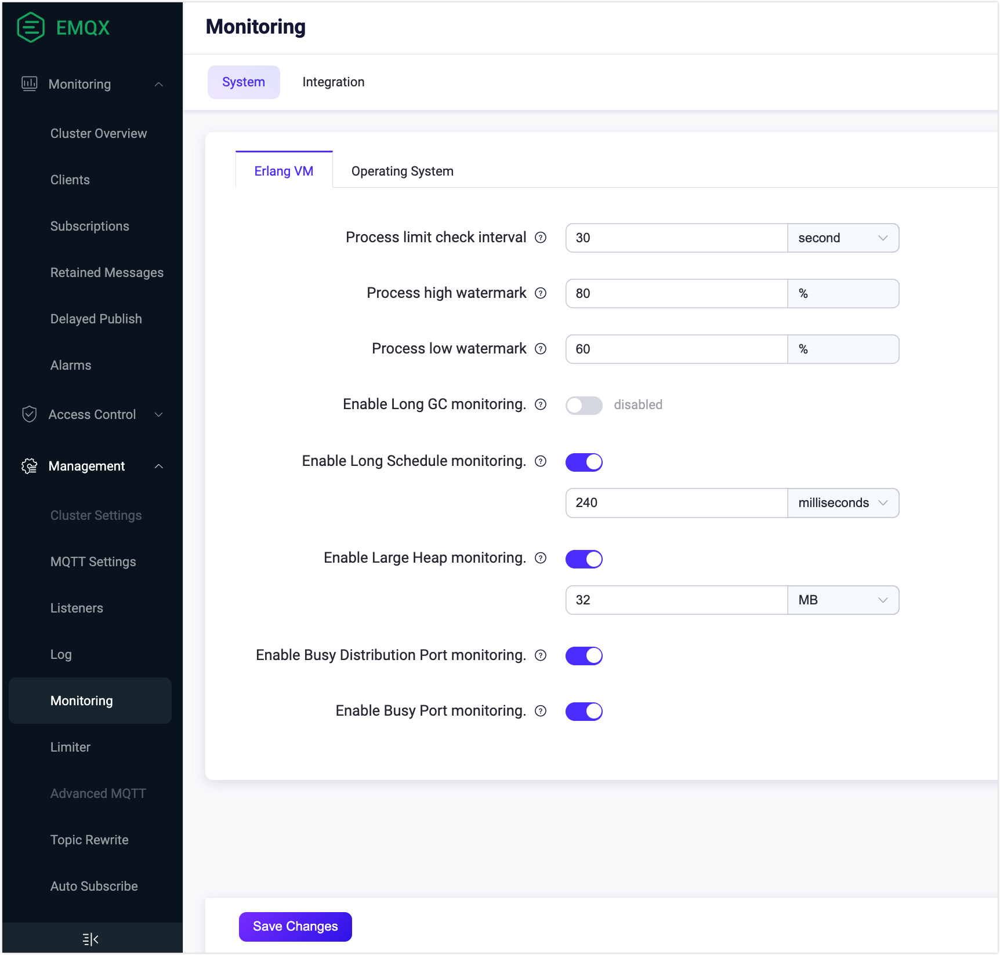
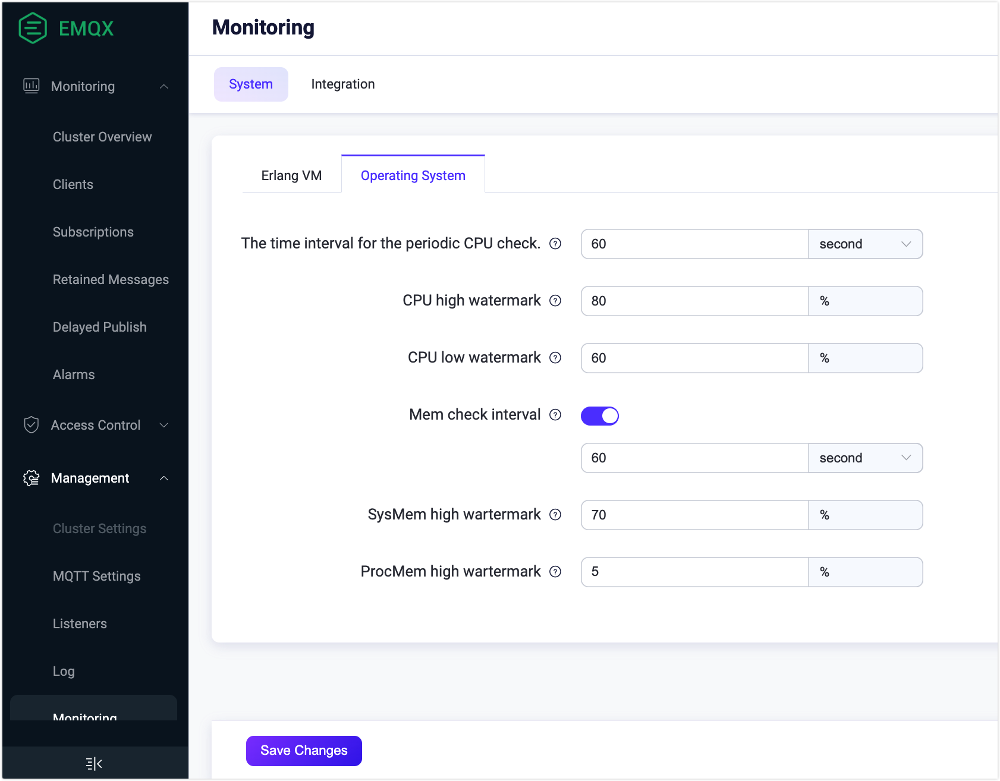

# Alarm

EMQX offers a built-in monitoring and alarm functionality for monitoring the internal state changes, such as CPU occupancy, system and process memory occupancy, number of processes, rule engine resource status, cluster partition and healing. EMQX triggers and records these changes when they exceed a threshold or deviate from expectations, and removes them from the list once they are restored. 

This section introduces which alarm information EMQX provides, how you can obtain and check the detailed alarm information, and how to configure the alarm settings and thresholds in EMQX. The monitoring and alarm function keeps you notified of potential problems during operation. By configuring alarms and setting appropriate thresholds, you can make sure that EMQX remains secure, stable, and reliable.

## Alarm List

The following table lists the alarms that can be triggered to indicate potential problems during system monitoring.

::: tip

Depending on the severance and impacts on the system, alarms can have 3 levels:

- **Error**: Errors caused by user presets. The client can perceive the error and retry.

- **Warning**: Occasional errors, and need to be taken seriously if they occur frequently.

- **Critical**: Irreversible data loss between the client and server, causing communication and business interruption.

The levels are defined from development perspectives and are only for a recommendation. You can define your own alarm levels according to the business needs.

:::



| **Alarm**                 | Level    | Description                                                  | **Details**                              | **Threshold**                                                |
| :------------------------ | -------- | :----------------------------------------------------------- | :--------------------------------------- | :----------------------------------------------------------- |
| high_system_memory_usage  | Warning  | System memory usage is too high                              | "System memory usage is higher than ~p%" | `os_mon.sysmem_high_watermark = 70%`                         |
| high_process_memory_usage | Warning  | Single Erlang process memory usage is too high (percentage of system memory usage) | Process memory usage is higher than ~p%  | `os_mon.procmem_high_watermark = 5%`                         |
| high_cpu_usage            | Warning  | CPU usage is too high                                        | ~p% cpu usage                            | `os_mon.cpu_high_watermark = 80%` `os_mon.cpu_low_watermark = 60%` |
| too_many_processes        | Warning  | Too many processes                                           | ~p% process usage                        | `vm_mon.process_high_watermark = 80%` `vm_mon.process_low_watermark = 60%` |
| partition                 | Critical | Partition occurs at node                                     | Partition occurs at node ~s              | -                                                            |
| resource                  | Critical | Resource is disconnected                                     | Resource ~s(~s) is down                  | -                                                            |
| conn_congestion           | Critical | Connection process congestion                                | connection congested                     | -                                                            |





| **Alarm**                 | Level    | Description                                                  | **Details**                                  | **Threshold**                                                |
| :------------------------ | -------- | :----------------------------------------------------------- | :------------------------------------------- | :----------------------------------------------------------- |
| high_system_memory_usage  | Warning  | System memory usage is too high                              | "System memory usage is higher than ~p%"     | `os_mon.sysmem_high_watermark = 70%`                         |
| high_process_memory_usage | Warning  | Single Erlang process memory usage is too high (percentage of system memory usage) | Process memory usage is higher than ~p%      | `os_mon.procmem_high_watermark = 5%`                         |
| high_cpu_usage            | Warning  | CPU usage is too high                                        | ~p% cpu usage                                | `os_mon.cpu_high_watermark = 80%` `os_mon.cpu_low_watermark = 60%` |
| too_many_processes        | Warning  | Too many processes                                           | ~p% process usage                            | `vm_mon.process_high_watermark = 80%` `vm_mon.process_low_watermark = 60%` |
| license_quota             | Warning  | License exceeds quota                                        | License: the number of connections exceeds % | `license.connection_high_watermark_alarm = 80%` `license.connection_low_watermark_alarm = 75%` |
| license_expiry            | Critical | License expired                                              | License will be expired at %                 | -                                                            |
| partition                 | Critical | Partition occurs at node                                     | Partition occurs at node ~s                  | -                                                            |
| resource                  | Critical | Resource is disconnected                                     | Resource ~s(~s) is down                      | -                                                            |
| conn_congestion           | Critical | Connection process congestion                                | Connection congested                         | -                                                            |



## Obtain Alarms

EMQX provides you with various ways to obtain alarms and check the detailed alarm formation. One way is to access the alarms on EMQX Dashboard, where you can view a list of active or historical alarms. However, it is only a central place for easy access to an overview of alarms that have been triggered. Another way is to subscribe to system topics through MQTT to receive real-time notifications of alarms with detailed alarm information. Alarms can also be obtained from the log or via HTTP API. 

### View Alarms in Dashboard

On EMQX Dashboard, click **Monitoring** -> **Alarms**. Select the **Active** or **History** tab, and you can see the list of currently active alarms and historical alarms.

### Obtain Alarms via System Topic

EMQX will publish an MQTT message to system topics `$SYS/brokers/<Node>/alarms/activate` or `$SYS/brokers/<Node>/alarms/deactivate` when an alarm is triggered or cleared. Users can subscribe to the topic to receive alarm notifications.

The payload in the alarm notification message is in JSON format and contains the following fields:

| Field           | Type             | Description                                                  |
| --------------- | ---------------- | ------------------------------------------------------------ |
| `name`          | string           | Alarm name                                                   |
| `details`       | object           | Alarm details                                                |
| `message`       | string           | Human-readable alarm instructions                            |
| `activate_at`   | integer          | A UNIX timestamp in microseconds representing the activation time of the alarm |
| `deactivate_at` | integer / string | A UNIX timestamp in microseconds representing the deactivation time of the alarm. The value of this field for the activated alarm is `infinity`. |
| `activated`     | boolean          | Whether the alarm is activated                               |

Taking the alarm of high system memory usage as an example, you will receive an alarm message like below:

One system multifunction will be repeatedly reported. That is, if one alarm on high CPU usage is activated, the system will not generate another alarm of the same type. The generated alarm will be automatically deactivated when the monitored metric returns to normal, or you can manually deactivate the alarm.

### Obtain Alarms from Log

The activation and deactivation of alarms can be written to log (console or file). When failures occur during message transmission or event processing, detailed information can be logged, and the logging system can also be used to capture alerts through log analysis. The following example shows the detailed alarm information printed in the log:
The log level is `warning`, and the `msg` field is `alarm_is_activated` and `alarm_is_deactivated`.

### Obtain Alarms via HTTP API

You can query and manage alarms through the [API Docs](https://docs.emqx.com/en/enterprise/v5.0/admin/api-docs.html). Click **Alarms** on the left navigation menu on the UI to execute this API request. For how to work with EMQX API, see [REST API](../admin/api.md).

## Alarm Configuration

Alarm configuration includes configuring alarm settings and thresholds. Alarm settings determine how the alarm message is displayed and stored, while alarm thresholds establish limits or values that trigger the alarm when potential problems are detected. The alarm configuration feature allows you to customize the alarm settings and thresholds to meet your business needs.

### Configure Alarm Settings

The settings for alarms can only be configured by modifying the configuration items in `emqx.conf` file. The following table lists the configuration items available for alarm setting configuration.

| Configuration Item    | Description                                                  | Default Value        | Optional Values |
| --------------------- | ------------------------------------------------------------ | -------------------- | --------------- |
| alarm.actions         | Actions of writing the alarm to log (console or file) and publishing the alarm as an MQTT message to the system topics `$SYS/brokers/<node_name>/alarms/activate` and `$SYS/brokers/<node_name>/alarms/deactivate`. The actions are triggered when the alarm is activated or deactivated. | `["log", "publish"]` | -               |
| alarm.size_limit      | The maximum total number of deactivated alarms to be kept as history. When this limit is exceeded, the oldest deactivated alarms are deleted. | `1000`               | `1-3000`        |
| alarm.validity_period | Retention time of deactivated alarms. Alarms are not deleted immediately when deactivated but after a period of time. | `24h`                | -               |

### Configure Alarm Thresholds via Dashboard

Alarm thresholds can be configured on EMQX Dashboard. There are two ways to launch the **Monitoring** page for configuring the alarm thresholds:

1. On the **Alarms** page, click the **Setting** button and you will be led to the **Monitoring** page. 
2. From the left navigation menu, click **Management** -> **Monitoring**. 

On the  **Monitoring** page, click the **Erlang** tab, you can configure the following items for the system performance of the Erlang Virtual Machine:

**Process limit check interval**: Specify the time interval for checking the periodic process limit. The default value is `30` seconds.

**Process high watermark**: Specify the threshold value of processes that can simultaneously exist at the local node. When the percentage exceeds the specified number, an alarm is raised. The default value is `80` percent.

**Process low watermark**: Specify the threshold value of processes that can simultaneously exist at the local node. When the percentage is lowered to the specified number, an alarm is cleared. The default value is `60` percent.

**Enable Long GC monitoring**: Disabled by default. When enabled, a warning-level log `long_gc` is emitted and an MQTT message is published to the system topic `$SYS/sysmon/long_gc` when an Erlang process spends long time performing garbage collection.

**Enable Long Schedule monitoring**: Enabled by default, which means when the Erlang VM detects a task scheduled for too long, a warning level log `long_schedule` is emitted. You can set the proper time scheduled for a task in the text box. The default value is `240` milliseconds. 

**Enable Large Heap monitoring**: Enabled by default, which means when an Erlang process consumed a large amount of memory for its heap space, a warning level log `large_heap` is emitted, and an MQTT message is published to the system topic `$SYS/sysmon/large_heap`. You can set the limit of space bytesize in the text box. The default value is `32` MB.

**Enable Busy Distribution Port monitoring**: Enabled by default, which means when the Remote Procedure Call (RPC) connection used to communicate with other nodes in the cluster is overloaded, a warning level log `busy_dis_port` log is emitted, and an MQTT message is published to system topic `$SYS/sysmon/busy_dist_port`.

**Enable Busy Port monitory**: Enabled by default, which means when a port is overloaded, a warning level log `busy_port` is emitted, and an MQTT message is published to the system topic `$SYS/sysmon/busy_port`.

After you complete the configurations, click **Save Changes**.

Click the **Operating System** tab, you can configure the following items for the system performance:

**The time interval of the periodic CPU check**: Specify the time interval for checking the CPU usage. The default value is `60` seconds.

**CPU high watermark**: Specify the threshold value of how much system CPU can be used. When the percentage exceeds the specified value, a corresponding alarm is raised. The default value is `80` percent.

**CPU low watermark**: Specify the threshold value of how much system CPU can be used. When the percentage is lowered to the specified value, a corresponding alarm is released. The default value is `60` percent.

**Mem check interval**: Enabled by default. You can specify the time interval for periodic memory checks. The default value is `60` seconds.

**SysMem high watermark**: Specify the threshold for how much system memory can be allocated. When the percentage exceeds the specified value, a corresponding alarm is raised. The default value is `70`%.

**ProcMem high watermark**: Specify the threshold for how much system memory can be allocated by one Erlang process. When the percentage exceeds the specified value, a corresponding alarm is raised. The default value is `5`%.

### Configure Alarm Thresholds via Configuration Items

You can also configure alarm thresholds by modifying the configuration items for alarm thresholds. The following configuration items are currently available to be modified in `emqx.conf` file:

| Configuration Item             | Description        | Default Value                    |
|-----------------------------------|---------------------------|----------------------------------------------------------------------------|
| sysmon.os.cpu_check_interval      | Check interval for CPU usage. | `60s`                     |
| sysmon.os.cpu_high_watermark      | The high watermark of the CPU usage, the threshold to activate the alarm. | `80%`                     |
| sysmon.os.cpu_low_watermark       | The low watermark of the CPU usage, the threshold to deactivate the alarm. | `60%`                     |
| sysmon.os.mem_check_interval      | Check interval for memory usage. | `60s`                     |
| sysmon.os.sysmem_high_watermark   | The high watermark of the system memory usage. The alarm will be activated when the total memory occupied reaches this value. | `70%`                     |
| sysmon.os.procmem_high_watermark  | The high watermark of the process memory usage. The alarm will be activated when the memory occupied by a single process reaches this value. | `5%`                      |
| sysmonn.vm.process_check_interval | Check interval for the number of processes. | `30s`                     |
| sysmon.vm.process_high_watermark  | The high watermark of the process occupancy rate; The alarm will be activated when this threshold is reached; Measured as a ratio of the number of created processes/maximum number limit. | `80%`                     |
| sysmon.vm.process_low_watermark   | The low water mark of the process occupancy rate; The alarm will be deactivated when it goes below this threshold; Measured as a ratio of the number of created processes/maximum number limit. | `60%`                     |
| sysmonn.vm.long_gc                | Whether to enable Long GC monitoring | `disabled`                |
| sysmon.vm.long_schedule           | Whether to enable Long Schedule monitoring | `disabled`                |
| sysmon.vm.large_heap              | Whether to enable Large Heap monitoring | `disabled`                |
| sysmon.vm.busy_port               | Whether to enable Busy Distribution Port monitoring | `true`                    |
| sysmonn.top.num_items             | Number of top processes per monitoring group | `10`                      |
| sysmon.top.sample_interlval       | Check interval for top processes | `2s`                      |
| sysmon.top.max_procs              | Stop collecting data when the number of processes in the VM exceeds this value | `1000000`                 |


EMQX Enterprise will raise an alarm when the license expires in less than 30 days, or if the number of connections exceeds the high watermark. You can adjust the high/low watermark for the number of connections by modifying the following configuration items in `emqx.conf` file. For more information on how to configure settings for the license, see [License](../configuration/license.md).

| Configuration item            | Description                                                  | Default value                                     |
| ----------------------------- | ------------------------------------------------------------ | ------------------------------------------------------------ |
| license.connection_high_watermark_alarm  | The high watermark of the max connections the license supports. The alarm is activated when this threshold is reached. Measured as a ratio of active connections/max connections. | `80%` |
| license.connection_low_watermark_alarm    | The low watermark of the max connections the license supports. The alarm is deactivated when it goes below this threshold. Measured as a ratio of active connections/max connections. | `75%` |


