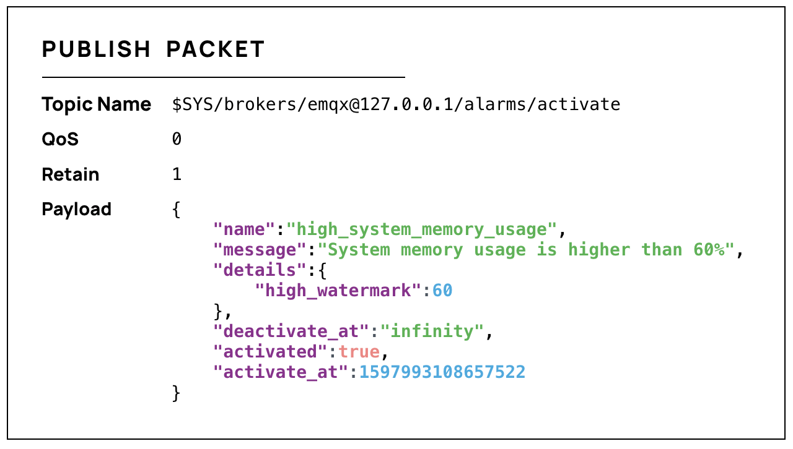

# Alarm

EMQX has offered a built-in monitoring and alarm functionality for monitoring the CPU occupancy, system and process memory occupancy, number of processes, rule engine resource status, cluster partition and healing, and will raise an alarm in case of system malfunctions. The activation and deactivation of alarms will generate an alarm log and EMQX will publish an MQTT message with the topic of `$SYS/brokers/<Node>/alarms/activate` or `$SYS/brokers/<Node>/alarms/deactivate`. Users can subscribe to the topic to receive alarm notifications.

The payload in the alarm notification message is in JSON format and contains the following fields:

| Field           | Type             | Description                                                  |
| --------------- | ---------------- | ------------------------------------------------------------ |
| `name`          | string           | Alarm name                                                   |
| `details`       | object           | Alarm details                                                |
| `message`       | string           | Human-readable alarm instructions                            |
| `activate_at`   | integer          | A UNIX timestamp in microseconds representing the activation time of the alarm |
| `deactivate_at` | integer / string | A UNIX timestamp in microseconds representing the deactivation time of the alarm. The value of this field for the activated alarm is `infinity`. |
| `activated`     | boolean          | Whether the alarm is activated                               |

Taking the alarm of high system memory usage as an example, you will receive an alarm message like below:

One system multifunction will be repeatedly reported. That is, if one alarm on high CPU usage alarm is activated, the system will not generate another alarm of the same type. The generated alarm will be automatically deactivated when the monitored metric returns to normal, or you can manually deactivate the alarm.

Users can view the current alarms and historical alarms on the Dashboard, or use EMQX HTTP API to query and manage alarms.

Users can use the configuration items to customize the alarm feature to meet their business needs. The following configuration items are currently available:

| Configuration item              | Type              | Default Value                    | Description                                      |
|-----------------------------------|-------------------|---------------------------|----------------------------------------------------------------------------|
| sysmon.os.cpu_check_interval      | duration          | 60s                       | Check interval for CPU usage; |
| sysmon.os.cpu_high_watermark      | percent           | 80%                       | The high watermark of the CPU usage, the threshold to activate the alarm; |
| sysmon.os.cpu_low_watermark       | percent           | 60%                       | The low watermark of the CPU usage, the threshold to deactivate the alarm; |
| sysmon.os.mem_check_interval      | duration          | 60s                       | Check interval for memory usage; |
| sysmon.os.sysmem_high_watermark   | percent           | 70%                       | The high watermark of the system memory usage. The alarm will be activated when the total memory occupied reaches this value. |
| sysmon.os.procmem_high_watermark  | percent           | 5%                        | The high watermark of the process memory usage. The alarm will be activated when the memory occupied by a single process reaches this value. |
| sysmonn.vm.process_check_interval | duration          | 30s                       | Check interval for the number of processes; |
| sysmon.vm.process_high_watermark  | percent           | 80%                       | The high watermark of the process occupancy rate; The alarm will be activated when this threshold is reached; Measured as a ratio of the number of created processes/maximum number limit. |
| sysmon.vm.process_low_watermark   | percent           | 60%                       | The low water mark of the process occupancy rate; The alarm will be deactivated when it goes below this threshold; Measured as a ratio of the number of created processes/maximum number limit. |
| sysmonn.vm.long_gc                | disabled/duration | disabled                  | Whether to enable Long GC monitoring |
| sysmon.vm.long_schedule           | disabled/duration | disabled                  | Whether to enable Long Schedule monitoring |
| sysmon.vm.large_heap              | disabled/bytesize | disabled                  | Whether to enable Large Heap monitoring |
| sysmon.vm.busy_port               | boolean           | true                      | Whether to enable Busy Distribution Port monitoring |
| sysmonn.top.num_items             | integer           | 10                        | Number of top processes per monitoring group |
| sysmon.top.sample_interlval       | duration          | 2s                        | Check interval for top processes |
| sysmon.top.max_procs              | integer           | 1000000                   | Stop collecting data when the number of processes in the VM exceeds this value  |
| sysmonn.top.db_hostname           | string            | ""                        | Hostname of the PostgreSQL database |
| sysmonn.top.db_port               | integer           | 5432                      | Port of the PostgreSQL database |
| sysmon.top.db_username            | string            | "system_monitor"          | Username of the PostgreSQL database |
| sysmon.top.db_password            | string            | "system_monitor_password" | Password in the PostgreSQL database |
| sysmon.top.db_name                | string            | "postgres"                | Name of the PostgreSQL database |


EMQX Enterprise will raise an alarm when the license expires in less than 30 days, or if the number of connections exceeds the high watermark. You can adjust the high/low watermark for the number of connections.

| Configuration item            | Type     | Default value | Description                                                  |
| ----------------------------- | -------- | ----------- | ------------------------------------------------------------ |
| license.connection_high_watermark_alarm  | percent  | 80%         | The high watermark of the max connections the license supports. The alarm is activated when this threshold is reached. Measured as a ratio of active connections/max connections. |
| license.connection_low_watermark_alarm    | percent  | 75%         | The low watermark of the max connections the license supports. The alarm is deactivated when it goes below this threshold. Measured as a ratio of active connections/max connections. |
|||||
