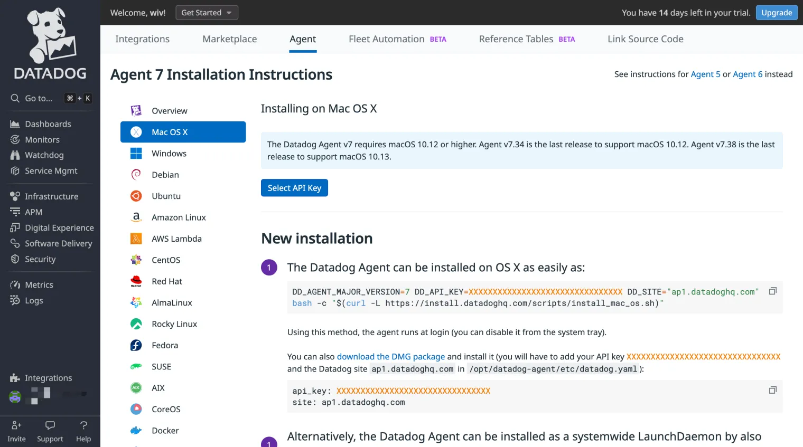
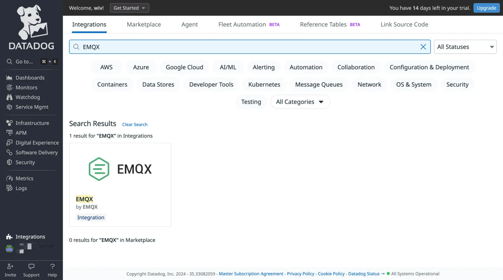
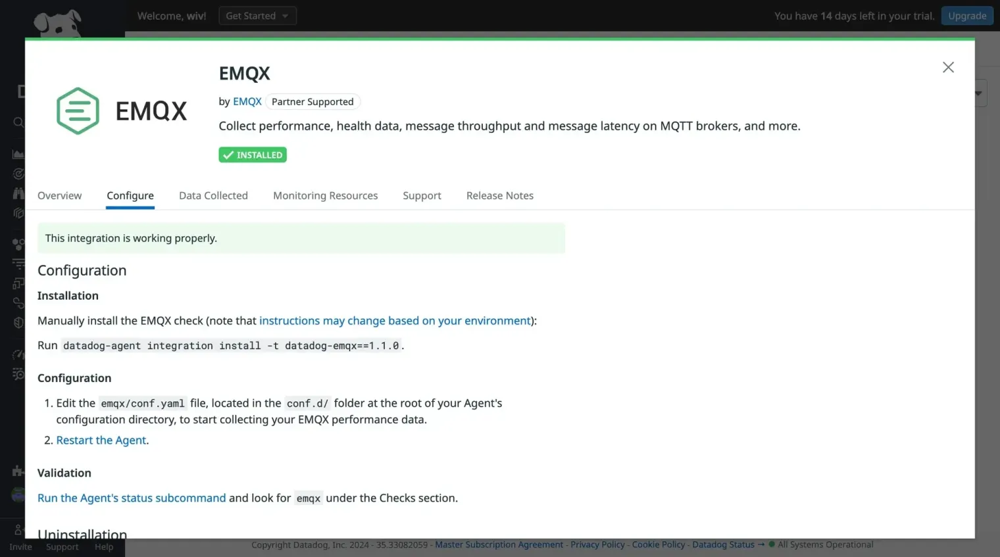
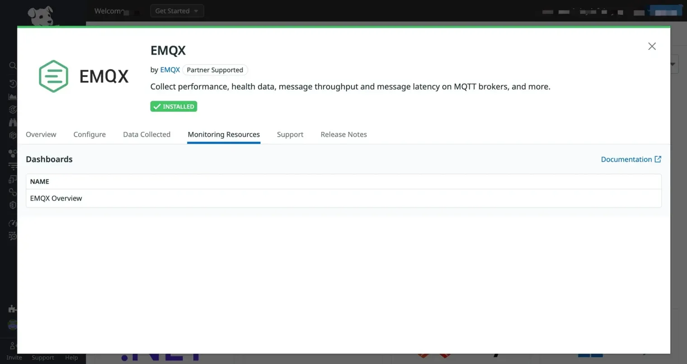
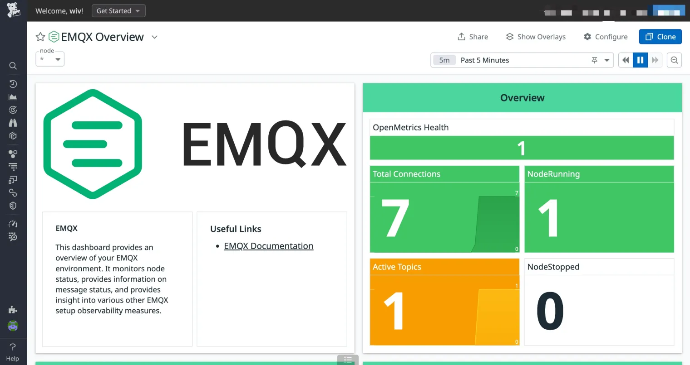
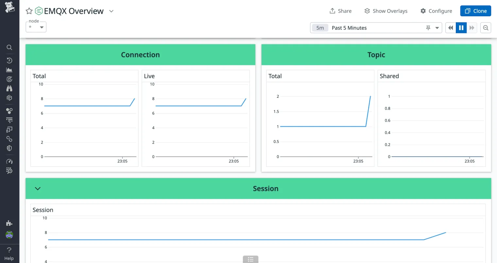
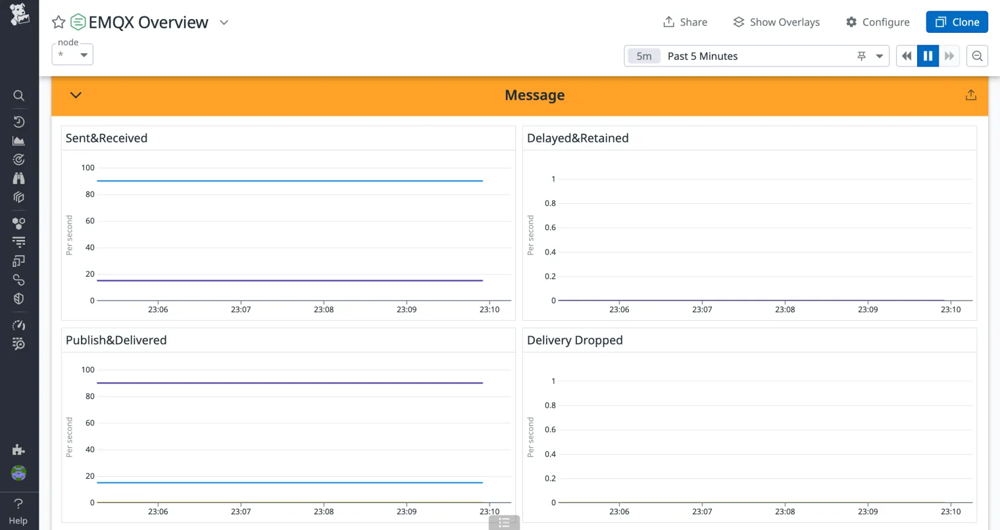
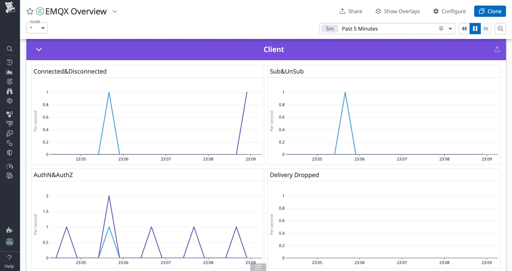

# Integrate with Datadog

[Datadog](https://www.datadoghq.com/) is a cloud-based observability and security platform that offers automated infrastructure monitoring, application performance monitoring, log management, and real-user monitoring. It unifies these capabilities into a real-time application solution, enabling developers to easily monitor, analyze, and optimize performance and reliability.

EMQX provides an out-of-the-box [Datadog integration](https://docs.datadoghq.com/integrations/emqx/) to help users better understand the running status of EMQX, and facilitate monitoring and troubleshooting system performance issues. Thus, users can build more efficient, reliable, and real-time data transmission IoT applications.

## How Datadog Integration Works

The integration between EMQX and Datadog is not a new feature. It makes full use of the existing features of EMQX. The working principle is as follows:

1. Install Datadog Agent on the EMQX cluster side and add [Datadog - EMQX integration](https://docs.datadoghq.com/integrations/emqx/), an out-of-the-box extension plug-in provided by Datadog for EMQX.

2. By modifying the preset configuration of the integration, allow Datadog Agent to periodically pull indicator data from EMQX's Prometheus pull REST API. The indicator data is processed by the Datadog Agent and uploaded to the Datadog platform.

3. In the Datadog cloud platform, you can view various indicator data through the preset Dashboard charts of the integration.

Next, we will follow the above steps to set up.

## Install the Datadog Agent

[Datadog Agent](https://docs.datadoghq.com/getting_started/agent/) collects EMQX metrics and sends them to the Datadog cloud. It needs to be deployed on the server where the EMQX cluster is located or on a server that can access the EMQX node.

If you are using Datadog for the first time, visit [Datadog](https://www.datadoghq.com/) to create an account and log in to the Datadog console. Next, you need to install the Datadog Agent on the server where EMQX is located, following the steps below:

1. Navigate to **Integrations** → **Agent** in the menu bar to access the Agent Installation Instructions page.

2. Choose your operating system version and follow the provided instructions.



## Add EMQX Integration to Datadog

EMQX offers out-of-box [Datadog integration](https://docs.datadoghq.com/integrations/emqx/) that can be easily incorporated into your Datadog console by following these steps:

1. Open your Datadog console and navigate to **Integrations** → **Integrations** in the menu bar.

2. In the search box, type `EMQX` to find the integration with the same name and author.

3. Click the **Install Integration** button in the upper right corner of the pop-up box to add the EMQX integration to Datadog.



4. After completing the installation, navigate to the **Configure** tab to access the configuration guidelines for the EMQX integration. Carry out the necessary configuration within the Datadog Agent.



## Add and Enable EMQX Integration on Datadog Agent

Following the configuration guidelines, add the EMQX integration to the Datadog Agent to configure the collection and reporting of EMQX metrics.

1. Execute the following command on the server where the Datadog Agent is hosted to add the EMQX integration. Note that this example uses version 1.1.0; always refer to the latest guidelines for the appropriate version:

    ```bash
    datadog-agent integration install -t datadog-emqx==1.1.0
    ```

2. Once the installation is complete, modify the Agent configuration file to enable EMQX integration.

    Navigate to the Agent configuration directory (usually located at `/opt/datadog-agent/etc/conf.d/`). Locate the `emqx.d` directory within this directory. You'll find a sample configuration file named `conf.yaml.example` in the `emqx.d` directory.

    Create a copy of this file in the same directory and rename it to `conf.yaml`. Edit the `conf.yaml` file, adjusting the following configuration item:

    ```bash
    instances:
      - openmetrics_endpoint: http://localhost:18083/api/v5/prometheus/stats?mode=all_nodes_aggregated
    ```

    The `openmetrics_endpoint` specifies the address from which the Datadog Agent extracts metrics data in OpenMetrics format. In this case, it's set to the HTTP API address of EMQX. Make sure to replace this with an address accessible by the Datadog Agent.

    The API also allows specifying the range of metrics to pull via the `mode` query parameter. The meaning of each parameter is as follows:
    
    | **Parameter**          | **Description**                                              |
    | ---------------------- | ------------------------------------------------------------ |
    | node                   | Returns metrics for the current requested node. If no mode parameter is specified, this is used by default. |
    | all_nodes_unaggregated | Returns metrics for each individual node in the cluster, maintaining the independence of metrics. The results include node names for differentiation. |
    | all_nodes_aggregated   | Returns aggregated metric values for all nodes in the cluster. |
    
    For a unified view, use the `mode=all_nodes_aggregated` option. This ensures that the Datadog control sees values for the entire EMQX cluster.

3. Refer to [this document](https://docs.datadoghq.com/agent/guide/agent-commands/#start-stop-and-restart-the-agent) to restart the Agent. Take macOS as an example:

    ```bash
    launchctl stop com.datadoghq.agent
    launchctl start com.datadoghq.agent
    ```

4. After rebooting your system, use the following command to verify if the EMQX integration is successfully enabled. If you see `Instance ID: ... \[OK\]`, it indicates that the integration has been successfully enabled.

    ```bash
    $ datadog-agent status | grep emqx -A 4
        emqx (1.1.0)
        ------------
          Instance ID: emqx:1865f3a06d300ccc \[OK\]
          Configuration Source: file:/opt/datadog-agent/etc/conf.d/emqx.d/conf.yaml
          Total Runs: 17
          Metric Samples: Last Run: 166, Total: 2,822
          Events: Last Run: 0, Total: 0
          Service Checks: Last Run: 1, Total: 17
          Average Execution Time : 43ms
          Last Execution Date : 2024-05-11 17:35:41 CST / 2024-05-11 09:35:41 UTC (1715420141000)
          Last Successful Execution Date : 2024-05-11 17:35:41 CST / 2024-05-11 09:35:41 UTC (1715420141000)
    
    ```

Now you have completed all the necessary configurations on the Datadog Agent. The Agent will periodically collect EMQX runtime data and send them to Datadog. 

Next, let's check the Datadog console to ensure that the metrics are being collected correctly.

## View EMQX Metrics on the Datadog Console

The Datadog Agent's EMQX integration provides a ready-to-use Dashboard chart that displays node status, message status, and other more in-depth observability metrics. You can follow these steps to utilize it:

1. Open the Datadog console and navigate to **Integrations** → **Integrations** in the menu bar.

2. Locate the installed EMQX integration and click to open it.

3. Switch to the **Monitoring Resources** tab within the pop-up box to open the **EMQX Overview** charts under **Dashboards**.

    

**The charts provide the following information:**

- **OpenMetrics Health**: The number of active metrics collectors.
- **Total Connections**: The overall count of connections, including those that remain the sessions despite being disconnected.
- **NodeRunning**: The number of running nodes within the cluster.
- **Active Topics**: The number of currently active topics.
- **NodeStopped**: The count of stopped nodes in the cluster.
- **Connection**
  - **Total**: The total number of connections, including those that maintain the session even when disconnected.
  - **Live**: The number of actively maintained TCP connections.
- **Topic**
  - **Total**: The overall number of topics.
  - **Shared**: The count of shared topics.
- **Session**: The total number of sessions.
- **Erlang VM**: The CPU, memory, and queue usage of the Erlang virtual machine.
- **Retainer & Delayed**
  - **Retained**: The number of retained messages.
  - **Delayed**: The count of delayed messages.
- **Message**
  - **Sent & Received**: The rate of sent and received messages.
  - **Delayed & Retained**: The rate of delayed and retained messages.
  - **Publish & Delivered**: The rate of message publishing and delivery.
  - **Delivery Dropped**: The number of delivered messages that were dropped.
- **Client**
  - **Connected & Disconnected**: The rate of connections being established and terminated.
  - **Sub & UnSub**: The subscription and unsubscription rates.
  - **AuthN & AuthZ**: Information on authentication and authorization rates.
  - **Delivery Dropped**: The number of dropped delivery messages.
- **Mria**: The total number of Mria transactions.

Below are screenshots of some of the overview metrics charts; the values dynamically change based on the load of EMQX and client activity.









## Next Steps

The charts built into Datadog's EMQX integration show only some of the key metrics. You can also refer to [this document](https://docs.datadoghq.com/integrations/emqx/#metrics) to access all the reported EMQX metrics and create your own monitoring charts based on them.

You can configure alert rules in Datadog based on these metrics. When certain metrics reach preset thresholds or abnormal situations occur, Datadog will send notifications to remind you to take necessary actions promptly, minimizing the impact of system failures on your business.
