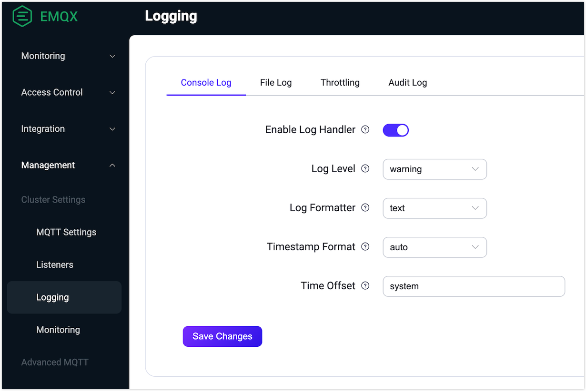

# Logs

Logs provide a reliable source of information for troubleshooting and system performance optimization. You can find the record about the access, operating, or network issues from EMQX logs.

EMQX supports both console logs and file logs. There are two different ways of outputting log data. You can choose the output method as needed or keep both. Console log refers to outputting log data to the console or command line interface. It is typically used during development and debugging, as it allows developers to quickly view log data in real-time as EMQX runs. File log refers to outputting log data to a file. This is typically used in production environments, where it is important to persist log data over time for analysis and troubleshooting.

The system's default log handling behavior can be configured via the environment variable `EMQX_DEFAULT_LOG_HANDLER`, which accepts the following settings:

- `file`: Directs log output to files.
- `console`: Channels log output to the console.

Environment variable `EMQX_DEFAULT_LOG_HANDLER` defaults `console`, but explicitly set to `file` when EMQX is initiated via systemd's `emqx.service` file.

To minimize the impact of logs on system operation, for example, when the log data is too much or the log writing is too slow, EMQX activates the overload protection mechanism by default to better serve our users.

## Log Level

EMQX log has 8 levels ([RFC 5424](https://www.ietf.org/rfc/rfc5424.txt)), with warning as the default level, from low to high these 8 levels are:

```bash
debug < info < notice < warning < error < critical < alert < emergency
```
The table below describes the meaning and output contents for each log level.

| Log Level | Meaning                                                      | Output Examples                                              |
| --------- | ------------------------------------------------------------ | ------------------------------------------------------------ |
| debug     | Detailed information about the internal workings of a program, helping to debug and diagnose issues in the code. <br />It is not recommended to output this level of logging directly to the production environment. Instead, enable [Log Trace](./tracer.md) for a specific client. | Variable values, function call stacks, and other detailed debugging data. |
| info      | Useful information that is more general than debug-level logs. | Client connections, subscriptions, publishes, QoS levels, and message delivery status. |
| notice    | Important system information indicating that an event has occurred, but no action is required. | Number of clients connected to the proxy server, number of reconnections attempted, and number of crashed nodes. |
| warning   | Potential issues or errors that require action; typically used for proactive monitoring and detecting potential problems before they become critical issues. | Disconnections, connection timeouts, authentication failures, and other similar events. |
| error     | The occurrence of an error that requires error handling; typically used to flag errors so that administrators can quickly detect and resolve issues. | Fails to connect to an external database, to subscribe to a non-existent topic, or to parse a configuration file, or other similar events. |
| critical  | Critical error that results in system crashes or prevents it from functioning; typically used to flag severe problems so that administrators can take immediate action. | Proxy server crashes, database unavailability, and other similar events. |
| alert     | Severe problems that may cause the application to stop and need to take immediate action to prevent further losses. | The application has reached a critical threshold, such as running out of disk space or memory, or a critical system process has crashed or stopped responding. |
| emergency | Extremely serious problems that prevent the application from running and require immediate action; happen in rare circumstances. | Failure in data synchronizing between different nodes.       |

## Configure Logging via Dashboard

This section mainly describes how to configure logging with EMQX Dashboard. Changes take effect immediately without restarting the node.

Go to EMQX Dashboard. Click **Management** -> **Logging** on the left navigation menu. Select the corresponding tab for configurations on the console log or file log.

### Configure Console Log

On the **Logging** page, select the **Console Log** tab.



Configure the following settings for the console log handler:

- **Enable Log Handler**: Click the toggle switch to enable the console log handler.

- **Log Level**: Select the log level to use from the drop-down list. The default value is `warning`.

- **Log Formatter**: Select the log format from the drop-down list. Optional values are `text` and `JSON`. The default value is `text`.

- **Timestamp Format**: Select the format of the timestamp in the log. Optional values are:
  - `auto`: Automatically determines the timestamp format based on the log formatter being used. Utilizes `rfc3339` format for text formatters, and `epoch` format for JSON formatters.

  - `epoch`: Represents timestamps in microseconds precision Unix epoch format.
  - `rfc3339`: Uses RFC3339 compliant format for date-time strings. For example, `2024-03-26T11:52:19.777087+00:00`.

- **Time Offset**: Define the time offset relative to UTC in the log. By default, it follows the system, with a default value of `system`.

After you finish the configurations, click **Save Changes**.

### Configure File Log

On the **Logging** page, select the **File Log** tab.


Configure the following settings for file log handler:

- **Enable Log Handler**: Click the toggle switch to enable the file log handler.

- **Log File Name**: Type the name of the log file. The default name is `log/emqx.log`.

- **Max Log Files Number**: Specify the maximum number of rotated log files. The default value is `10`.

- **Rotation Size**: Log file will be rotated once it reaches the specified size. It is by default enabled. You can type the specific value in the text box below. If you disable it, the value will be `infinity`, which means the log file will grow indefinitely.

- **Log Level**: Select the log level to use from the drop-down list. Optional values are: `debug`, `info`, `notice`, `warning`, `error`, `critical`, `alert`, `emergency`. Default value is: `warning`.

- **Log Formatter**: Select the log format from the drop-down list. Optional values are `text` and `JSON`. The default value is `text`.

  Note: If you select `JSON`, it is recommended to disable the toggle switch for **Single Log Max Length**, otherwise you will get incomplete JSON data.


- **Timestamp Format**: Select the format of the timestamp in the log. Optional values are:

  - `auto`: Automatically determines the timestamp format based on the log formatter being used. Utilizes `rfc3339` format for text formatters, and `epoch` format for JSON formatters.


  - `epoch`: Represents timestamps in microseconds precision Unix epoch format.

  - `rfc3339`: Uses RFC3339 compliant format for date-time strings. For example, `2024-03-26T11:52:19.777087+00:00`.

- **Time Offset**: Define the time offset relative to UTC in the log. By default, it follows the system, with a default value of `system`.

After you finish the configurations, click **Save Changes**.

When file logging is enabled (log.to = file or both), the following files will appear in the log directory:

- **emqx.log.N:** Log file prefixed with emqx.log, that contains all the log messages of EMQX, such as `emqx.log.1`,` emqx.log.2` ...
- **emqx.log.siz and emqx.log.idx:** System files used to record log rotation information. **Do not change manually**.

## Configure Logging via Configuration File

You can also configure EMQX logging through configuration files. For example, if you want to export the warning-level logs to a file or output with a console, you can modify the configuration items under `log` in `emqx.conf` as shown below. The configuration takes effect after the node restarts. For more information on configuring logging with configuration files, see [Configuration - Logs](../configuration/logs.md).

```bash
log {
  file {
    default {
      enable = true
      formatter = text
      level = warning
      path = "/Users/emqx/Downloads/emqx-560/log/emqx.log"
      rotation_count = 10
      rotation_size = 50MB
      time_offset = system
      timestamp_format = auto
  }
  console {
    enable = true
    formatter = json
    level = debug
    time_offset = system
    timestamp_format = auto
  }
}
```

## Log Format

The format of the log message (with different fields separated by spaces) is as follows:

```
**timestamp level tag clientid msg peername username ...**
```

where,

- **timestamp:** An RFC-3339 formatted timestamp indicating when the log entry was created.
- **level:** The severity level of the log, enclosed in brackets. Format: [level], which can be standard log levels such as `info`, `warning`, `error`, etc.
- **tag:** All-uppercase single word used for categorizing logs for easier searching and analysis, e.g., MQTT, AUTHN, AUTHZ
- **clientid:** Included only when the log is about a specific client. Identifies the client related to the log entry.
- **msg:** The content of the log message. To enhance searchability and readability, most messages adopt a `snake_case` formatting style,
      such as `mqtt_packet_received`. Note: Not all messages follow this format; some may vary.
- **peername:** The client's source IP address and port number in `IP:port` format, indicating the connection origin.
- **username:** Present only for logs associated with a client having a specified non-empty username. Indicates the username of the client involved.
- **...:** Additional arbitrary fields may follow the msg field, providing more context or details as needed.

### Log Message Example

```bash
2024-03-20T11:08:39.568980+01:00 [warning] tag: AUTHZ, clientid: client1, msg: cannot_publish_to_topic_due_to_not_authorized, peername: 127.0.0.1:47860, username: user1, topic: republish-event/1, reason: not_authorized
```

## Log Throttling

Log Throttling is a feature designed to mitigate the risk of log flooding by limiting the logging of repeated events within a specified time window. By only logging the first event and suppressing subsequent identical events within this window, log management becomes more efficient without sacrificing observability.

You can configure the throttling time window through the Dashboard by selecting **Management** -> **Logging** and clicking the **Throttling** tab. The default time window is set to 1 minute, with a minimum allowable value of 1 second.


 You can also directly configure the time window in the configuration file as follows:

```
log {
  throttling {
    time_window = "5m"
  }
}
```

Log throttling is enabled by default and applies to selected log events such as authorization failures or message queue overflows. However, when the log level for `console` or `file` is set to debug, throttling is disabled to ensure detailed logging for troubleshooting.

Throttling is applied only to the following log events:

 - "authentication_failure"
 - "authorization_permission_denied"
 - "cannot_publish_to_topic_due_to_not_authorized"
 - "cannot_publish_to_topic_due_to_quota_exceeded"
 - "connection_rejected_due_to_license_limit_reached"
 - "dropped_msg_due_to_mqueue_is_full"

::: tip Note
The list of throttled events is subject to updates.
:::

If any events are throttled within a time window, a summary warning message will log the count of dropped events for each type. For example, if 5 unauthorized subscription attempts occur within a window, the following events will be logged:

```
2024-03-13T15:45:11.707574+02:00 [warning] clientid: test, msg: authorization_permission_denied, peername: 127.0.0.1:54870, username: test, topic: t/#, action: SUBSCRIBE(Q0), source: file
2024-03-13T15:45:53.634909+02:00 [warning] msg: log_events_throttled_during_last_period, period: 1 minutes, 0 seconds, dropped: #{authorization_permission_denied => 4}
```

As you can see, the first "authorization_permission_denied" event is fully logged. The next 4 similar events are dropped but their number is recorded in "log_events_throttled_during_last_period" statistics.
