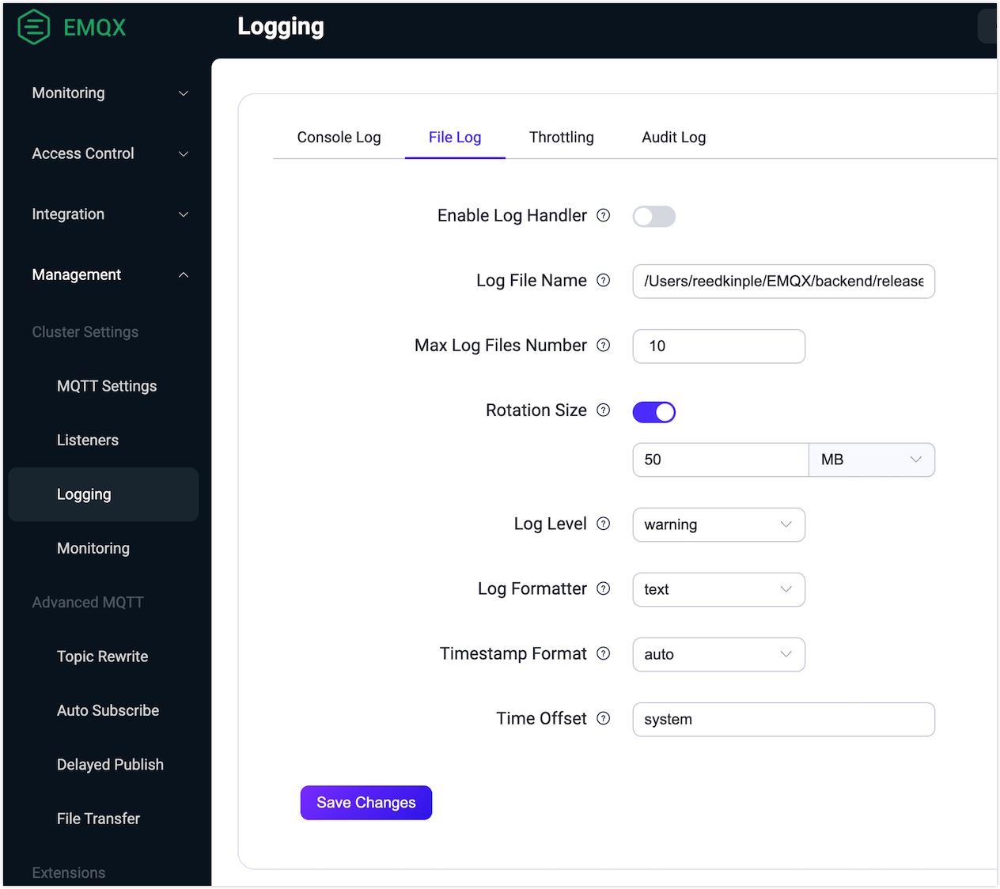

# Logs

Logs provide a reliable source of information for troubleshooting and system performance optimization. You can find the record about the access, operating or network issues from EMQX logs. 

EMQX supports both console logs and file logs. They are two different ways of outputting log data. You can choose the output method as needed or keep both. Console log refers to outputting log data to the console or command line interface. It is typically used during development and debugging, as it allows developers to quickly view log data in real-time as EMQX runs. File log refers to outputting log data to a file. This is typically used in production environments, where it is important to persist log data over time for analysis and troubleshooting.

To minimize the impact of logs on system operation, for example, when the log data is too much or the log writing is too slow, EMQX activates the overload protection mechanism by default to better serve our users.

## Log Level

EMQX log has 8 levels ([RFC 5424](https://www.ietf.org/rfc/rfc5424.txt)), with warning as the default level, from low to high these 8 levels are:

```bash
debug < info < notice < warning < error < critical < alert < emergency
```
The table below describes the meaning and output contents for each log level. 

| Log Level  | Meaning                                                      | Output Examples                                              |
| ---------- | ------------------------------------------------------------ | ------------------------------------------------------------ |
| debug      | Detailed information about the internal workings of a program, helping to debug and diagnose issues in the code. <br>It is not recommended to output this level of logging directly to the production environment. Instead, enable [Log Trace](./tracer.md) for a specific client. | Variable values, function call stacks, and other detailed debugging data. |
| info       | Useful information that is more general than debug-level logs. | Client connections, subscriptions, publishes, QoS levels, and message delivery status. |
| notice     | Important system information indicating that an event has occurred, but no action is required. | Number of clients connected to the proxy server, number of reconnections attempted, and number of crashed nodes. |
| warning    | The existence of potential issues or errors that require action; typically used for proactive monitoring and detecting potential problems before they become critical issues. | Disconnections, connection timeouts, authentication failures, and other similar events. |
| error      | The occurrence of an error that requires error handling; typically used to flag errors so that administrators can quickly detect and resolve issues. | Fails to connect to an external database, to subscribe to a non-existent topic, or to parse a configuration file, or other similar events. |
| critical   | Critical error that results in system crashes or prevents it from functioning; typically used to flag severe problems so that administrators can take immediate action. | Proxy server crashes, database unavailability, and other similar events. |
| alert      | The need for immediate action to prevent further losses. This level of logging will trigger an alert notification and may cause the application to stop. | The application has reached a critical threshold, such as running out of disk space or memory, or a critical system process has crashed or stopped responding. |
| Emergency? |                                                              |                                                              |

## Configure Logging via Dashboard

This section mainly describes how to configure logging with EMQX Dashboard. Changes take effect immediately without restarting the node.

Go to EMQX Dashboard. Click **Management** -> **Log** on the left navigation menu. Select the corresponding tab for configurations on console log or file log.

### Configure Console Log

On the **Log** page, select the **Console Log** tab. 

 

Configure the following fields for general settings of the console log handler:

- **Enable Log Handler**: Click the toggle switch to enable the console log handler. 

- **Log Level**: Select the log level to use from the drop-down list. Default value is: `warning`.

- **Time Offset**: Define the format of the timestamp in the log. `system` is typed by default.

- **Single Log Max Length**: Disabled by default, which means the maximum length of a single log message is unlimited. If you enable the toggle switch, you can specify the maximum length. When the length exceeds the limit, the log message will be truncated.

- **Log Formatter**: Select the log format from the drop-down list. Optional values are: `text` and `json`. Default value is `text`. 

  Note: If you select `json`, it is recommended to disable the toggle switch for **Single Log Max Length**, otherwise you will get incomplete json data.

- **Single Line Mode**: Enabled by default. If you disable the toggle switch, log messages wrap around when being printed.

- **Queue Length before Entering Sync Mode**: Set the number limit of buffered log events. If the message queue grows larger than the set value, the handler starts handling log events synchronously, which means that the client process sending the event must wait for a response. It is set to `100` by default. 

- **Queue Length before Entering Drop Mode**: Set the number limit of buffered log events. If the message queue grows larger than the set value, the handler starts to drop new log events. It is set to `3000` by default.

- **Flush Threshold**: Set the number limit of buffered log events. If the number of events exceeds the set value, the handler starts to discard the buffered log messages. It is set to `8000` by default.

Scroll down the page, and continue to configure the options for log file overload kill feature and log burst control feature.


- **Log Handler Overload Kill**: Enabled by default, which means the log handler process will be terminated when it is overload.
- **Log Handler Max Memory Size**: Type the value to specify the maximum memory size that the log handler process is allowed to use. Select the units from the drop-down list. Default value is `30 MB`.
- **Max Queue Length**: Type the value in the text box to specify the maximum allowed queue length. Default value is `2000`. 
- **Handler Restart Timer**: Enabled by default, which means the handler restarts automatically after a delay in the event of termination. You can specify the time for delay in the text box. Select the units from the drop-down list. If you disable the toggle switch, the value will be `infinity`, it will block any subsequent restarts.
- **Enable Burst**: Enabled by default.
- **Events Number**: Specify the maximum number of log events to handle within a `window_time` interval. Default value is `10000`.
- **Window Time**: Specify the window time for handling the log events. Default value is `1 second`.
- **Report Type**: Select the type from the drop-down list. Optional values: `error` and `progress`. Default value is `error`.
- **Max Depth**: Enabled by default. You can specify the maximum depth for Erlang term log formatting and Erlang process message queue inspection. You can increase or decrease the value using the number spinner. 

After you finished the configurations, click **Save Changes**.

### Configure File Log

On the **Log** page, select the **File Log** tab. 



Configure the following fields for the general settings of the console log handler:

- **Enable Log Handler**: Click the toggle switch to enable the file log handler.

- **Log File Name**: Type the name of the log file. The default name is `log/emqx.log`.

- **Rotation Enable**: The rotation feature is by default enabled. The generated log files will have corresponding index numbers added to their file suffixes.

- **Max Log Files Number**: Specify the maximum number of rotated log files. Default value is `10`.

- **Rotation Size**: Log file will be rotated once it reaches the specified size. It is by default enabled. You can type the specific value in the text box below. If you disable it, the value will be `infinity`, which means the log file will grow indefinitely.

- **Log Level**: Select the log level to use from the drop-down list. Optional values are: `debug`, `info`, `notice`, `warning`, `error`, `critical`, `alert`, `emergency`. Default value is: `warning`.

- **Time Offset**: Define the format of the timestamp in the log. `system` is typed by default.

- **Single Log Max Length**: Disabled by default, which means the maximum length of a single log message is unlimited. If you enable the toggle switch, you can specify the maximum length. When the length exceeds the limit, the log message will be truncated.

- **Log Formatter**: Select the log format from the drop-down list. Optional values are: `text` and `json`. Default value is `text`. 

  Note: If you select `json`, it is recommended to disable the toggle switch for **Single Log Max Length**, otherwise you will get incomplete json data.

- **Single Line Mode**: Enabled by default. When disabled, log messages wrap around when being printed.

- **Queue Length before Entering Sync Mode**: Set the number limit of buffered log events. If the message queue grows larger than the set value, the handler starts handling log events synchronously, which means that the client process sending the event must wait for a response. It is set to `100` by default. 

- **Queue Length before Entering Drop Mode**: Set the number limit of buffered log events. If message queue grous larger than the set value, the handler starts to drop new log events. It is set to `3000` by default.

- **Flush Threshold**: Set the number limit of buffered log events. The handler starts to discard the buffered log messages. It is set to `8000` by default.

Configuration options for log file overload kill feature and log burst control feature are the same as for [**Console Log**](#Configure Console Log).

When file logging is enabled (log.to = file or both), the following files will appear in the log directory:

- **emqx.log.N:** L og file prefixed with emqx.log, that contains all the log messages of EMQX, such as `emqx.log.1`,` emqx.log.2` ...
- **emqx.log.siz and emqx.log.idx:** System files used to record log rotation information. **Do not change manually**. 
- **run_erl.log:** System file used to record startup information when starting EMQX in the background with `emqx start`.
- **erlang.log.N:** Log file prefixed with erlang.log, which is a copy file of the console log when EMQX is started in the background with `emqx start`, such as `erlang.log.1`,` erlang.log.2` ...

## Configure Logging via Configuration File

You can also configure EMQX logging through configuration files. For example, if you want to export the warning-level logs to a file or output with a console, you can modify the configuration items under `log` in `emqx.conf` as shown below. The configuration takes effect after the node restarts. For more information on configuring logging with configuration files, see [Logs](../configuration/logs.md). 

```bash
log {
  file_handlers.default {
    level = warning
    file = "log/emqx.log"
    count = 10
    max_size = 50MB
    formatter = text
  }
  console_handler {
    level = warning
    formatter = text
  }
}
```

## Log Examples

The format of the log message (with different fields separated by spaces) is as follows:

```
**date time level client_info module_info msg**
```

where,

- **date:** Local data. The format is: YYYY-MM-DD
- **time:** Local time, accurate to milliseconds. The format is: hh:mm:ss.ms
- **level:** Log level, wrapped in brackets. The format is:[Level]
- **client_info (optional):** Only exists if this log message is related to a client. The format is: ClientId@Peername or ClientId or Peername
- **msg:** Log message content. The format is arbitrary and can contain spaces.

### Log Message Example 1:

```bash
2022-06-30T16:07:47.689512+08:00 [debug] clientid: test, line: 792, mfa: emqx_connection:handle_incoming/2, msg: mqtt_packet_received, packet: PINGREQ(Q0, R0, D0), payload: [], peername: 127.0.0.1:64391, tag: MQTT
```

The fields in this log message are:

- **datetime:** `2022-06-30T15:59:19.438914+08:00`
- **level:** `[debug]`
- **flat log-content:** `clientid: test, line: 792, mfa: emqx_connection:handle_incoming/2, msg: mqtt_packet_received, packet: PINGREQ(Q0, R0, D0), payload: [], peername: 127.0.0.1:64391, tag: MQTT`

This log indicates that EMQX received a `PINGREQ(Q0,R0,D0)` packet at `2022-06-30T16:07:47.689512+08:00` with clientid `test`. The IP of the client is `127.0.0.1:64391`.

### Log Message Example 2:

```bash
2022-06-30T16:25:32.446873+08:00 [debug] line: 150, mfa: emqx_retainer_mnesia:store_retained/2, msg: message_retained, topic: $SYS/brokers/emqx@127.0.0.1/sysdescr
```

The fields in this log message are:

- **date-time:** `2022-06-30T16:25:32.446873+08:00`
- **level:** `[debug]`
- **flat log-content:** `line: 150, mfa: emqx_retainer_mnesia:store_retained/2, msg: message_retained, topic: $SYS/brokers/emqx@127.0.0.1/sysdescr`
