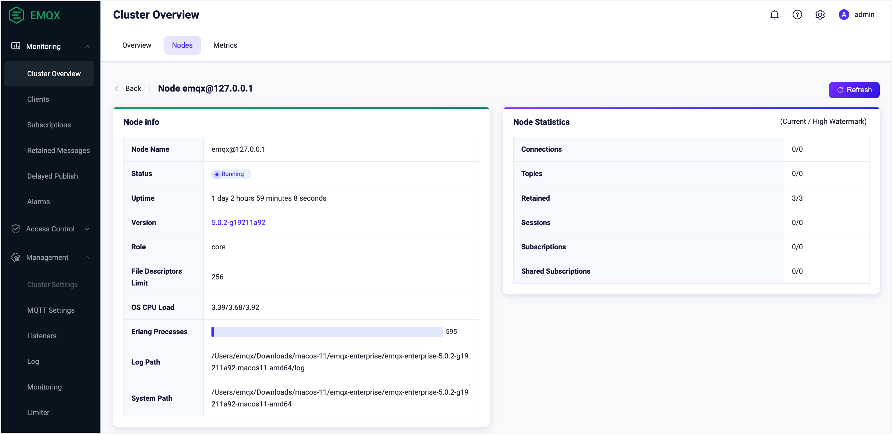
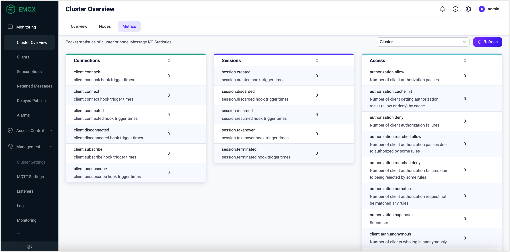
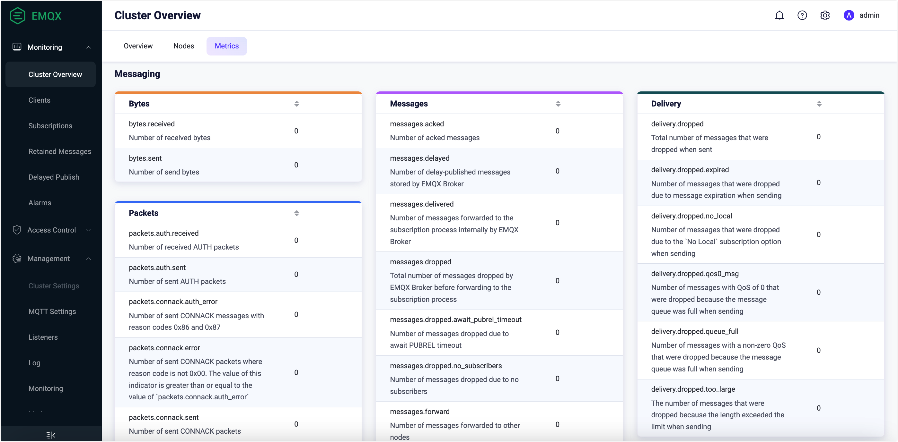
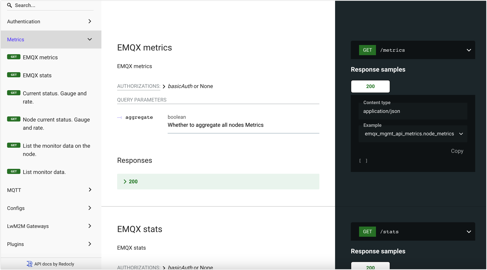
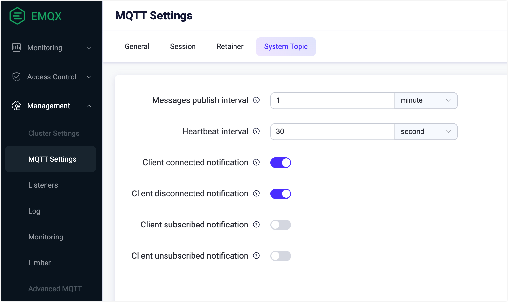

# Statistics and Metrics

EMQX provides metrics monitoring functions, based on which the operation and maintenance personnel can monitor the current service status and troubleshoot possible system malfunctions. 

EMQX divides monitoring status into Statistics and Metrics. 

- Statistics are integer-type gauges used to return a single value at the point of time the metric was requested. 
- Metrics are integer-type counters used to measure simple incrementing and decrementing numbers, such as the number of sent bytes and messages.  

EMQX provides users with multiple ways to view statistics and metrics. Most directly, you can view these data on the EMQX Dashboard. When it is not convenient to access the Dashboard, you can also get the data through [REST API](#request-metrics-and-statitics-via-rest-api) and [system topic](#obtain-metrics-and-statistics-via-system-topics) messages. Additionally, you can easily integrate the monitoring functions with your own monitoring system, see [Integrate with Prometheus](./prometheus.md). 

## View Statistics on Dashboard

On EMQX Dashboard, click **Monitoring** -> **Cluster Overview** from the left navigation menu. On the **Cluster Overview** page, click the **Nodes** tab. Click the name of the node to see the details about the node statistics of the specific node on the right.

Statistics include two values: current values and historical maximums, for example, the current number of subscriptions and the historical maximum number of subscriptions. Here is the EMQX statistics list:

| Statistics                 | Description                                                  |
| -------------------------- | ------------------------------------------------------------ |
| connections.count          | The number of current connections                            |
| connections.max            | The historical maximum number of connections                 |
| live_connections.count     | The number of currently live connections                     |
| live_connections.max       | The historical maximum number of live connections            |
| channels.count             | The same as `sessions.count`                                 |
| channels.max               | The same as `sessions.max`                                   |
| sessions.count             | The number of current sessions                               |
| sessions.max               | The historical maximum number of sessions                    |
| topics.count               | The number of current topics                                 |
| topics.max                 | The historical maximum number of topics                      |
| suboptions.count           | The same as `subscriptions.count`                            |
| suboptions.max             | The same as `subscriptions.max`                              |
| subscribers.count          | The number of current subscribers                            |
| subscribers.max            | The historical maximum number of subscribers                 |
| subscriptions.count        | The number of current subscriptions, including shared subscriptions |
| subscriptions.max          | The historical maximum number of subscriptions               |
| subscriptions.shared.count | The number of current shared subscriptions                   |
| subscriptions.shared.max   | The historical maximum number of shared subscriptions        |
| retained.count             | The number of currently retained messages                    |
| retained.max               | The historical maximum number of retained messages           |
| delayed.count              | The number of currently delayed messages                     |
| delayed.max                | The historical maximum number of delayed  messages           |

## View Metrics on Dashboard

On EMQX Dashboard, click **Monitoring** -> **Cluster Overview** from the left navigation menu. On the **Cluster Overview** page, you can see metrics by clicking the **Metrics** tab. EMQX Metrics currently covers four dimensions: bytes, packets, messages, and events.

### Connection and Session Metrics

You can see the event-related metrics for the cluster or node, such as client connection, connection sessions, and client access.

#### Connections

| Metrics             | Description                                                  |
| ------------------- | ------------------------------------------------------------ |
| client.connack      | The number of connection acknowledgment (CONNACK) messages received by clients |
| client.connect      | The number of connection requests from the client, including both successful and failed connection requests |
| client.connected    | The number of client connections that have succeeded         |
| client.disconnected | The number of client disconnections, including active and abrupt disconnection |
| client.subscribe    | The number of successful subscriptions                       |
| client.unsubscribe  | The number of successful unsubscriptions                     |

#### Sessions

| Metrics            | Description                                      |
| ------------------ | ------------------------------------------------ |
| session.created    | The number of sessions that have been created    |
| session.discarded  | The number of sessions that have been discarded  |
| session.resumed    | The number of sessions that have been resumed    |
| session.takenover  | The number of sessions that have been taken over |
| session.terminated | The number of sessions that have been terminated |

#### Access

| Metrics                     | Description                                                  |
| --------------------------- | ------------------------------------------------------------ |
| authorization.allow         | The total number of client authorization passes, including getting authorization results by cache and authorization requests not matched by any rules |
| authorization.deny          | The total number of client authorization fails, including getting authorization results by cache and authorization requests not matched by any rules |
| authorization.matched.allow | The number of client authorization passes due to authorized by some rules |
| authorization.matched.deny  | The number of client authorization fails due to being rejected by some rules |
| authorization.nomatch       | The number of client authorization requests not matched by any rules |
| authorization.cache_hit     | The number of clients getting authorization results (allow or deny) by cache |
| authorization.superuser     | The number of clients being authorized as superuser          |
| client.auth.anonymous       | The number of clients who log in anonymously                 |
| client.authenticate         | The number of triggered authentication                       |
| client.authorize            | The number of triggered authorization                        |

### Messaging

Scroll down the **Metrics** page, and you can see message-related metrics, including bytes, packets, messages, and delivery. 

#### Bytes

| Metrics    | Description              |
| -------------- | ------------------------ |
| bytes.received | The number of received bytes |
| bytes.sent     | The umber of sent bytes |

#### Packets

| Metrics                      | Description                                                  |
| ---------------------------- | ------------------------------------------------------------ |
| packets.received             | The number of received packets                               |
| packets.sent                 | The number of sent packets                                   |
| packets.connect.received     | The number of received CONNECT packets                       |
| packets.connack.auth_error   | The number of sent CONNACK messages with reason codes 0x86 and 0x87 |
| packets.connack.error        | The number of sent CONNACK packets with reason codes apart from 0x00. The value of this indicator is greater than or equal to the value of `packets.connack.auth_error` |
| packets.connack.sent         | The number of sent CONNACK packets                           |
| packets.publish.received     | The number of received PUBLISH packets                       |
| packets.publish.sent         | The number of sent PUBLISH packets                           |
| packets.publish.inuse        | The number of received PUBLISH packets with occupied packet identifiers |
| packets.publish.auth_error   | The number of received PUBLISH packets that failed the ACL check |
| packets.publish.error        | The number of received PUBLISH packets that cannot be published |
| packets.publish.dropped      | The number of PUBLISH packets that are discarded due to the receiving limit |
| packets.puback.received      | The number of received PUBACK packets                        |
| packets.puback.sent          | The number of sent PUBACK packets                            |
| packets.puback.inuse         | The number of received PUBACK messages with occupied identifiers |
| packets.puback.missed        | The number of received PUBACK packets with unknown identifiers |
| packets.pubrec.received      | The number of received PUBREC packets                        |
| packets.pubrec.sent          | The number of sent PUBREC packets                            |
| packets.pubrec.inuse         | The number of received PUBREC messages with occupied identifiers |
| packets.pubrec.missed        | The number of received PUBREC packets with unknown identifiers |
| packets.pubrel.received      | The number of received PUBREL packets                        |
| packets.pubrel.sent          | The number of sent PUBREL packets                            |
| packets.pubrel.missed        | The number of received PUBREL packets with unknown identifiers |
| packets.pubcomp.received     | The number of received PUBCOMP packets                       |
| packets.pubcomp.sent         | The number of sent PUBCOMP packets                           |
| packets.pubcomp.inuse        | The number of received PUBCOMP messages with occupied identifiers |
| packets.pubcomp.missed       | The number of missed PUBCOMP packets                         |
| packets.subscribe.received   | The number of received SUBSCRIBE packets                     |
| packets.subscribe.error      | The number of received SUBSCRIBE packets with failed subscriptions |
| packets.subscribe.auth_error | The number of received SUBACK packets that failed the ACL check |
| packets.suback.sent          | The number of sent SUBACK packets                            |
| packets.unsubscribe.received | The number of received UNSUBSCRIBE packets                   |
| packets.unsubscribe.error    | The number of received UNSUBSCRIBE packets with failed unsubscriptions |
| packets.unsuback.sent        | The number of sent UNSUBACK packets                          |
| packets.pingreq.received     | The number of received PINGREQ packets                       |
| packets.pingresp.sent        | The number of sent PUBRESP packets                           |
| packets.disconnect.received  | The number of received DISCONNECT packets                    |
| packets.disconnect.sent      | The number of sent DISCONNECT packets                        |
| packets.auth.received        | The number of received AUTH packets                          |
| packets.auth.sent            | The number of sent AUTH packets                              |

#### Message (PUBLISH packet)

| Metrics                   | Description                                                  |
| ------------------------------- | ------------------------------------------------------------ |
| messages.acked | The number of acknowledged messages |
| messages.delayed                | The number of messages for delayed publish that are stored by EMQX |
| messages.delivered              | The number of messages forwarded to the subscription process internally by EMQX |
| messages.dropped                | The total number of messages dropped by EMQX before forwarding to the subscription process |
| messages.dropped.no_subscribers | The number of messages dropped due to no subscribers  |
| messages.dropped.await_pubrel_timeout | The number of messages dropped due to await PUBREL timeout |
| messages.forward                | The number of messages forwarded to other nodes       |
| messages.publish                | The number of messages published in addition to system messages |
| messages.qos0.received          | The number of QoS 0 messages received from clients    |
| messages.qos1.received          | The number of QoS 2 messages received from clients    |
| messages.qos2.received          | The number of QoS 1 messages received from clients    |
| messages.qos0.sent              | The number of QoS 0 messages sent to clients          |
| messages.qos1.sent              | The number of QoS 1 messages sent to clients          |
| messages.qos2.sent              | The number of QoS 2 messages sent to clients          |
| messages.received               | The number of messages received from the client, which is equal to the sum of `messages.qos0.received`,` messages.qos1.received`, and `messages.qos2.received` |
| messages.sent                   | The number of messages sent to the client, which is equal to the sum of `messages.qos0.sent`,` messages.qos1.sent`, and `messages.qos2.sent` |

#### Delivery

| Metrics                     | Description                                                  |
| --------------------------- | ------------------------------------------------------------ |
| delivery.dropped            | The total number of messages that have been dropped when being sent |
| delivery.dropped.expired    | The number of messages that have been dropped because the message expired when being sent |
| delivery.dropped.no_local   | The number of messages that have been dropped due to the `No Local` subscription option when being sent |
| delivery.dropped.qos0_msg   | The number of messages with QoS of 0 that have been dropped because the message queue was full when being sent |
| delivery.dropped.queue_full | The number of messages with a non-zero level of QoS that have been dropped because the message queue was full when being sent |
| delivery.dropped.too_large  | The number of messages that have been dropped because the length exceeded the limit when being sent |

## Request Monitoring Status via REST API

You can also get the metrics and statistics through the [API Docs](https://docs.emqx.com/en/enterprise/v5.0/admin/api-docs.html). Click **Metrics** on the left navigation menu on the UI to execute this API request. For how to work with EMQX API, see [REST API](../admin/api.md).

## Obtain Monitoring Status via System Topics

EMQX periodically publishes messages about the running status, message statistics, and client online and offline events through system topics. Clients can subscribe to system topics by adding the prefix `$SYS/` before the topic name. For more information on different types of system topics, see [System Topic](./mqtt-system-topics.md).

You can configure system topic settings on Dashboard. Click **Management** -> **MQTT Settings** from the left navigation menu. Select **System Topic** tab.

- **Messages publish interval**: Set the time interval for sending `$sys` topic. 
- **Heartbeat interval**: Set the time interval for sending heartbeat messages.
- **Client connected notification**: Enabled by default and event messages about client being connected will be published.
- **Client disconnected notification**: Enabled by default and event messages about client being disconnected will be published.
- **Client subscribed notification**: Disabled by default; When enabled, event messages about a client subscribing to a topic will be published.
- **Client unsubscribed notification**: Disabled by default; When enabled, event messages about a client unsubscribing to a topic will be published.

