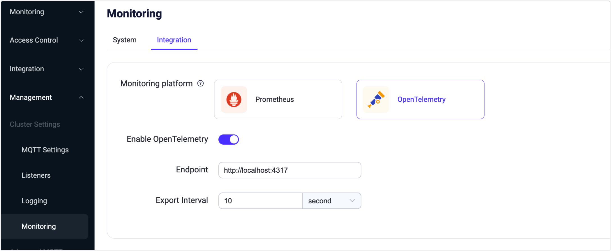

# Integrating Opentelemetry

[OpenTelemetry](https://opentelemetry.io/docs/what-is-opentelemetry/) is an observability framework and toolkit designed to create and manage telemetry data such as traces, metrics, and logs. Crucially, OpenTelemetry is vendor- and tool-agnostic, meaning that it can be used with a broad variety of Observability backends, including open source tools like Jaeger and Prometheus, as well as commercial offerings. 
EMQX 5.2 has support for sending Metrics via the OTEL protocol to the OpenTelemetry Collector.

```
                                       -> StatsD
                                       -> ElasticSearch        
       GRPC                            -> InfluxDB
EMQX    -->   Opentelemetry Collector  -> Prometheus
       OTEL Protocol                   -> Datadog
                                       -> Amazon CloudWatch
                                       -> Any open source or vendor backend of your choice
```

## Prerequisites
- Deploy [OpenTelemetry Collector](https://opentelemetry.io/docs/collector/getting-started).

- Configure Collector's GRPC receiving port (default 4317) and Prometheus Metrics exporting port (8889).
```
# otel-collector-config.yaml
receivers:
  otlp:
    protocols:
      grpc:

exporters:
  prometheus:
    endpoint: "0.0.0.0:8889"
      
processors:
  batch:
  
service:  
  pipelines:    
    metrics:
      receivers: [otlp]
      processors: [batch]
      exporters: [prometheus]
```
- Deploy [Prometheus])https://prometheus.io/docs/prometheus/latest/installation).
- Configure Prometheus to scrape metrics collected by the Collector.
```
# prometheus.yaml
scrape_configs:
  - job_name: 'otel-collector'
    scrape_interval: 10s
    static_configs:
      - targets: ['otel-collector:8889'] # emqx metrics
      - targets: ['otel-collector:8888'] # collector metrics
```

## Configurate EMQX via Dashboard


- EndPoint: Collector's GRPC address, default is `http://localhost:4317`.
- Export Interval: Interval to push metrics to Collector, default 10 seconds.

## Visualize EMQX metrics in Prometheus

The EMQX metrics can be viewed in Prometheus web console (http://otel-collector:9090):


## Summary

EMQX has built-in support for pushing metrics directly to the OpenTelemetry Collector over the GRPC OTEL protocol. The Collector can then route, filter, and transform the data to any desired backend for storage and visualization.

Future versions of EMQX will also integrate trace and log data with the Collector, enabling full OpenTelemetry support.


