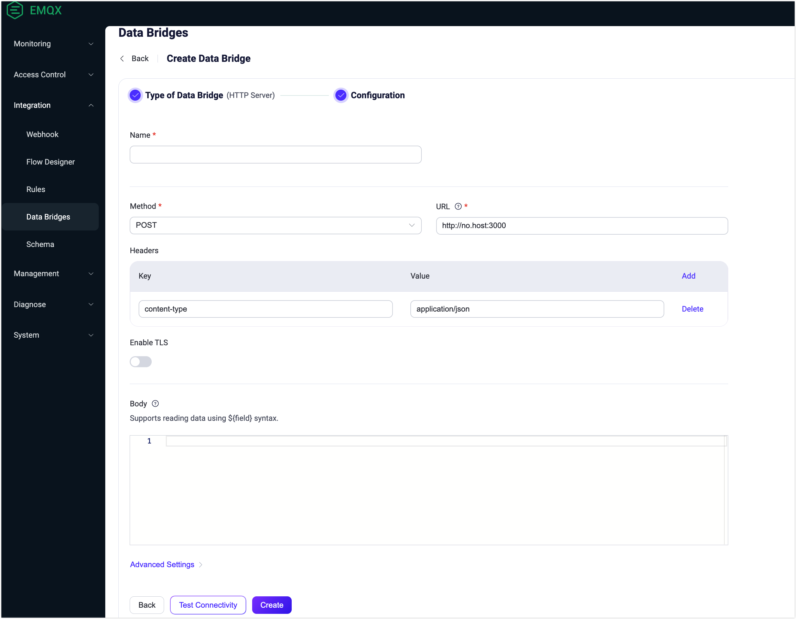
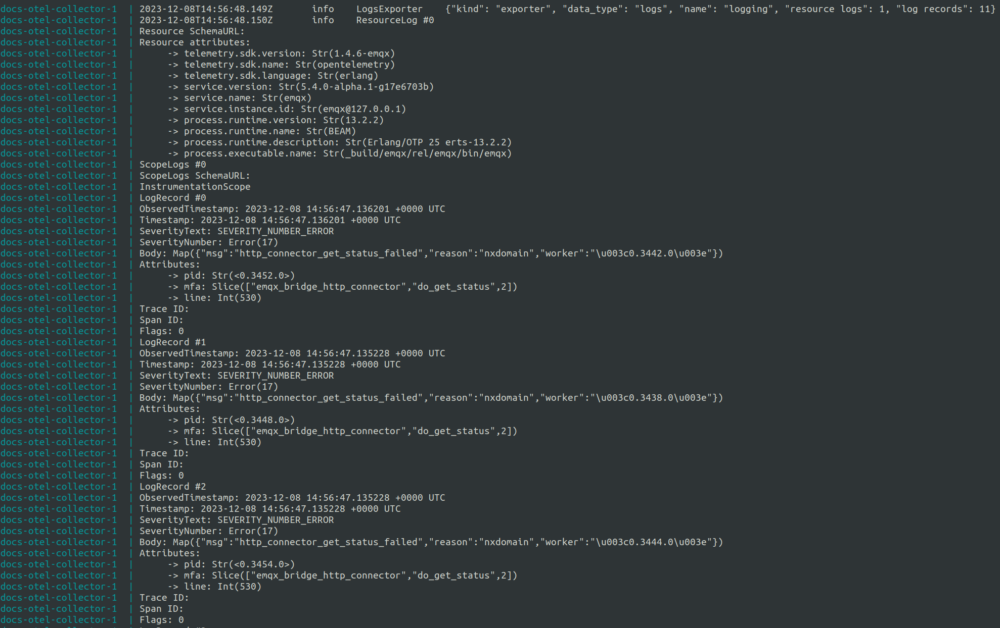

# Integrate OpenTelemetry for Log Management

This page provides a comprehensive guide on integrating the OpenTelemetry log handler with EMQX for advanced log management. It covers setting up the OpenTelemetry Collector, configuring the OpenTelemetry log handler in EMQX to export logs, and managing potential log overloads. This integration allows you to format EMQX log events according to [OpenTelemetry log data model](https://opentelemetry.io/docs/specs/otel/logs/data-model/) and export them to the configured OpenTelemetry Collector or backend system, offering improved monitoring and debugging capabilities.

## Set Up OpenTelemetry Collector

Before enabling EMQX OpenTelemetry logging, you need to deploy and configure OpenTelemetry Collector and an OpenTelemetry compatible logging collection system. This guide walks you through deploying the [OpenTelemetry Collector](https://opentelemetry.io/docs/collector/getting-started) and setting it up to redirect logs to `stdout` using the debug exporter.

1. Create the OpenTelemetry Collector configuration file named `otel-logs-collector-config.yaml`:

   ```yaml
   receivers:
     otlp:
       protocols:
         grpc:
   
   exporters:
     logging:
       verbosity: detailed
   
   processors:
     batch:
   
   extensions:
     health_check:
   
   service:
     extensions: [health_check]
     pipelines:
       logs:
         receivers: [otlp]
         processors: [batch]
         exporters: [logging]
   ```

2. In the same directory, create a Docker Compose file `docker-compose-otel-logs.yaml`:

   ```yaml
   version: '3.9'
   
   services:
     # Collector
     otel-collector:
       image: otel/opentelemetry-collector:0.90.0
       restart: always
       command: ["--config=/etc/otel-collector-config.yaml", "${OTELCOL_ARGS}"]
       volumes:
         - ./otel-logs-collector-config.yaml:/etc/otel-collector-config.yaml
       ports:
         - "13133:13133" # Health check extension
         - "4317:4317"   # OTLP gRPC receiver
   ```

3. Launch the Collector using Docker Compose:

   ```bash
   docker compose -f docker-compose-otel-logs.yaml up
   ```

4. Once operational, the OpenTelemetry Collector should be accessible at [http://localhost:4317](http://localhost:4317/).


## Enable OpenTelemetry Log Handler in EMQX

1. Add the configuration below to the EMQX `cluster.hocon` file (assuming EMQX runs locally):

   ```bash
   opentelemetry {
     exporter {endpoint = "http://localhost:4317"}
     logs {enable = true, level = warning}
   }
   ```

   ::: warning Note

   The `opentelemetry.logs.level` setting is overridden by the default log level configured in [EMQX log handler(s)](../../observability/log.md). For instance, if OpenTelemetry log level is `info` but EMQX console log level is `error`, only `error` level events or higher will be exported. 

   :::

2. Start the EMQX node.

3. Generate EMQX log events, such as creating a bridge to an inaccessible HTTP service via the Dashboard:

   

4. Shortly after (default is around 1 second), the Otel Collector should display the received EMQX log events, like those indicating HTTP bridge connection failures:

   

## Manage Log Overload

EMQX accumulates log events and exports them periodically in batches.
The frequency of this export is controlled by the `opentelemetry.logs.scheduled_delay` parameter, defaulting to 1 second. 
The batching log handler incorporates an overload protection mechanism, allowing accumulating events only up to a specific limit, which defaults to 2048. You can configure this limit using the following configuration:

```
opentelemetry {
  logs {max_queue_size = 2048}
}
```
Once the `max_queue_size` limit is reached, new log events will be dropped until the current queue is exported.

::: warning Note

OpenTelemetry logs overload protection works independently from the default [EMQX log handler(s)](../log.md) overload protection.
Thus, depending on the configuration, the same log event can be dropped by OpenTelemetry handler but logged by default EMQX log handler(s), or vice versa.
:::
