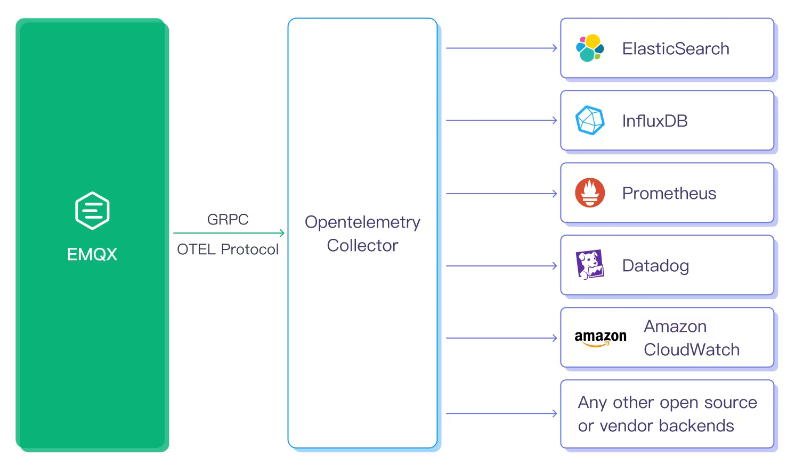

# Integrate with OpenTelemetry

[OpenTelemetry](https://opentelemetry.io/docs/what-is-opentelemetry/) is an observability framework and toolkit designed to create and manage telemetry data such as traces, metrics, and logs. Crucially, OpenTelemetry is vendor- and tool-agnostic, meaning that it can be used with a broad variety of Observability backends, including open-source tools like Jaeger and Prometheus, as well as commercial offerings.

EMQX supports directly pushing telemetry data to the OpenTelemetry Collector via the gRPC OTEL protocol, and then transferring, filtering, or converting the data through the Collector to any backend you want to integrate for storage and visualization, such as Jaeger and [Prometheus](../../observability/prometheus.md). By integrating with OpenTelemetry, EMQX's metric collection, distributed tracing of message publishing, and unified collection and context association of logs can be optimized. This integration can help users achieve visual monitoring and alert notifications for EMQX, tracking the flow of messages between different systems and services. This is very helpful for continuous performance optimization, quicker problem localization, and system monitoring.

This section introduces how EMQX integrates the telemetry data with the OpenTelemetry Collector, enabling full built-in OpenTelemetry support for the following observability information:

- [Metrics](./metrics.md)
- [Traces](./traces.md)
- [Logs](./logs.md)
