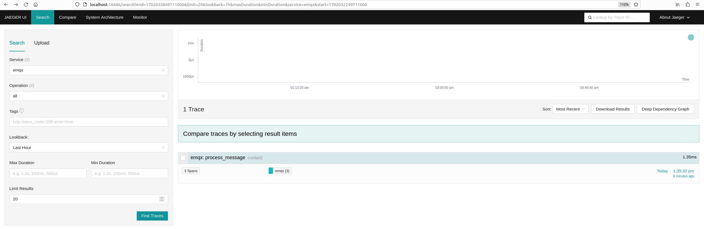

# EMQX OpenTelemetry Traces

EMQX 5.4 introduced support for distributed [OpenTelemetry tracing](https://opentelemetry.io/docs/concepts/signals/traces/).

The Trace Context is propagated via MQTT 'User-Property', following the [W3C recommendation document](https://w3c.github.io/trace-context-mqtt/).

::: tip Warning

'User-Property was introduced in MQTT 5.0, so EMQX can extract and propagate Trace Context only when MQTT 5.0 is used.
:::


## Prerequisites

Before instrumenting EMQX with OpenTelemetry traces, you need to deploy and configure OpenTelemetry Collector and preferably an OpenTelemetry compatible observability platform. In this example, we will use Jaeger:

 - [OpenTelemetry Collector](https://opentelemetry.io/docs/collector/getting-started).
 - [Jaeger](https://www.jaegertracing.io/docs/latest/deployment/).

## Local setup

1. Create OpenTelemetry Collector config file, `otel-trace-collector-config.yaml`:

```yaml
receivers:
  otlp:
    protocols:
      grpc:

exporters:
  otlp:
    endpoint: jaeger:4317
    tls:
      insecure: true

processors:
  batch:

extensions:
  health_check:

service:
  extensions: [health_check]
  pipelines:
    traces:
      receivers: [otlp]
      processors: [batch]
      exporters: [otlp]
```

2. Create `docker-compose-otel-trace.yaml` in the same directory as the otel config file:

```yaml
version: '3.9'

services:
  jaeger:
    image: jaegertracing/all-in-one:1.51.0
    restart: always
    ports:
      - "16686:16686"

  # Collector
  otel-collector:
    image: otel/opentelemetry-collector:0.90.0
    restart: always
    command: ["--config=/etc/otel-collector-config.yaml", "${OTELCOL_ARGS}"]
    volumes:
      - ./otel-trace-collector-config.yaml:/etc/otel-collector-config.yaml
    ports:
      - "13133:13133" # health_check extension
      - "4317:4317"   # OTLP gRPC receiver
    depends_on:
      - jaeger-all-in-one
```

3. Start the services:

```bash
docker compose -f docker-compose-otel-trace.yaml up
```

4. Once docker compose services are up,  OpenTelemetry collector listens on the default GRPC port (4317) on the host machine and Jaeger WEB UI can be accessed at http://localhost:16686.


## Configure EMQX OpenTelemetry traces integration

1. Add the following configuration to EMQX cluster.hocon (assuming that EMQX is running on the same local machine):

```
opentelemetry {
  exporter {endpoint = "http://localhost:4317"}
  traces {enable = true}
}
```

2. Start EMQX node.
   In this example, we will start 2 nodes cluster with node names `emqx@127.0.0.1` and `emqx1@1270.0.1` to illustrate distributed tracing capabilities.

3. Subscribe a few clients to the same topics using MQTT X CLI client:

   3.1 On `emqx@127.0.0.1` node (assuming default MQTT listener is on 1883 port):

    ```
    mqttx-cli sub -t t/trace/test -h localhost -p 1883
    ```

   3.2 On `emqx@127.0.0.1` node (assuming it listens  on 1884 port):

    ```
    mqttx-cli sub -t t/trace/test -h localhost -p 1884
    ```

4. Publish a message to the topic with a valid `traceparent` User-Property:

    ```
    mqttx-cli pub -t t/trace/test -h localhost -p 1883 -up "traceparent: 00-cce3a024ca134a7cb4b41e048e8d98de-cef47eaa4ebc3fae-01"
    ```

5. Wait for about 5 seconds (the default interval at which EMQX exports trace data) and go to Jaeger WEB UI (http://localhost:16686):

    5.1 Select `emqx` service and click 'Find traces'. Wait a few seconds v1.4.6-emqxmore and refresh the page if `emqx` service has not appeared in the drop-down list.

    5.2. You should see the message trace:

    

    5.3. Click on the trace to see span details and the trace timeline:

    


As can be seen in the example, EMQX traces two distinct spans:

 - `process_message` spans which starts when PUBLISH packet is received and parsed by EMQX node and ends when the message is dispatched to local subscribers and/or forwarded to other nodes that have active subscribers.  One span corresponds to one traced published message.

 - `send_published_message` which starts when a traced message is received by a subscriber connection controlling process and ends when outgoing packet is serialized and sent to the connection socket. One `send_published_message` span is created per each active subscriber.


## External trace context propagation by EMQX

If EMQX receives trace context (`traceparent`/`tracestate` User-property) in a published message, it always sends it unaltered when forwarding the Application Message to a Client in conformance with [MQTT specification 3.3.2.3.7](https://docs.oasis-open.org/mqtt/mqtt/v5.0/os/mqtt-v5.0-os.html#_Toc3901116).

Due to this reason, EMQX is capable of participating in distributed trace out of the box (even if OpenTelemetry Trace feature is disabled), simply by propagating User-Properties from a publisher to a subscriber.
Enabling Traces integration in EMQX is only needed to trace the external EMQX spans as described above.

## Overload protection

EMQX accumulates tracing spans and exports them periodically in batches.
The exporting interval is controlled by `opentelemetry.trace.scheduled_delay` configuration parameter, which defaults to 5s.
The batching trace spans processor has an overload protection mechanism, which allows to accumulate spans only up to a certain limit.

The limit is configurable and defaults to 2048 spans:

```
opentelemetry {
  traces {max_queue_size = 2048}
}
```
Once the `max_queue_size` limit is reached, new tracing spans will be dropped until the current queue is exported.

::: tip Warning

If a traced message dispatched to a high number of subscribers (much higher than the value of `max_queue_size`),
it is expected that only small number of spans will be exported and most of the spams will be dropped by the overload protection.

Increasing `max_queue_size` should always be done with extra care, as it can affect performance and memory consumption.
:::
