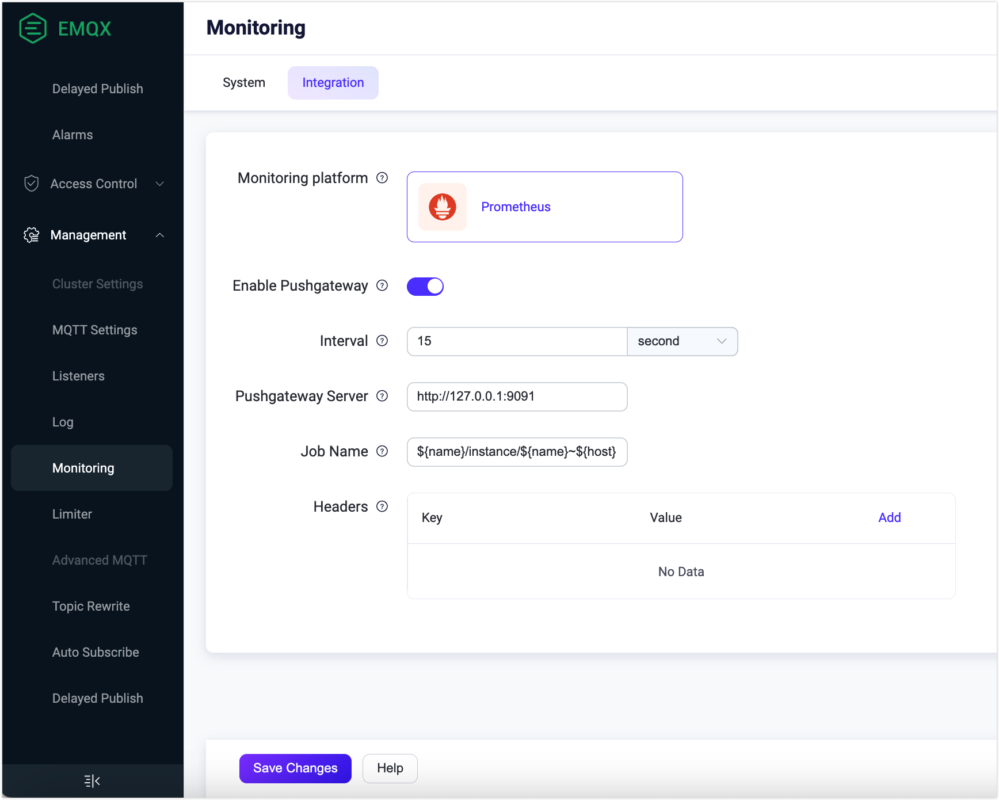

# Integrate with Prometheus

EMQX supports integration with third-party monitoring systems, such as [Prometheus](https://prometheus.io/). It is the monitoring solution open-sourced by SoundCloud. It offers a versatile set of features including support for multidimensional data models, flexible query language, and powerful alarm management.

Using a third-party monitoring system can bring the following advantages:

- A complete monitoring system, where the monitoring data of EMQX will be integrated with that of the other systems. For example, you can get the monitoring information of the server host;
- More intuitive monitoring report with figures and charts, such as using [Grafana dashboard](#use-grafana-to-visualize-EMQX-metrics);
- Various alarm notification options, such as using Prometheus Alertmanager.



Since EMQX 5.0.4, you can use EMQX Dashboard for configuration. In the EMQX Dashboard, click **Management** -> **Monitoring** on the left navigation menu, then click the **Integration** tab for the configuration, which takes effect immediately after saving without needing to restart the node.





You can use EMQX Dashboard to configure monitoring data integration to Prometheus platform. In the EMQX Dashboard, click **Management** -> **Monitoring** on the left navigation menu, then click the **Integration** tab for the configuration.



## Configure Prometheus Integration

There are two different modes for integrating Prometheus monitoring metrics: the pull mode and using Pushgateway. This section describes the configuration of these two modes and the configuration of Grafana.

### Pull Metrics via REST API

To collect metrics using the pull mode via the REST API, you need to configure pull rules on Prometheus. You can click the **Help** button on the Prometheus configuration page to view specific configuration instructions.

EMQX provides the following API endpoints for Prometheus to collect system metrics:

- `http://127.0.0.1:18083/api/v5/prometheus/stats`: Basic metrics and counters of EMQX.
- `http://127.0.0.1:18083/api/v5/prometheus/auth`: Key metrics and counters in access control, including authentication and authorization.
- `http://127.0.0.1:18083/api/v5/prometheus/data_integration`: Metrics and counters related to the rule engine, connectors, actions, and codecs.

::: tip

For more information about Prometheus pull endpoints, refer to the API documentation: [Monitor](https://www.emqx.io/docs/zh/v5.4/admin/api-docs.html#tag/Monitor). 

:::

#### Node or Cluster Metrics

When calling the above API endpoints to obtain metrics, different URL query parameters are supported to obtain different types of metric values.

- `mode=node`: The default value, returns metrics of the current node. If the `mode` is not specified, it defaults to returning this metric.

- `mode=all_nodes_aggregated`: Cluster metric aggregation mode, the arithmetic or logical sum of metrics from all running nodes in the cluster. 

  :::tip Logical Sum: 

  For metrics such as "On/Off Status," "Running Status," the logical sum will be returned. 

  :::

- `mode=all_nodes_unaggregated`: Cluster metric non-aggregation mode, metrics of all running nodes in the cluster. For different nodes' metrics, the node name is added as a label to distinguish between different nodes. 

  :::tip Example:

  ```
  ...
  emqx_connections_count{node="emqx@127.0.0.1"} 0
  ...
  ```

  :::

### Use Pushgateway

EMQX supports pushing metrics to Pushgateway, which is disabled by default. To enable the Pushgateway service, you can click the **Enable Pushgateway** toggle switch on the Prometheus configuration page in the Dashboard. 

::: tip 

Currently, pushing metrics to Pushgateway only includes the content from the `/api/v5/stats` endpoint. 

:::



Configure the following fields according to your business needs, and then click **Save Changes**. 

- **Interval**: Specify the time interval for reporting the monitoring metrics data to Pushgateway. The default value it `15` seconds.
- **Pushgateway Server**: Type the URL of Prometheus server. It is `http://127.0.0.1:9091` by default.
- **Job Name**: Specify variables that include the EMQX node name and hostname. The default value is `${name}/instance/${name}~${host}`. For example, when the EMQX node name is `emqx@127.0.0.1`, the `name` variable takes the value `emqx` and the `host` variable takes the value `127.0.0.1`.
- **Headers**: Type the key and value of the HTTP headers for the monitoring metrics that are pushed to Pushgateway. You can add a list of headers by clicking the **Add** button. The type is string, for example, { Authorization = "some-authz-tokens"}.

At the same time, you can click the **Help** button and refer to the steps on the **Use Pushgateway** tab for configuration.

You can enable and configure the Pushgateway by adding the following configurations to `etc/emqx.conf`. For more information on configuration items, see [Configuration - Prometheus](../configuration/prometheus.md).

```bash
prometheus {
  push_gateway_server = "http://127.0.0.1:9091"
  interval = 15s
  headers {}
  job_name = "${name}/instance/${name}~${host}"
}
```

## Use Grafana to Visualize EMQX Metrics

You can also use Grafana with Prometheus to visualize EMQX metrics, which can be achieved by importing the EMQX template files into Grafana. To download the template, click [EMQX | Grafana Dashboard](https://grafana.com/grafana/dashboards/17446-emqx/) or click the **Help** button at the bottom of the **Integration** tab of the **Monitoring** page.

::: tip

For detailed operating steps, see [Monitoring MQTT broker with Prometheus and Grafana](https://www.emqx.com/en/blog/emqx-prometheus-grafana)

:::
