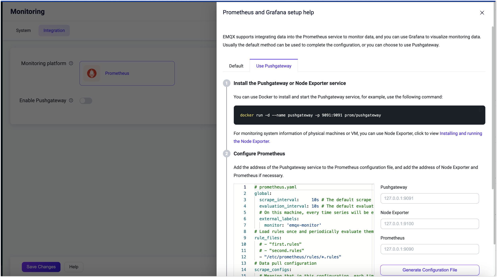

# Integrate with Prometheus

EMQX supports integration with third-party monitoring systems, such as [Prometheus](../observability/prometheus.md). Using a third-party monitoring system can bring the following advantages:

- A complete monitoring system, where the monitoring data of EMQX will be integrated with that of the other systems. For example, you can get the monitoring information of the server host;
- More intuitive monitoring report with figures and charts, such as using [Grafana dashboard](#use-grafana-to-visualize-EMQX-metrics);
- Various alarm notification means, such as using Prometheus Alertmanager.

[Prometheus](https://prometheus.io/) is the monitoring solution open-sourced by SoundCloud. It offers a versatile set of features including support for multidimensional data models, flexible query language, and powerful alarm management.

EMQX provides the following endpoints to integrate with Prometheus to collect system metrics: `http://127.0.0.1:18083/api/v5/prometheus/stats`. 

## Configure via Dashboard



Since EMQX 5.0.4, you can use EMQX Dashboard for configuration. In the EMQX Dashboard, click **Management** -> **Monitoring** on the left navigation menu, then click the **Integration** tab for the configuration, which takes effect immediately after saving without needing to restart the node.





You can use EMQX Dashboard to configure monitoring data integration to Prometheus platform. In the EMQX Dashboard, click **Management** -> **Monitoring** on the left navigation menu, then click the **Integration** tab for the configuration.

You can click the **Help** button at the bottom to see the instructions on how to set up Prometheus and Grafana, a monitoring dashboard of Prometheus.



### Enable Pushgateway

EMQX also supports pushing metrics to Pushgateway server, which is disabled by default. You can also enable Pushgateway on Dashboard by clicking the toggle switch. When Pushgateway is enabled, you can configure the following items for the service:


- **Interval**: Specify the time interval for reporting the monitoring metrics data to Pushgateway. The default value it `15` seconds.
- **Pushgateway Server**: Type the URL of Prometheus server. It is `http://127.0.0.1:9091` by default.
- **Job Name**: Specify variables that include the EMQX node name and hostname. The default value is `${name}/instance/${name}~${host}`. For example, when the EMQX node name is `emqx@127.0.0.1`, the `name` variable takes the value `emqx` and the `host` variable takes the value `127.0.0.1`.
- **Headers**: Type the key and value of the HTTP headers for the monitoring metrics that pushed to Pushgateway. You can add a list of headers by clicking the **Add** button. The type is string, for example, { Authorization = "some-authz-tokens"}.

After you complete the configuration, click **Save Changes**.



## Configure via Configuration File

You can also configure integration with Prometheus through configuration files. You can modify the configuration items under `prometheus` in `emqx.conf` as shown below.  

You can enable the Pushgateway server by adding the following configurations to `etc/emqx.conf`. For more information on configuration items, see [Prometheus](../configuration/prometheus.md).

```bash
prometheus {
  push_gateway_server = "http://127.0.0.1:9091"
  interval = 15s
  headers {}
  job_name = "${name}/instance/${name}~${host}"
}
```

## Use Grafana to Visualize EMQX Metrics

You can also use Grafana with Prometheus to visualize EMQX metrics, which can be achieved by importing the EMQX template files into Grafana. 

To download the template, click [EMQX | Grafana Dashboard](https://grafana.com/grafana/dashboards/17446-emqx/) or click the **Help** button at the bottom of the **Integration** tab of the **Monitoring** page.

::: tip

For detailed operating steps, see [Monitoring MQTT broker with Prometheus and Grafana](https://www.emqx.com/en/blog/emqx-prometheus-grafana)

:::
