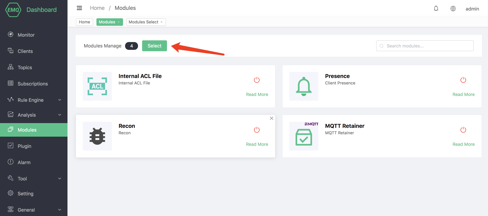
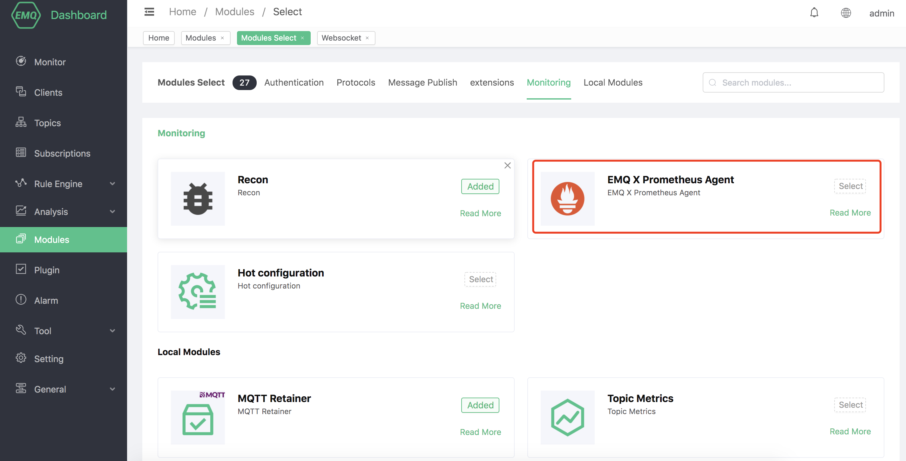
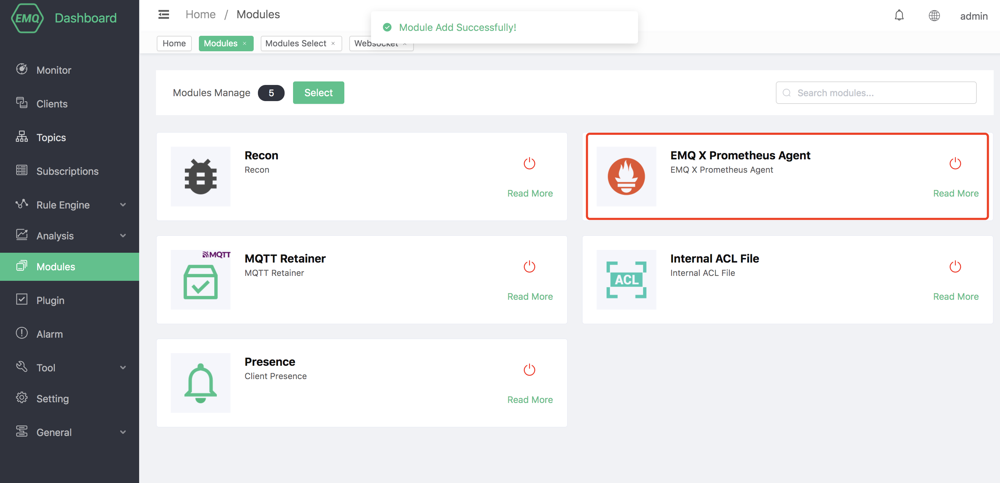

# EMQX Prometheus Agent

EMQX Prometheus Agent supports pushing data to Pushgateway, and then pulling it by Promethues Server for storage.

## Create module

Open [EMQX Dashboard](http://127.0.0.1:18083/#/modules), click the "Modules" tab on the left, and choose to add:

Choose EMQX Prometheus Agent

Configure related parameters

After clicking add, the module is added

### Grafana Data Template

The ʻemqx_prometheus` plugin provides template files for Grafana's Dashboard. These templates contain the display of all EMQX monitoring data. Users can directly import it into Grafana to display the icon of EMQX monitoring status.

The template file is located at: [emqx_prometheus/grafana_template](https://github.com/emqx/emqx-prometheus/tree/master/grafana_template).
