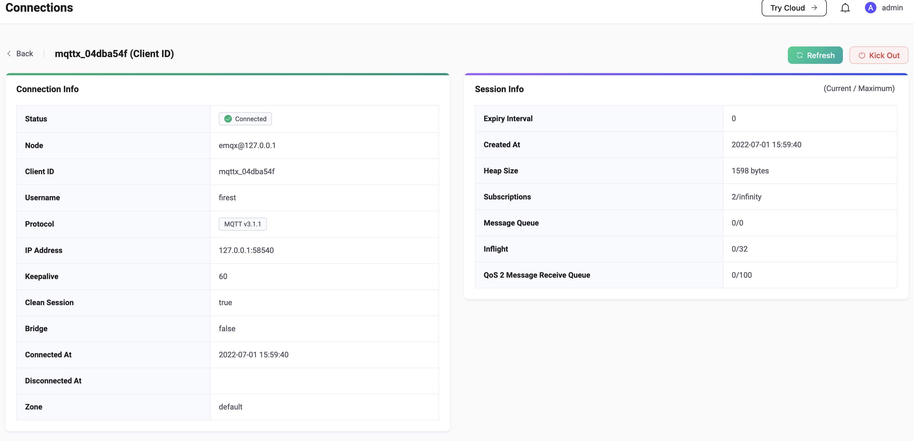

# Slow subscribers statistics

This module ranks subscribers and topics in descending order according to the latency of message transmission

## Open module

Open EMQX Dashboard, click on the `Diagnose` and select `Slow Subscriptions`, then `Enable` it.

## Implementation note

With this feature enabled, EMQX will start measuring message transmission latency.
The measurement always starts when a message is received by EMQX, and the end of the measurement is configurable.
See more details below in configurations.

The per clientid-topic latency measurements are then ranked in the table view.

## Configuration description

-   threshold

     *threshold* is the minimum number of milliseconds the latency has to exceed, otherwise not collected for ranking

-   top\_k\_num

    This field determines the upper limit of the number of statistical records in the ranking table

-   expire\_interval

    *expire interval* controls the effective time of each ranking record. If the a client-topic has no higher latency inserted for such long time, the record expires. For example if expire interval is 5 minutes, and client1-topic1 had a latency 500ms recorded (ranked top-K) at T1, and for the next 5 minutes there are no further measurements greater than 500, the ranking recorded will be deleted shortly after T1+5min

-   stats\_type

    The ways to calculate the latency are as follows:

    1.  `whole`

        From the time the message arrives at EMQX until the message completes transmission

    2.  `internal`

        From when the message arrives at EMQX until when EMQX starts delivering the message

    3.  `response`

        From the time EMQX starts delivering the message, until the message completes transmission

    Definition of message completion transmission:

    1.  QoS 0

        When EMQX starts to deliver

    2.  QoS 1

        When EMQX receives *PUBACK* from the client

    3.  QoS 2

        When EMQX receives *PUBCOMP* from the client

Note: The open source version is configured in emqx.conf

## Slow subscribers record

Under this tab, the subscriber information will be displayed in descending order according to the time latency. After Clicking *Client ID*, it will display the subscriber details, where you can analyze and find the problem.

