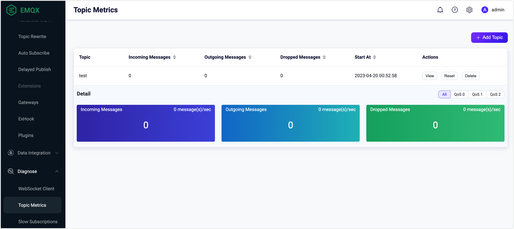
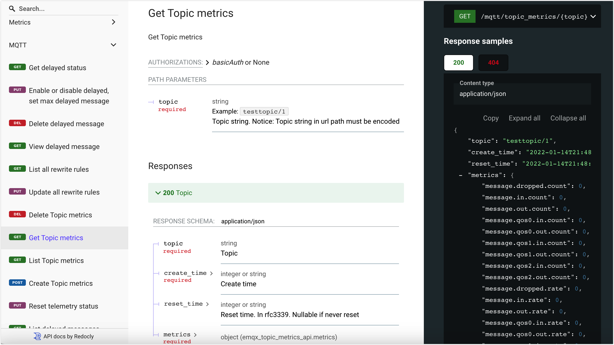

# Topic Metrics

EMQX provides a topic monitoring feature (called Topic Metrics) that allows you to count the number of messages sent and received, the rate and other metrics for a given topic. You can view and use this feature on EMQX Dashboard by clicking **Diagnose** -> **Topic Metrics** from the left navigation menu, or you can request topic metrics through the HTTP API.

## View Topic Metrics on Dashboard

After the Topic Metrics feature is enabled, you can add new topic monitoring rules by clicking the **Add Topic** button in the top right corner of the page. At the moment, topic filters with wildcards are currently not supported, for example, `+` or `#`. You have to use specific topic names.

Click the **View** button in **Actions** column and you will see detailed information about how many messages on this topic are received, sent, and dropped in one second. You can select different QoS levels to view the information by QoS. 

The topic metrics list contains the following fields:

- **Topic**: The name of the topic that you want to monitor.
- **Incoming messages**: Messages received by EMQX every second on the monitored topic.
- **Outgoing Messages**: Messages routed by MEQX every second on the monitored topic.
- **Dropped Messages**: Messages are dropped by EMQX every second on the monitored topic.
- **Start at**: Time you created this topic monitoring record.
- **Actions**: Operations you can do on this topic monitoring record.
  - **View**: View detailed metrics of the topic by different QoS levels.
  - **Reset**: Click this button will get the monitoring restarted.
  - **Delete**: Remove the record.

## Request Topic Metrics via HTTP API

You can also get the topic metrics through the [API Docs](https://docs.emqx.com/en/enterprise/v5.0/admin/api-docs.html). Click **MQTT** -> **Topic Metrics** on the left navigation menu on the UI to execute this API request. For how to work with EMQX API, see [REST API](../admin/api.md).

