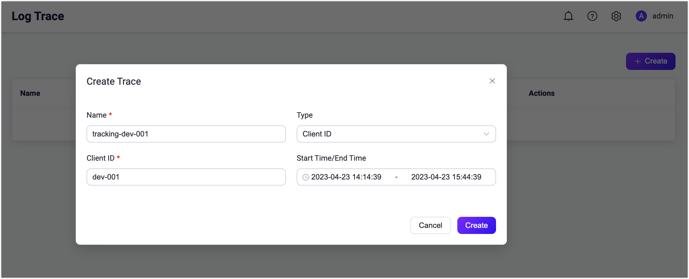
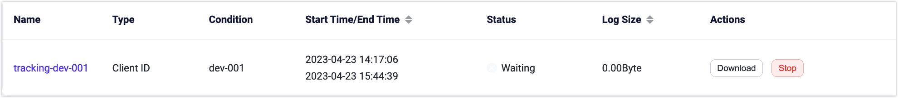
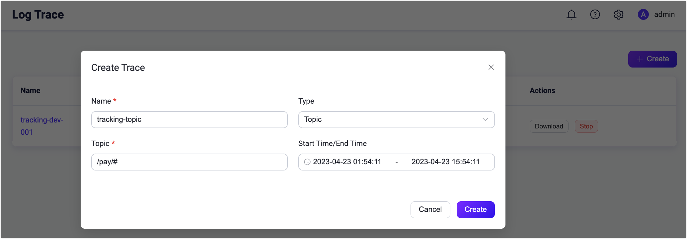
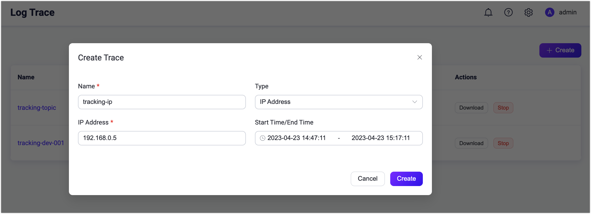
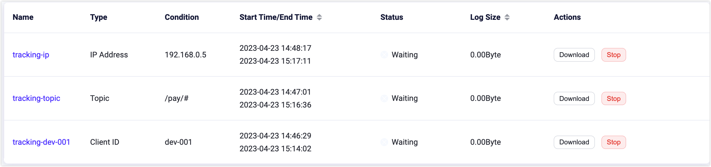
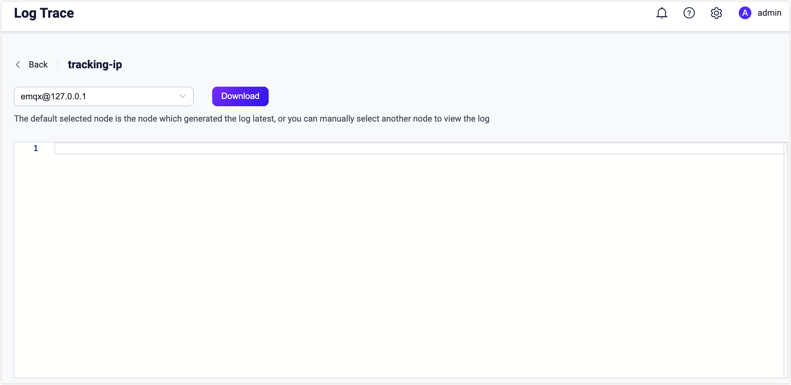

# Log Trace

EMQX 5.0 introduces the Log Trace feature, enabling real-time debug-level log outputs for specific client IDs, topics, IP addresses, or rule IDs. This allows detailed debugging in production environments without affecting system performance due to excessive logs, increasing the efficiency of diagnosing and resolving EMQX issues.

## How It Works 

The Log Trace feature is implemented using the built-in Erlang Logger Filter function, which has a negligible impact on the overall message throughput. EMQX uses independent File Handlers to persist Trace disk logs and creates a separate process for each client connection to process its messages.

When a client sends a message, the independent process responsible for that connection will first check if the message complies with the rules set by the customized Trace Filter. For example, the process may check if the message is from a specified client ID:

- If the message is from the specified client ID, the process will convert the message into binary data and then asynchronously send it to the appropriate File Handler. 
- If it is not from the specified client ID, EMQX will execute the original transfer logic. 

The File Handlers are responsible for persisting the binary data into Trace files on disk. 

## Benefits

The Log Trace feature has the following benefits:

- **Safety**: The filtering process is performed independently for each client, which prevents the File Handler from being overloaded with incoming messages. Since most of the logs are filtered out, this approach is safe for production environments. 
- **Reliability**: This feature ensures that trace logging does not impact the overall message throughput of EMQX and provides a reliable and efficient way to store and retrieve log data.
- **Agility**: Log Trace can be used for various scenarios, such as debugging abnormal messages or data losses, client disconnection, subscription failure, and etc. For system malfunctions that occur at a specific time, you can set the task start/stop time for automatic log collection, which is very convenient.

<!-- TODO 下面的内容先凑合使用，后续更新 -->

## Create Log Trace

This section demonstrates how to create Log Trace rules by client ID, Topic, or IP address in Dashboard. Click **Diagnose** -> **Log Trace** on the left navigation menu. On the **Log Trace** page, click **Create** to set your rules. 

### Trace by Client IDs

1. Select `Client ID` from the drop-down list of **Type**.

2. Type the Client IDs to be traced.

3. Select the start and end times. If the start time is earlier than or the same as the current time, it will start from the current time.

4. Click **Create**. You can see the trace record after successful creation. You can view it or choose to download the log. The log contains the current Client ID interaction with the EMQX connection.

   

### Trace by Topics

1. Select `Topic` from the drop-down list of **Type**.

2. Type the topic to be traced. Wildcard characters are supported.

3. Select the start and end time. If the start time is earlier than or the same as the current time, it will start from the current time.

   

4. Click **Create**. You can see the trace record after successful creation. You can view it or choose to download the log. The log contains information about publishing, subscription and unsubscription of the current topic.

### Trace by IP Address

1. Select `IP Addess` from the drop-down list of **Type**.

2. Type the IP address to be traced.

3. Select the start and end time. If the start time is earlier than or the same as the current time, it will start from the current time.

   

4. Click **Create**. You can see the trace record after successful creation. You can view it or choose to download the log. The log contains the current IP interaction with the EMQX connection.

### Trace by Rule ID

Trace according to the rule ID by selecting the type as Rule ID and entering the rule ID you need to trace.

The trace results will include the execution results of the rule SQL and the execution logs of all actions added to the rule. This can be used for debugging and optimizing the rule.

The [Test Rule](../data-integration/rule-get-started.md#test-rule) operation can automatically create and manage this trace type. When testing a rule, EMQX will automatically generate a trace task and delete it automatically after the test stops.

## View Log Trace 

The created trace records will be listed. You can create up to 30 traced logs. The log file size viewed in the list is the sum of the uncompressed file sizes. You can click the **Stop** button to stop logging manually or wait until the specified end time.

Click a specific trace record by the name, you can select to download the log on different nodes. 

Trace logs have a maximum capacity of 512MB logs per node. Once the generated log file reaches the maximum limit, it stops appending any further logs and raises an alert in the primary log file. In the event of a timeout during Dashboard downloading, you can locate the log file in the `/data/trace` directory on the server. When an EMQX cluster is restarted, the unfinished log trace will be resumed.

