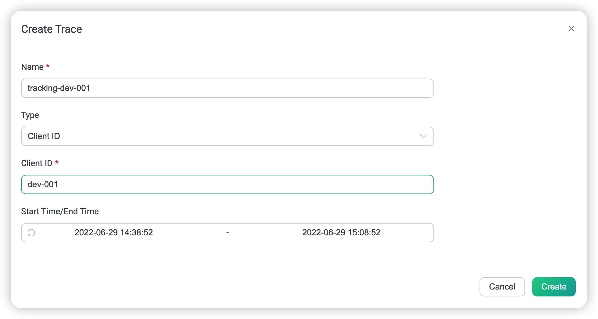
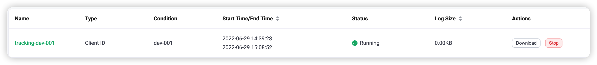
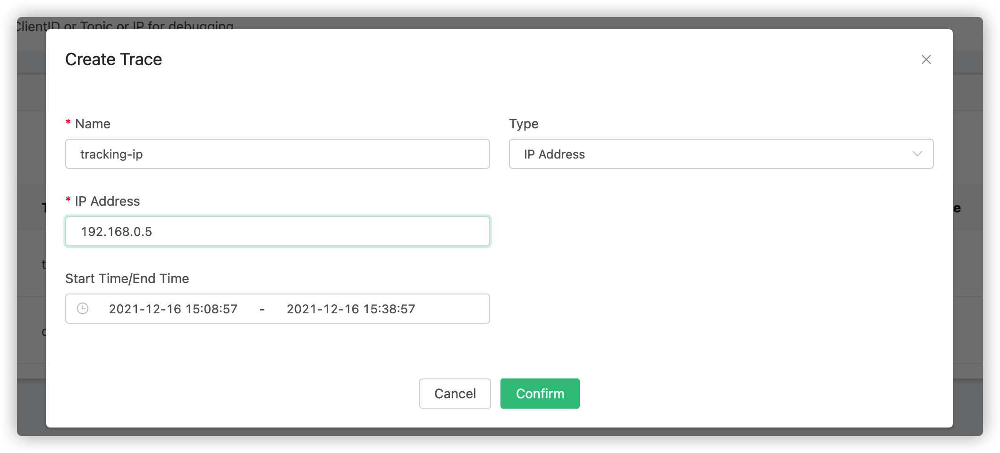

# Trace

Real-time filtering logs for the ClientID or Topic or IP for debugging.

## Create module

Open [EMQX Dashboard](http://127.0.0.1:18083/#/modules), click the "Modules" tab on the left, and choose to add:

Select the trace module, no need to configure parameters, directly open

## Trace ClientID

1. Select the type as `ClientID`.
2. Fill in the specific ClientID information that needs to be traced.
3. Select the start and end time. If the start time is less than or equal to the current time it will start from the current time.

You can see the Trace record after successful creation in the list, where you can view it or choose to download the log.
The log contains all the information about the current ClientID interaction with the EMQX connection.

## Trace Topic

1. Select the type as `Topic`;
2. Fill in the Topic information that needs to be traced(wildcard characters are supported);
3. Select the start and end time. If the start time is less than or equal to the current time it will start from the current time.

You can see the Trace record after successful creation in the list, where you can view it or choose to download the log.
The log contains Publish/Subscribe/UnSubscribe information for the current topic on EMQX.

## Trace IP

1. Select the type as `IP Address`;
2. Fill in the IP Address information that needs to be traced;
3. Select the start and end time. If the start time is less than or equal to the current time it will start from the current time.

You can see the Trace record after successful creation in the list, where you can view it or choose to download the log.
The log contains all the information about the current IP interaction with the EMQX connection.

### Notes

1. Up to 30 trace logs can be saved. 
2. Trace logs can generate a maximum of 512M logs per node. If the generated log file reaches the maximum, it will stop appending logs and give an alert in the main log file.
3. You can choose to stop logging manually, or wait until the end time to stop automatically.
4. The size of the log file viewed in the list is the sum of the uncompressed file sizes.
5. The EMQX cluster will continue an outstanding trace after restart.
