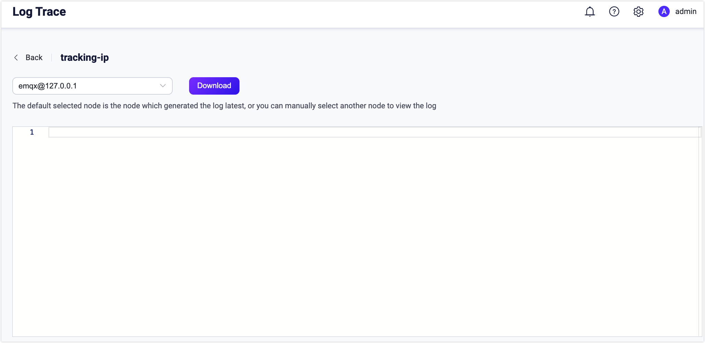

# Log Trace

EMQX 5.0 introduces the Log Trace feature, enabling real-time debug-level log outputs for specific client IDs, topics, IP addresses, or rule IDs. This allows detailed debugging in production environments without affecting system performance due to excessive logs, increasing the efficiency of diagnosing and resolving EMQX issues.

## How Log Trace Works

The Log Trace feature is implemented using Erlang's built-in Logger Filter function, which has a negligible impact on the overall message throughput. EMQX uses independent File Handlers to persist Trace logs and creates a separate process for each client connection to process its messages.

When a client sends a message, the process responsible for that connection checks if the message matches the rules set by the Trace Filter. For example, it may check if the message is from a specified client ID:

- If the message matches the filter criteria, the process converts it into a human-readable trace event and asynchronously sends it to the appropriate File Handler.
- Otherwise, the message is processed as usual.

The File Handlers are responsible for persisting trace events into their respective Trace files on disk.

If a node or the entire EMQX cluster is restarted, any unfinished Log Traces will be automatically resumed.

## Why Use Log Trace

The Log Trace feature is an effective tool for debugging and monitoring in production environments for several key reasons:

- **Safety**: The filtering process is performed independently for each client, which prevents the File Handler from being overloaded. Since most logs are filtered out, this approach is safe for production environments.
- **Reliability**: This feature ensures that trace logging does not impact the overall message throughput of EMQX and provides a reliable and efficient way to store and retrieve log data.
- **Agility**: Log Trace can be used for various scenarios, such as debugging messages or data loss, client disconnections, or subscription failures. For issues that occur at a specific time, you can schedule the trace to start and stop automatically for convenient log collection.

## Create a Log Trace

This section demonstrates how to create Log Trace rules from the Dashboard. You can trace interactions based on Client ID, Topic, IP address, or Rule ID.

1. Click **Diagnose** -> **Log Traces** on the left navigation menu. 
2. On the **Log Traces** page, click **Create** to configure your trace rules. 

### Configure Common Trace Options

On the **Create Trace** dialog, configure the following options that apply to all trace types:

- **Name**: Enter a descriptive name to identify the trace in the system. This name will appear in the trace list and should provide useful context, such as the type of trace (e.g., "Client ID Trace" or "Topic Trace") for quicker search and identification.
- **Start Time / End Time**: Select the start and end times for the trace. If the start time is in the past, the trace will begin immediately.
- **Formatter**: The format for the log output. Options include `JSON` and `Text`.
- **Payload Encode**: Specify the format for the message payload in the trace log. Choose one of the following:
  - `Text`: Plain text, recommended for JSON-encoded payloads.
  - `HEX`: Hexadecimal encoding, recommended for custom binary protocols.
  - `Hidden`: Obfuscates the payload as `******`, useful for masking sensitive information.
- **Payload Limit**: Set the maximum number of bytes to be printed for the payload in the trace file. This option is only effective when **Payload Encode** is either `Text` or `HEX`. If the payload exceeds this limit, it will be truncated. The default value is `1024 B`. This limit is enabled by default but can be disabled to allow unlimited payload size.

### Trace by Client ID

1. In the **Create Trace** dialog, select `Client ID` from the **Type** drop-down list.
2. Enter the Client IDs to be traced.
3. Configure the common options as described in [Common Trace Options](#configure-common-trace-options).
4. Click **Create**.

The log trace will capture interactions between the specified Client ID and the EMQX broker.

### Trace by Topic

1. In the **Create Trace** dialog, select `Topic` from the **Type** drop-down list.
2. Enter the topic to be traced. Wildcards are supported, for example, `/pay/#`.
3. Configure the common options as described in [Common Trace Options](#configure-common-trace-options).
4. Click **Create**.

The log trace will capture messages published to the specified topic, as well as subscription and unsubscription events.

### Trace by IP Address

1. In the **Create Trace** dialog, select `IP Address` from the **Type** drop-down list.
2. Enter the IP address to be traced, for example, `192.168.0.5`.
3. Configure the common options as described in [Common Trace Options](#configure-common-trace-options).
4. Click **Create**.

The log trace will capture interactions between the client connecting from the specified IP address and the EMQX broker.

### Trace by Rule ID

1. In the **Create Trace** dialog, select `Rule ID` from the **Type** drop-down list.
2. Enter the rule ID to trace. You can find the rule ID on the **Integration** -> **Rules** page.
3. Configure the common options as described in [Common Trace Options](#configure-common-trace-options).
4. Click **Create**.

The trace results will include the execution results of the rule SQL and the execution logs for all actions added to the rule, useful for debugging and optimizing the rule.

The [Test Rules](../data-integration/rule-get-started.md#test-rules) operation can automatically create and manage this trace type. When testing a rule, EMQX will automatically generate a trace task and delete it automatically after the test stops.

## View Log Trace

Created Log Traces are listed on the **Log Trace** page. The log file size shown in the list is the sum of the uncompressed file sizes. You can stop a trace manually by clicking the **Stop** button, or it will stop automatically when the specified end time is reached.

There is a limit to the number of traces you can create. By default, this limit is 30, but it is configurable via the `trace.max_traces` parameter.

Click a trace name to open the trace details, where you can view trace events and download the logs from a specific node in the cluster.

By default, each trace is limited to a maximum of 128MB of log data per node. This limit can be configured using the `trace.max_file_size` configuration parameter. To manage disk space, File Handlers operate in a rotating manner: once a trace's log reaches the size limit, the oldest trace events are discarded to make room for the new ones. Note that this is not a hard limit; the total size of the log files is usually lower than the configured value but may briefly exceed it by a few kilobytes.

If a download from the Dashboard times out, you can manually retrieve the trace logs from the `/data/trace` directory on each EMQX node.

