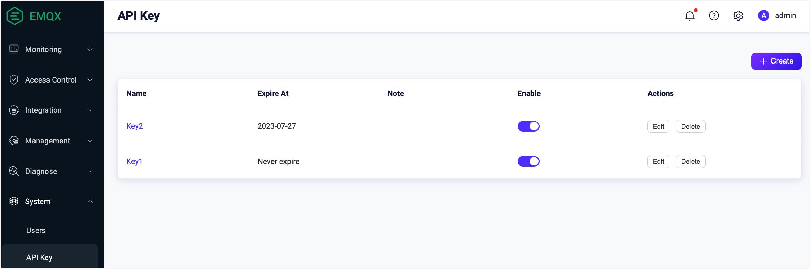

# API Keys

On the **API Keys** page in the EMQX Dashboard, you can generate API keys and secret keys for authenticating [HTTP API](../../develop/api.md) requests.

## Create an API Key

1. Navigate to **System** -> **API Key** in the Dashboard.

2. Click the **+ Create** button in the top-right corner to open the Create API Key dialog.

3. Configure the API key details:

   - Leave the **Expire At** field empty if you want the key to never expire.
   - Optionally select a role for the API key (EMQX Enterprise only). For details on available roles, see [Roles and Permissions](../../develop/api.md#roles-and-permissions).

4. Click **Confirm**. The API key and secret key are displayed in the **Created Successfully** dialog.

   ::: warning Important Notice

   Save the API Key and Secret Key in a safe place immediately. The Secret Key will not be shown again after you close this dialog.

   :::

5. Click **Close** to dismiss the dialog.

## Manage API Keys

After creating an API key, you can manage it from the API Keys page:

- **View details**: Click the key name in the **Name** column.
- **Edit**: Click the **Edit** button in the **Actions** column to reset the expiration time, change the enabled status, or update the note.
- **Delete**: Click the **Delete** button in the **Actions** column to remove an API key that is no longer needed.

