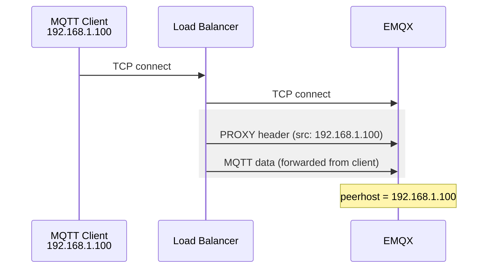

# PROXY Protocol

When EMQX is deployed behind a load balancer or reverse proxy, the TCP connection that reaches EMQX originates from the proxy rather than from the actual client. As a result, EMQX sees only the proxy's address, losing visibility into the real client IP. This matters for authentication rules that filter by IP, authorization policies based on source address, audit logs, rate limiting, and troubleshooting.

The PROXY protocol solves this problem. Defined by HAProxy, it is a lightweight, transport-layer mechanism that prepends a small header to the TCP stream carrying the original client's IP address, port, and connection metadata. EMQX reads this header before any MQTT traffic is processed, allowing it to treat the reported address as the true client address for all subsequent operations.

## PROXY Protocol Versions

Two versions of the PROXY protocol exist:

| Version | Format | TLS Certificate Forwarding |
| ------- | ------ | -------------------------- |
| v1 | Human-readable text line | Not supported |
| v2 | Binary header | Supported (CN, Subject, SAN, etc.) |

**v1** is straightforward. The proxy inserts a single ASCII line before the payload:

```text
PROXY TCP4 192.168.1.100 10.0.0.1 56324 1883\r\n
```

**v2** uses a compact binary format that carries richer metadata, including TLS extension fields. If the load balancer performs TLS termination with mutual authentication and you need client certificate information available inside EMQX (for example, to use `${cert_common_name}` in authentication or authorization placeholders), PROXY protocol v2 is required.

::: tip

PROXY protocol is a unidirectional, per-connection mechanism. It does not require any changes on the MQTT client side.

:::

## How It Works

The flow with PROXY protocol enabled is:

1. The MQTT client opens a TCP connection to the load balancer.
2. The load balancer establishes a new TCP connection to EMQX and immediately sends a PROXY protocol header (v1 or v2) describing the original client's address.
3. EMQX reads and parses the header before any MQTT bytes are processed.
4. All subsequent EMQX operations (authentication, authorization, logging, rate limiting) use the client address reported in the header.



If PROXY protocol is enabled on the EMQX listener but no header arrives (for example, a direct connection bypassing the load balancer), EMQX closes the connection with an error. Conversely, if the listener does not have PROXY protocol enabled but the proxy sends a header, EMQX treats it as malformed MQTT data.

::: warning Important Notice

Both the load balancer and the EMQX listener must agree on PROXY protocol. A mismatch causes connection failures.

:::

## Enable PROXY Protocol on EMQX Listeners

The `proxy_protocol` option is available on all TCP-based EMQX listeners: MQTT TCP, MQTT SSL, MQTT WebSocket, and MQTT WebSocket SSL. It is disabled by default.

### Configure via Dashboard

1. Go to **Management** -> **Listeners** in the EMQX Dashboard.
2. Click the listener you want to configure (for example, `default` on port 1883).
3. Set **Proxy Protocol** to `true`.
4. Click **Update**.

### Configure via emqx.conf

Add or modify the listener block in `etc/emqx.conf`. The following examples show the `proxy_protocol` option for each listener type.

**MQTT TCP (port 1883)**

```hocon
listeners.tcp.default {
  bind = "0.0.0.0:1883"
  proxy_protocol = true
}
```

**MQTT SSL (port 8883)**

```hocon
listeners.ssl.default {
  bind = "0.0.0.0:8883"
  proxy_protocol = true
  ssl_options {
    certfile = "etc/certs/cert.pem"
    keyfile  = "etc/certs/key.pem"
    cacertfile = "etc/certs/cacert.pem"
  }
}
```

**MQTT WebSocket (port 8083)**

```hocon
listeners.ws.default {
  bind = "0.0.0.0:8083"
  proxy_protocol = true
}
```

**MQTT WebSocket SSL (port 8084)**

```hocon
listeners.wss.default {
  bind = "0.0.0.0:8084"
  proxy_protocol = true
  ssl_options {
    certfile = "etc/certs/cert.pem"
    keyfile  = "etc/certs/key.pem"
    cacertfile = "etc/certs/cacert.pem"
  }
}
```

### Configuration Parameters

| Parameter | Type | Default | Description |
| --------- | ---- | ------- | ----------- |
| `proxy_protocol` | Boolean | `false` | Enable PROXY protocol on this listener. When enabled, EMQX expects every incoming connection to begin with a PROXY protocol header. |
| `proxy_protocol_timeout` | Duration | `3s` | Maximum time EMQX waits for the PROXY protocol header after a connection is accepted. The connection is closed if the header does not arrive within this period. |

Example with timeout configured:

```hocon
listeners.tcp.default {
  bind = "0.0.0.0:1883"
  proxy_protocol = true
  proxy_protocol_timeout = 5s
}
```

## Configure the Load Balancer to Send PROXY Protocol Headers

EMQX does not generate PROXY protocol headers. The upstream proxy must be configured to send them.

### HAProxy

Use `send-proxy-v2` (v2 binary) or `send-proxy` (v1 text) on each `server` line in the backend:

```bash
backend mqtt_backend
  mode tcp
  server emqx1 emqx1-cluster.emqx.io:1883 check send-proxy-v2
  server emqx2 emqx2-cluster.emqx.io:1883 check send-proxy-v2
  server emqx3 emqx3-cluster.emqx.io:1883 check send-proxy-v2
```

To also forward the client certificate Common Name (requires mutual TLS on the frontend), use `send-proxy-v2-ssl-cn`:

```bash
backend mqtt_backend
  mode tcp
  server emqx1 emqx1-cluster.emqx.io:1883 check send-proxy-v2-ssl-cn
  server emqx2 emqx2-cluster.emqx.io:1883 check send-proxy-v2-ssl-cn
  server emqx3 emqx3-cluster.emqx.io:1883 check send-proxy-v2-ssl-cn
```

### NGINX

Use `proxy_protocol on` in the `server` block for TCP/stream listeners:

```bash
stream {
  upstream mqtt_servers {
    server emqx1-cluster.emqx.io:1883;
    server emqx2-cluster.emqx.io:1883;
  }

  server {
    listen 1883;
    proxy_pass mqtt_servers;
    proxy_protocol on;
  }
}
```

::: tip Note

NGINX's open-source stream module does not forward TLS client certificate details via PROXY protocol. Use HAProxy with `send-proxy-v2-ssl-cn` if you need to pass certificate information to EMQX.

:::

## Use Client IP in Authentication and Authorization

Once PROXY protocol is enabled, EMQX replaces the connection's peer address with the address extracted from the PROXY header. The `${peerhost}` placeholder in authenticators and authorizers then reflects the real client IP, not the proxy's address.

Examples of where `${peerhost}` can be used:

- HTTP authenticator URL or body: `http://auth.example.com/check?ip=${peerhost}`
- MySQL/PostgreSQL authorization query: `SELECT ... WHERE ipaddress = ${peerhost}`
- File-based authorization with `{ipaddr, "192.168.1.0/24"}` matching against the real client IP

For TLS certificate placeholders such as `${cert_common_name}`, PROXY protocol v2 with TLS extension support is required. The load balancer must perform TLS termination with mutual authentication and forward certificate fields in the PROXY v2 header.

## Verify PROXY Protocol Is Working

After enabling PROXY protocol on both the load balancer and the EMQX listener, verify that EMQX is receiving the correct client IP:

**Check connection details via CLI**

```bash
emqx ctl clients list
```

The `peername` field in the output should show the original client IP and port, not the load balancer's address.

**Check via Dashboard**

In the EMQX Dashboard, go to **Clients** and open a connected client's detail page. The **IP Address** field should display the real client address.

**Check logs**

If a connection fails because no PROXY protocol header was received within `proxy_protocol_timeout`, EMQX logs an error similar to:

```text
[error] [esockd_proxy_protocol] The listener 0.0.0.0:1883 is working in proxy protocol mode,
but timed out while waiting for proxy_protocol header
```

This indicates that the connection reached EMQX without a PROXY header. Verify that the load balancer is configured to send it.
