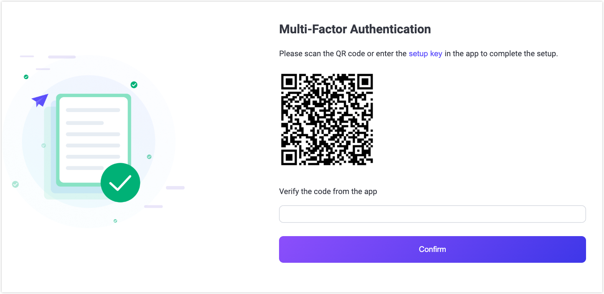

# Multi-Factor Authentication (MFA) 

EMQX 5.9.0 introduces the Multi-Factor Authentication (MFA) feature for the EMQX Dashboard to enhance security. The feature requires users to complete a two-step authentication process when logging in. This process adds an additional layer of security to prevent unauthorized access by verifying the user's identity using a password and a time-based one-time password (TOTP).

This page explains how to set up and use MFA for the EMQX Dashboard, covering both the user and administrator perspectives.

## Key Concepts

- **MFA**: A security feature that requires two forms of identification: the user's password and a second factor, such as a TOTP generated by an authenticator app.
- **TOTP**: A temporary code generated by an authenticator app like Google Authenticator or Authy, based on a shared secret between the app and the server.
- **QR Code**: A graphical representation of the shared secret that can be scanned by an authenticator app to simplify the setup process.

## How MFA Works

When MFA is enabled on the EMQX Dashboard, it enhances the login process by adding an extra layer of security. Here's how the MFA process works:

1. **User Login**: When you attempt to log in to the Dashboard, you'll first enter your username and password as usual.
2. **MFA Prompt**: If MFA is enabled for your account, you will be prompted to enter a verification code. This code is generated by an authenticator app (like Google Authenticator or Authy) on your mobile device.
3. **First-Time Setup**: If MFA has never been set up before, you will be asked to scan a QR code or manually enter a secret key into your authenticator app to complete the setup.
4. **Subsequent Logins**: After the initial setup, each time you log in, you'll need to open your authenticator app and enter the time-sensitive code it generates to complete the login process.

The goal of MFA is to ensure that even if someone obtains your password, they cannot log in to your account without also having access to the code from your authenticator app.

::: tip
To help protect your account, it’s important to complete the TOTP setup promptly.
After enabling TOTP for your own account or on behalf of another user, please ensure that the QR code is scanned or the secret key is entered into your authenticator app as soon as possible.
Delays in completing this step may increase the risk of unauthorized enrollment, especially if login credentials are compromised.
:::

## Enable and Configure MFA

MFA is disabled by default. To enable MFA for users, the administrator must configure the system to support MFA and set it up for individual users. Only users with [administrator privileges](../dashboard/system.md#users) can enable or disable MFA for other users.

### Enable MFA by Default for the Dashboard

To enable MFA for all Dashboard users by default, the administrator needs to configure the `dashboard.default_mfa` setting in the configuration file. This can be set to either `none` (to disable MFA) or `{mechanism: totp}` (to enable TOTP-based MFA).

Example configuration:

```bash
dashboard.default_mfa = {mechanism: totp}
```

### Enable MFA for Users via EMQX Dashboard

 Administrators can enable MFA directly from the Dashboard by following these steps:

1. In the Dashboard, click **System** -> **Users** from the left menu.
2. On the **Users** page, you will see a list of users. In the **Actions** column, click **MFA Settings** next to the specific user for whom you want to enable MFA.
3. In the **MFA Settings** dialog, click **Enable** to enable MFA for the selected user.

Once enabled, the user will be required to complete the MFA setup process during their next login.

### Reset TOTP Secret Key

In case the user needs to reset their TOTP setup (for example, if the authenticator app is uninstalled or if the secret key has been compromised), the administrator can reset the TOTP secret key for the user via the **MFA Settings** dialog.

1. On the **System** -> **Users** page, locate the user for whom you want to reset the TOTP secret key. In the **Actions** column, click on **MFA Settings** for the selected user.

2. In the **MFA Settings** dialog, you will see the **Reset TOTP Secret Key** button. Clicking this button will initiate the reset process.

   A confirmation prompt will appear, notifying you that resetting the secret key will make the previous key invalid. The user will need to set up a new TOTP secret key during their next login.

3. Click **Confirm** to proceed with the reset. After the reset, the user will need to follow the initial MFA setup process during their next login (scanning a new QR code or entering a new secret key in their authenticator app).

### Enable and Manage MFA via Configuration File and REST API

Administrators can enable or manage MFA for users through the configuration file and REST API.

::: tip

The POST and DELETE methods on the `/users/{username}/mfa` endpoint can only be used by administrators or by the user themselves. This means that a user with a "viewer" role cannot modify another user's MFA settings. Only the user associated with the current authentication token (the "bearer token") can modify their own MFA settings. 

For more information on the role-based access control implementation of the REST API, see [Roles and Permissions](../../develop/api.md#roles-and-permissions).

:::

#### Enable MFA for a Specific User

To enable MFA for a specific user, the administrator can send a `POST` request to the `/users/{username}/mfa` API endpoint with the following request body:

```json
{
  "mechanism": "totp"
}
```

#### Disable MFA for a Specific User

To disable MFA for a specific user, the administrator can send a `DELETE` request to the `/users/{username}/mfa` API endpoint.

## Log In Using MFA

As a user, once MFA is enabled for your account, you will need to follow these steps to log in to the EMQX Dashboard:

### First-Time Setup

When you log in for the first time after MFA has been enabled, you'll need to set up your authenticator app.

1. **Enter Your Username and Password**:
   On the login page, enter your username and password as usual.

2. **Scan the QR Code or Enter Setup Key**:
   After the initial password verification, the Dashboard will prompt you to scan a QR code or manually enter a setup key into your authenticator app to complete setup.

3. **Verify the code from the app**:
   The app will generate time-sensitive codes for future logins. Enter the code from the app for verification and click **Confirm**.

   The code is valid only for a short period of time (usually 30 seconds), so make sure to enter it quickly.



### Subsequent Logins

After you've completed the initial setup, you can use the authenticator app to log in.

1. **Enter Your Username and Password**:
   On subsequent login attempts, enter your username and password.
2. **Enter the TOTP Code**:
   Once your password is verified, you will be prompted to enter the TOTP code generated by your authenticator app.
3. **Successful Login**:
   If the code is valid, you will be logged into the Dashboard.
4. **Invalid Code**:
   If the code is incorrect or expired, you will see an error message. In this case, you can try entering the current code from your authenticator app.
