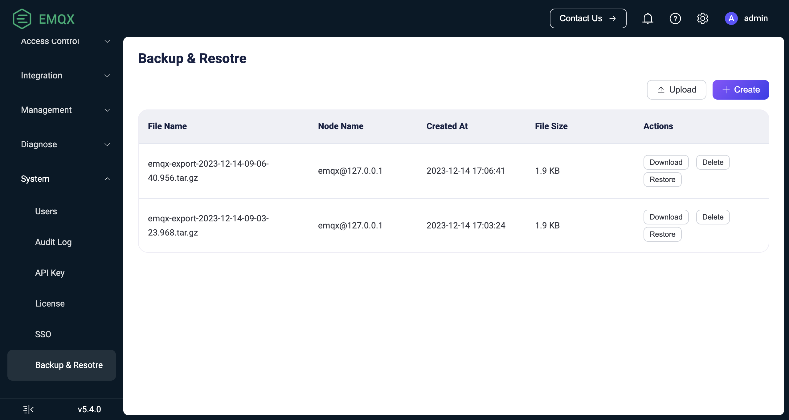

# Backup and Restore

EMQX adopts a distributed storage schema and also introduces a cluster transfer feature to ensure the system's high availability.

This page discusses how to backup your operating data and configuration files to prevent data losses in case of system malfunctions.

## Function Description

EMQX provides CLI commands for data import and export to implement backup and recovery. Although similar to the commands in EMQX 4.x, the export file format is incompatible with 4.x:

- In EMQX 4.x, a single JSON file was used to save all necessary data of EMQX configuration and the built-in database.
- In EMQX 5.x, the exported data is compressed into a tar file format, allowing for more efficient and structured handling of potentially large amounts of user data.

In addition to CLI commands, the EMQX Enterprise edition also offers a data backup and recovery page on the Dashboard, where you can perform data import and export operations.

The data that EMQX supports for import and export includes:

- Contents of EMQX [configuration rewrite file](../configuration/configuration.md#configuration-rewrite-file):
  - Authentication and authorization configuration
  - Rules, connectors, and Sink/Source
  - Listeners, gateway configuration
  - Other EMQX configurations
- Built-in database (Mnesia) data
  - Dashboard users and REST API keys
  - Client authentication credentials (built-in database password authentication, enhanced authentication)
  - PSK authentication data
  - Authorization rules
  - Blacklist data
- SSL/TLS certificates stored in the EMQX data directory (`node.data_dir`)
- Authorization acl.conf file stored in the EMQX data directory

::: tip Special Note

1. The exported file only includes SSL/TLS certificates and acl.conf file stored in the EMQX data directory. If there are any certificates or acl.conf files located outside the data directory, manually copy them to the appropriate locations before importing data to ensure completeness and correctness.
2. The exported file name format is `emqx-export-YYYY-MM-DD-HH-mm-ss.sss.tar.gz`, and the export directory is `<EMQX data directory>/backup`.

:::

### Export

Data can be exported from any running cluster node.

### Import

To import data, the EMQX node must be running, and some conditions need to be met for the import operation to be successful:

- If the [core node + replica node](../deploy/cluster/mria-introduction.md) mode is enabled, data import can only be performed on the core node. This will not affect the actual import behavior, as data will be replicated to all cluster nodes, including core and replica nodes. Operating on the core node ensures correct data import.
- Data exported from an EMQX Enterprise Edition cluster cannot be imported into an EMQX open-source version cluster.
- The data file cannot be renamed.

If any of the above conditions are not met, the import process will be aborted, and a corresponding error message will be displayed.

During the data import operation, data will be inserted (if it does not exist in the target EMQX cluster) or updated (if there are conflicts) into EMQX. The import process will not delete any existing data from the EMQX cluster.

::: tip Special Note

In rare cases, existing data may be incompatible with the imported data. For example, an EMQX cluster uses built-in database authentication and sets the salt position to "suffix," while the imported data sets the same configuration to "prefix." After the import, the new configuration will take effect, and previously created old user credentials will no longer work.

Therefore, importing data into an EMQX cluster without clearing data may require extra caution.

:::

## Dashboard Example

::: tip

This section only applies to the EMQX Enterprise edition.

:::

This section explains how to perform data import and export operations on the Dashboard.

:::tip

- Backup and recovery through the Dashboard are available in EMQX Enterprise Edition v5.4.0 and later versions.
- Backup files exported via CLI can also be managed on the Backup and Recovery page of the Dashboard.

:::

1. Log in to the Dashboard and go to **System** -> **Backup & Restore** page.

2. To export data, click the **Create** button in the top right corner to create a backup file based on the current data of the EMQX cluster. You can view the file information on the backup file list page:

   - **File Name**: The name of the backup file.
   - **Node Name**: This name refers to the node where the backup file is stored, and it does not mean that the backup only contains data from that node.
   - **Created At**: The creation time of the backup file.
   - **File Size**: The size of the backup file.

   You can click **Download** in the **Actions** column to download the file and back it up locally.

3. To import data, click the **Upload** button in the top right corner to upload a backup file to the current EMQX cluster. The file will not be restored immediately upon upload. You can go to the **Actions** column in the backup file list and click **Restore** to import the backup file into the current EMQX cluster.



## CLI Example

This section shows how to import and export data using the command Line Interface.

1. Export data. The file name format of the exported file is `emqx-export-YYYY-MM-DD-HH-mm-ss.sss.tar.gz`, and the export directory is `<EMQX data directory>/backup`:

    ```bash
    $ ./emqx ctl data export
    Exporting data to "data/backup/emqx-export-2023-06-19-15-14-19.947.tar.gz"...
    Exporting cluster configuration...
    Exporting additional files from EMQX data_dir: "data"...
    Exporting built-in database...
    Exporting emqx_admin database table...
    Exporting emqx_authn_mnesia database table...
    Exporting emqx_enhanced_authn_scram_mnesia database table...
    Exporting emqx_app database table...
    Exporting emqx_acl database table...
    Exporting emqx_psk database table...
    Exporting emqx_banned database table...
    Data has been successfully exported to data/backup/emqx-export-2023-06-19-15-14-19.947.tar.gz.
    ```
2. Import data. The name of the imported file can be specified as an absolute path or a relative path.
   If the file resides in `<EMQX data directory>/backup` directory, its basename without a path can also be used, e.g.:

    ```bash
    # import the file by the absolute path
    $ ./emqx ctl data import /tmp/emqx-export-2023-06-19-15-14-19.947.tar.gz
    Importing data from "/tmp/emqx-export-2023-06-19-15-14-19.947.tar.gz"...
    Importing cluster configuration...
    Importing built-in database...
    Importing emqx_banned database table...
    Importing emqx_psk database table...
    Importing emqx_acl database table...
    Importing emqx_app database table...
    Importing emqx_enhanced_authn_scram_mnesia database table...
    Importing emqx_authn_mnesia database table...
    Importing emqx_admin database table...
    Data has been imported successfully.
   
    # import the file by the path relative to EMQX root directory:
    $ ./emqx ctl data import ../../../tmp/emqx-export-2023-06-21-13-28-06.418.tar.gz
    Importing data from "../../../tmp/emqx-export-2023-06-21-13-28-06.418.tar.gz"...
    Importing cluster configuration...
    Importing built-in database...
    Importing emqx_enhanced_authn_scram_mnesia database table...
    Importing emqx_authn_mnesia database table...
    Importing emqx_admin database table...
    Importing emqx_acl database table...
    Importing emqx_banned database table...
    Importing emqx_psk database table...
    Importing emqx_app database table...
    Data has been imported successfully.
   
    # import the file from `<EMQX data directory>/backup` directory:
    $ cp /tmp/emqx-export-2023-06-21-13-28-06.418.tar.gz /opt/emqx/data/backup/
    $ ./emqx ctl data import emqx-export-2023-06-21-13-28-06.418.tar.gz
    Importing data from "data/backup/emqx-export-2023-06-21-13-28-06.418.tar.gz"...
    Importing cluster configuration...
    Importing built-in database...
    Importing emqx_enhanced_authn_scram_mnesia database table...
    Importing emqx_authn_mnesia database table...
    Importing emqx_admin database table...
    Importing emqx_acl database table...
    Importing emqx_banned database table...
    Importing emqx_psk database table...
    Importing emqx_app database table...
    Data has been imported successfully.
    ```
