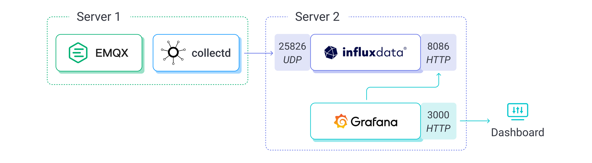
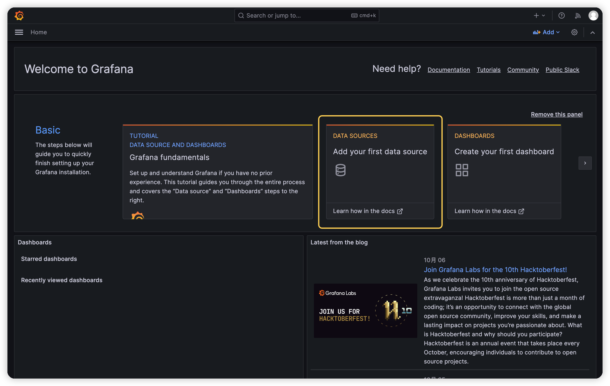
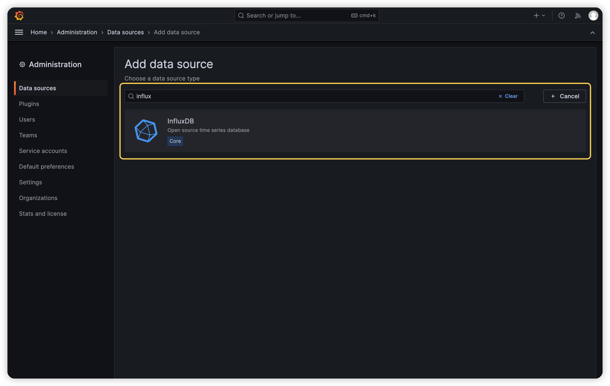
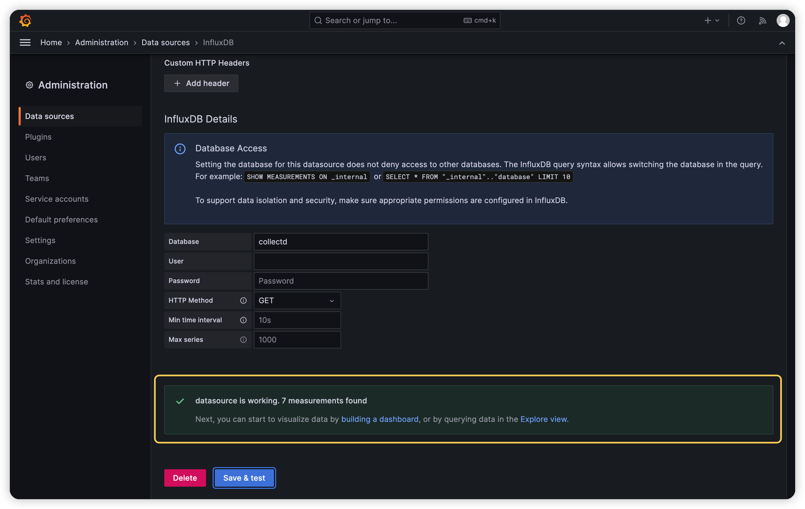
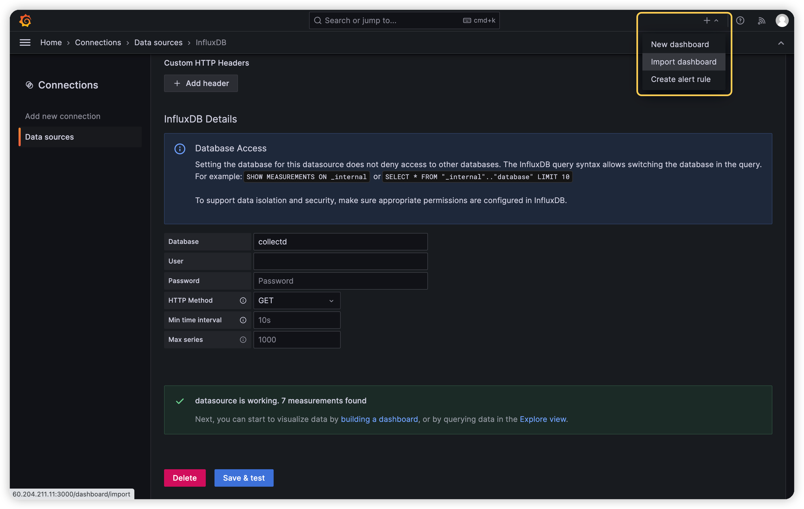
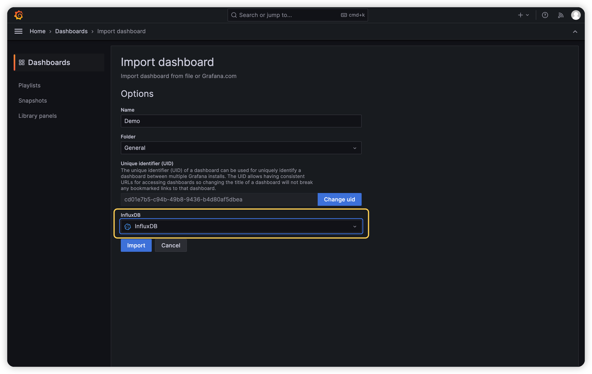
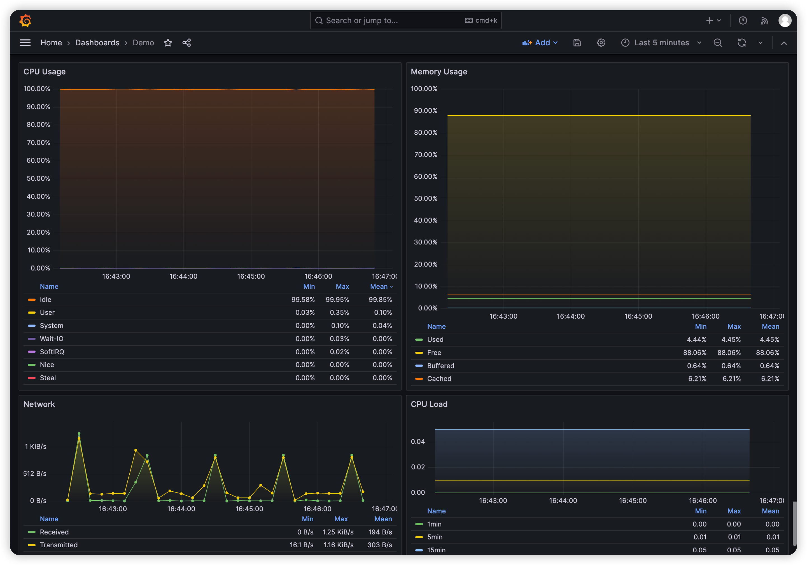
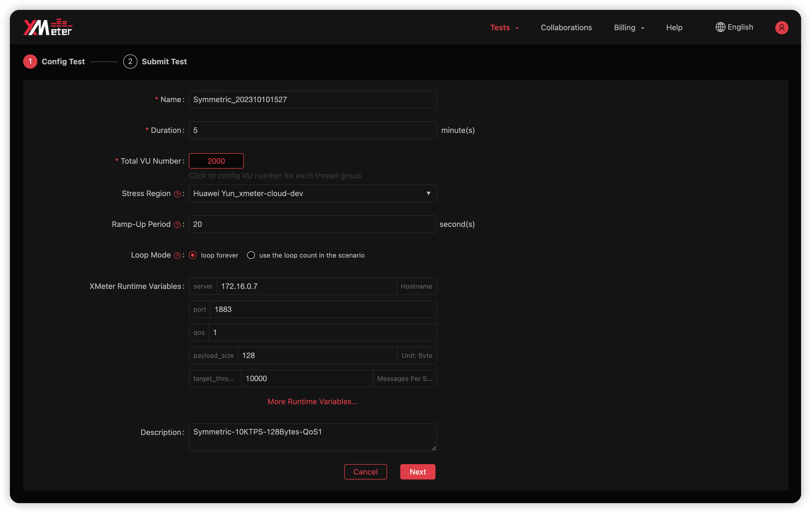
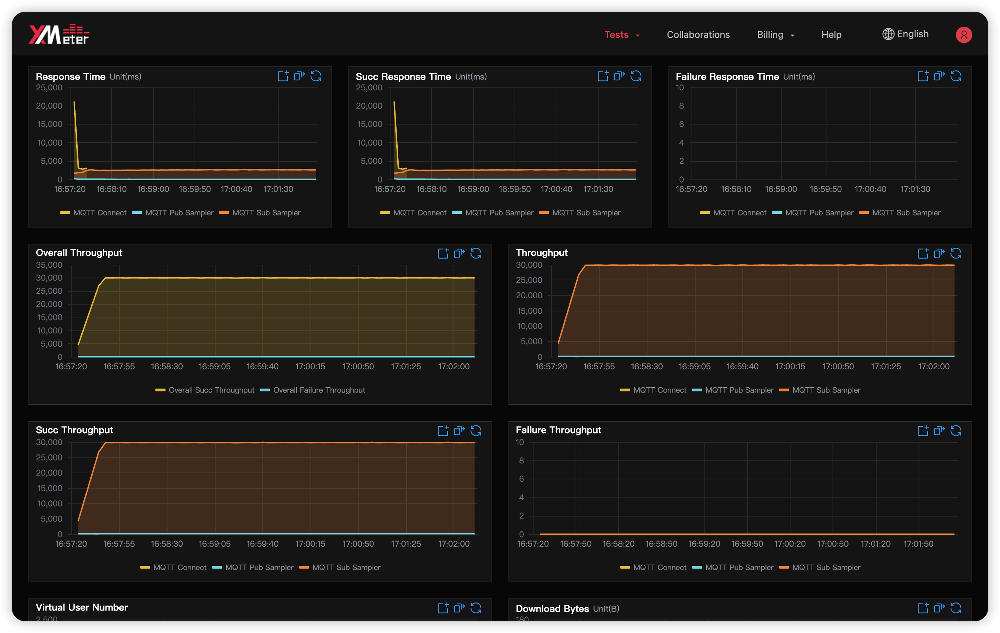

# Performance Test with XMeter Cloud

XMeter Cloud is a large-scale public cloud testing service tailored for the IoT sector, developed by EMQ. Built on the open-source Apache JMeter project, it offers support for simulating millions of device connections and conducting message throughput tests at scale.

This page introduces how to use XMeter Cloud to conduct performance tests on EMQX, enabling you to gather more comprehensive performance data, including the average and P99 end-to-end message latency.

## Testing Tools

You will need the following software or tools.

- [EMQX](https://emqx.io/): A highly scalable MQTT Broker, designed specifically for IoT and real-time communication applications.
- [XMeter Cloud](https://www.emqx.com/en/products/xmeter): A fully managed MQTT load testing cloud service, built on the Apache open source project JMeter, which can quickly run various MQTT load and scenario tests.
- [collectd](https://github.com/collectd/collectd): A daemon running on the system that collects information such as CPU, memory, disk usage, and network traffic, and send these collected data to the designated storage.
- [InfluxDB](https://www.influxdata.com/): An open-source time-series database for storing and analyzing time-series data.
- [Grafana](https://grafana.com/grafana/): An open-source data visualization and monitoring tool that converts data from a variety of data sources into aesthetically pleasing charts, graphs, and warnings.

## Set up Test Environment

Before the performance test, you need to establish a suitable test environment. You need two servers: one to run EMQX and collectd, and another for InfluxDB and Grafana. The hardware specifications of the EMQX server should be adjusted based on the anticipated test scale, while the latter typically utilizes a 4-core machine. The EMQX server must have a public IP address to enable XMeter Cloud access for testing. Using a public cloud server is often a practical choice.

To minimize network latency's impact on the performance test results, consider creating a peering connection between EMQX and XMeter. As of now, XMeter Cloud supports peering with the HUAWEI Cloud Platform. You can contact XMeter Cloud's technical team for assistance in setting up this connection.



The collectd is responsible for collecting system metrics such as CPU usage of the EMQX server. It then transmits these metrics to InfluxDB, deployed on the other server, which serves as the data storage component. Finally, Grafana utilizes InfluxDB as a data source to visualize these metrics as charts.

## Install and Configure Software

When the test environment is set up, you need to install and configure the software and tools on both cloud servers. Once the software and tools are properly set up, you can initiate the MQTT performance test from XMeter Cloud.

Throughout this process, you will require specific files, including template files for Grafana Dashboards and test scripts used in XMeter Cloud. These files can be found in the mqtt-test-kit directory under [bootcamp](https://github.com/emqx/bootcamp).

### Install and Configure EMQX

1. Download and install EMQX on Server 1:

```
wget https://www.emqx.com/en/downloads/broker/5.3.0/emqx-5.3.0-el7-amd64.rpm
sudo yum install emqx-5.3.0-el7-amd64.rpm -y
```

2. Run the following command to start EMQX:

```
sudo systemctl start emqx
```

> The actual command may vary depending on the OS version and installation method. Please refer to the commands provided on the [download](https://www.emqx.io/downloads) page.

### Install and Configure collectd

1. Install collectd on Server 1:

```
yum install collectd -y
```

You need to use specific collectd plugins, such as CPU, Load, Interface, and Memory, to collect system metrics covering CPU usage, CPU load, network traffic, and memory usage. These plugins are enabled by default, and you can find their configuration in the `/etc/collectd.conf`:

```
LoadPlugin cpu
...
LoadPlugin interface
...
LoadPlugin load
...
LoadPlugin memory
```

The CPU plugin in collectd reports CPU usage per core by default and utilizes CPU Jiffies. To modify it to report the average percentage of all cores directly, add the following configuration to the configuration file:

```
<Plugin cpu>
  ReportByCpu false
  ReportByState true
  ValuesPercentage true
</Plugin>
```

2. Enable and configure the collectd Network plugin that allows collectd to transmit the collected performance metrics to the InfluxDB on Server 2. Add the following configuration to `/etc/collectd.conf`  and replace `{Host}` with the actual LAN IP of Server 2, since the performance metrics must be sent to the specified host and port:

```
LoadPlugin network
<Plugin network>
  Server "{Host}" "25826"
</Plugin>
```

3. After completing the above configuration, run the following command to start collectd:

```
systemctl start collectd
```

### Install and Configure InfluxDB

::: tip

Do not install InfluxDB 2.7 or later versions. These versions no longer directly support backup write protocols such as collected and Prometheus. You must use Telegraf to convert these protocols into Line Protocol before writing them into InfluxDB. So for simplicity, directly install InfluxDB 1.8 that supports the collectd write protocol.

:::

1. Install InfluxDB 1.8 on Server 2:

```
wget https://dl.influxdata.com/influxdb/releases/influxdb-1.8.10.x86_64.rpm
sudo yum localinstall influxdb-1.8.10.x86_64.rpm -y
```

2. Modify InfluxDB' configuration so that it can receive performance metrics sent by collectd and store them in the database. Open the InfluxDB configuration file `/etc/influxdb/influxdb.conf`, and change the configuration items in the collectd section to the following content:

```
[[collectd]]
  enabled = true
  bind-address = ":25826"
  database = "collectd"
  batch-size = 5000
  batch-pending = 10
  batch-timeout = "10s"
  read-buffer = 0
  typesdb = "/usr/share/collectd/types.db"
  security-level = "none"
  parse-multivalue-plugin = "split"
```

The above configuration means that InfluxDB will listen to the collectd data on port 25826 and write it into a database named `collectd`, which is automatically created by InfluxDB.

`typesdb` is required, it points to a `types.db` file that defines the collectd data source specification, which InfluxDB needs to understand the collectd data. You can get this file by installing collectd on your machine. `/usr/share/collectd/types.db` is the default path to the `types.db` file when you install collectd by yum, or you can get `types.db` from [here](https://github.com/emqx/bootcamp/blob/main/mqtt-test-kit/types.db).

Setting `security-level` to `none` means that collectd data will not be signed and encrypted, which is consistent with the collectd configuration.

Setting `parse-multivalue-plugin` to `split` means that InfluxDB will store data with multiple values as multiple data points.

3. Start InfluxDB:

```
sudo systemctl start influxdb
```

You can verify whether the collectd data has been correctly written into InfluxDB with the following command:


```
$ influx
Connected to http://localhost:8086 version 1.8.10
InfluxDB shell version: 1.8.10
> use collectd
Using database collectd
> select * from cpu_value limit 8
name: cpu_value
time                host     type    type_instance value
----                ----     ----    ------------- -----
1692954741571911752 ecs-afc3 percent user          0.049981257028614265
1692954741571917449 ecs-afc3 percent system        0.024990628514307132
1692954741571923666 ecs-afc3 percent wait          0.024990628514307132
1692954741571932372 ecs-afc3 percent nice          0
1692954741571943586 ecs-afc3 percent interrupt     0
1692954741571947059 ecs-afc3 percent softirq       0
1692954741571947389 ecs-afc3 percent steal         0
1692954741571949536 ecs-afc3 percent idle          99.90003748594276
```

### Install and Configure Grafana

#### Install and Start Grafana

1. Install Grafana on Server 2:

```
sudo yum install -y https://dl.grafana.com/oss/release/grafana-10.0.0-1.x86_64.rpm
```

2. Start Grafana:

```
systemctl start grafana-server
```

#### Import a Dashboard into Grafana

You need to import a Dashboard into Grafana to provide 4 monitoring panels for CPU usage, CPU load, memory usage, and network traffic. Click [here](https://github.com/emqx/bootcamp/blob/main/mqtt-test-kit/Grafana-Dashboard.json) to download the Dashboard template file.

1. Make modifications to `Grafana-Dashboard.json` before importing the Dashboard, because each query in the Dashboard has an added host field to distinguish when there are multiple host data sources.

   Search for `host::tag` in `Grafana-Dashboard.json`, and you will find the following content:

   ```
   ...
   {
     "condition": "AND",
     "key": "host::tag",
     "operator": "=",
     "value": "ecs-afc3"
   }
   ...
   ```

   Globally replace the host name `ecs-afc3` with your own host name. You can run the following command to view the hostname:

   ```
   cat /proc/sys/kernel/hostname
   ```

2. Open a browser and type `<http://<hostname>>:3000` in the address bar to access Grafana. Replace `<hostname>` with the actual server address.

   ::: tip

   The default username and password for Grafana is admin. Grafana will ask you to change the default password when you log in for the first time.

   :::

3. Add InfluxDB as the data source by clicking **Add your first data source** on the home page:



4. Find the InfluxDB data source, click to add this data source, and go to the configuration page:



5. Here you only need to pay attention to three configuration items:

   - **URL**: InfluxDB's HTTP service listens on port 8086 by default, and InfluxDB and Grafana are on the same server. You can configure it as `http://localhost:8086`.
   - **Database**: The database from which Grafana will read collectd data, so please configure it as `collected`.
   - **HTTP Method**: Specifies the HTTP method that Grafana will use to query InfluxDB for data. You can configure it as `GET`.

   Click the **Save & test** button when you're done, and if the configuration is correct, you'll see a prompt **datasource is working. 7 measurements found**:



6. Click the plus sign in the upper right corner and select **Import dashboard**:



7. Import the modified `Grafana-Dashboard.json` file and select the InfluxDB data source you just added:



8. Click the **Import** button to complete the import, and you will see the following four monitoring charts, which show the current server CPU usage, memory usage, network send/receive traffic, and CPU load changes, respectively:



## System Tuning

Depending on the actual scale of the test, you may also need to adjust Linux kernel parameters and EMQX parameters. For example, when the number of MQTT client connections exceeds 65535, you might need to adjust parameters such as `fs.file-max` to increase the maximum number of file handles that EMQX can open. And when the message throughput is large, you might also need to adjust the size settings of the send and receive buffers for better performance. You can refer to the [Performance Tuning](./tune.md) documentation, this section will not be expanded further.

## Create Tests in XMeter Cloud

After registering and logging in to [XMeter Cloud](https://www.emqx.com/en/products/xmeter), go to the home page, and you will see the **Standard** and the **Professional** available for selection. The specific differences between these two plans can be found in the [Product Plans](https://docs.emqx.com/en/xmeter-cloud/latest/price/plan.html) section of the XMeter Cloud documentation.

Taking the **Professional** as an example. After switching to the **Professional**, you will see two testing options: **MQTT Standard Scenario Test** and **Custom Scenario Test**.

In the **MQTT Standard Scenario Test**, XMeter Cloud has preset some standard scenarios, such as one-to-one, fan-out. You only need to simply configure parameters such as the number of publishing and subscribing clients, the message publishing rate to initiate the test.

In the **Custom Scenario Test**, You can implement tests for more complex scenarios, but you need to write JMeter test scripts yourself and upload them to XMeter Cloud. As a reference, you can download sample scripts [here](https://github.com/emqx/bootcamp/tree/main/mqtt-test-kit/scripts). The `Fan-In.jmx`, `Fan-Out.jmx`, `Symmetric.jmx`, `Symmetric-Bridge.jmx` correspond to fan-in, fan-out, symmetric, and bridge scenarios, respectively.

Each script provides custom variables for you to modify parameters such as QoS level, Payload size, message publishing rate. Taking the `Symmetric.jmx` script as an example, before submitting the test, you need to configure the following parameters:



- **Name**: By default, XMeter Cloud will concatenate the test scenario name with the current time as the test name. You can change it to any name you prefer, as long as it does not confuse you among multiple tests.
- **Duration**: Set the duration of this test.
- **Total VU Number**: Set the number of virtual users per thread group, which is the number of MQTT clients, the thread groups depend on the actual content of the script. The `Symmetric.jmx` script includes a thread group Pub for publishing messages and a thread group Sub for receiving messages. So if the number of virtual users for both Pub and Sub thread groups is set to 1000, then the total number is 2000.
- **Stress Region**: Set the VPC where the test machine will be created and the load will be initiated. This needs to be configured only when using peer connections.
- **Ramp-Up Period**: Set how much time it needs to reach the total number of virtual users when running the test script. If the **Total VU Number** is set to 2000 and the **Ramp-Up Period** is set to 20 seconds, then XMeter Cloud will initiate connections at a rate of 100 connections per second.
- **Loop Mode**: `loop forever` means that the duration of the test run will be completely determined by the **Duration**; `use the loop count in the scenario` means that the test may end earlier than the time specified by **Duration**, but it will not exceed **Duration** at the longest.
- **XMeter Runtime Variables**: The variables defined in our test script are listed here,  which allow us to fine-tune our test cases by modifying them, such as changing the QoS level of the message. The following are the custom variables provided by the Symmetric.jmx script:
  - **server**: The address of the MQTT server, which needs to be configured as the server's intranet address after creating the peer connection.
  - **host**: The listening port of the MQTT server.
  - **qos**: The QoS level used when the message is published. The maximum QoS for subscribers is fixed at 2, ensuring that QoS degradation does not occur.
  - **payload_size**: The Payload size of the message in bytes.
  - **target_throughput**: The target throughput, which refers to the total publishing rate of the messages. When you set the number of virtual users in the publisher thread group to 1000 and **target_throughput** to 10000, then each publisher will publish the message at 10 msgs/s.
  - **publisher_number**, etc.: In XMeter Cloud, these variables are overridden by the previous configurations, such as **Total VU Number** and **Ramp-Up Period**. So there is no need to care about them. They are only effective when you launch the test directly using JMeter.

After completing the above configurations, you can click **Next** to submit the test. During the running of the test, you can observe the real-time changes in throughput and response time in XMeter Cloud, and observe the CPU and other system resources usage of the server where EMQX is located in Grafana:


