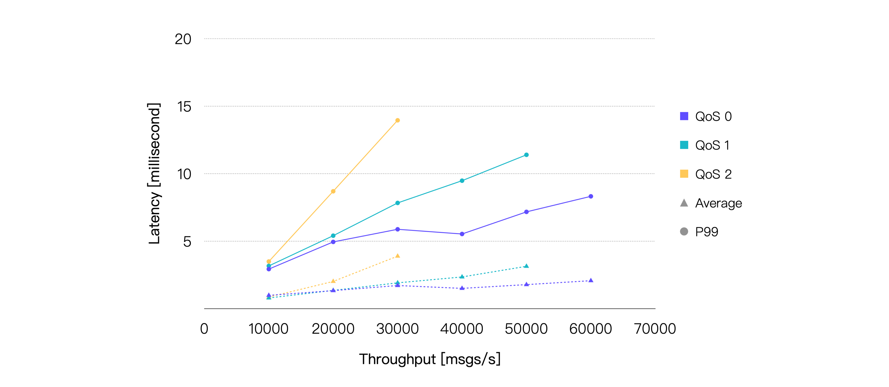
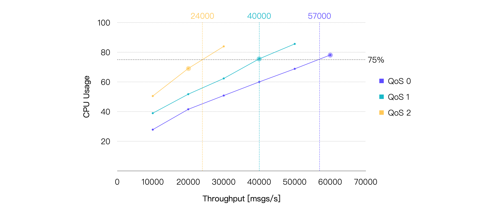
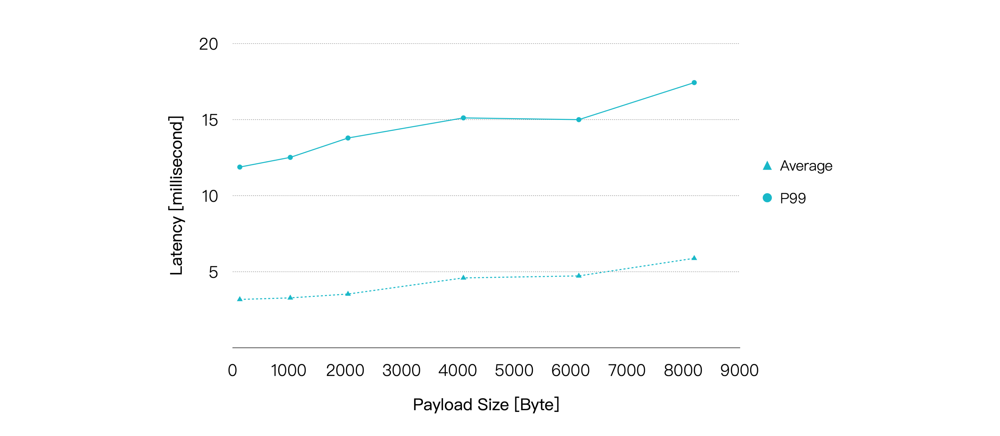
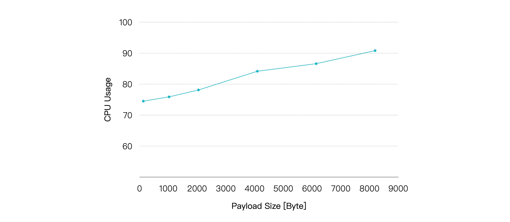
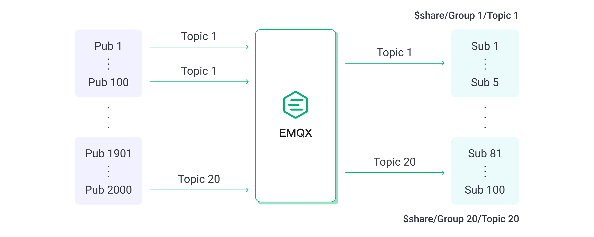
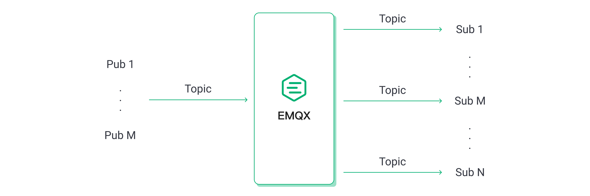
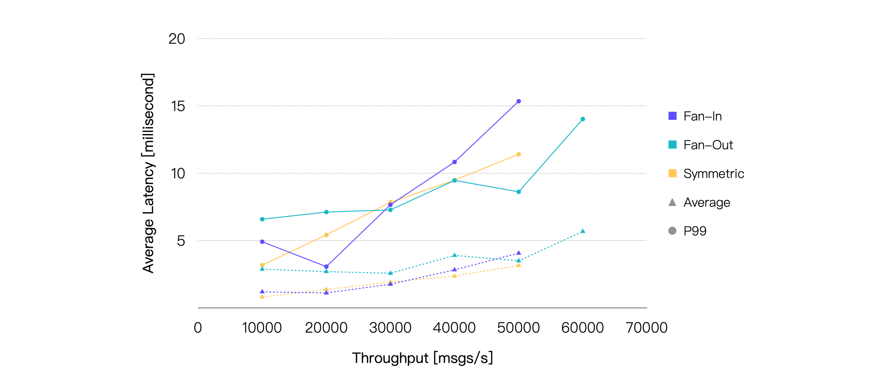
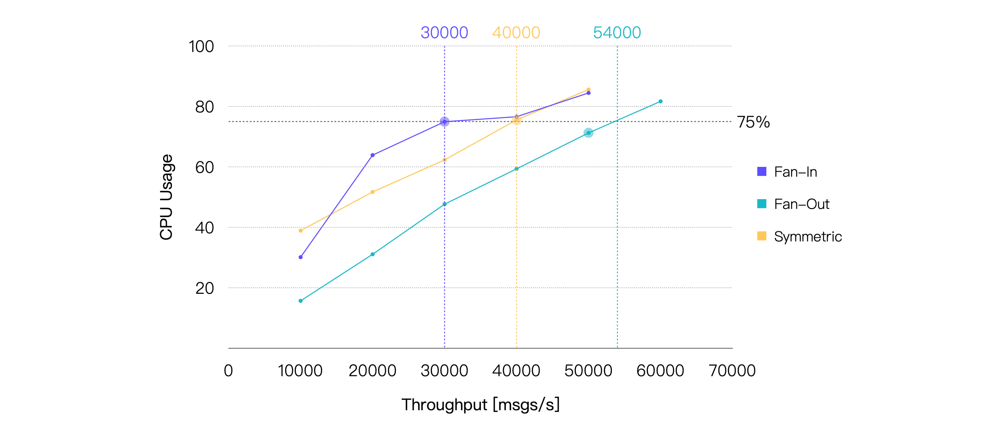
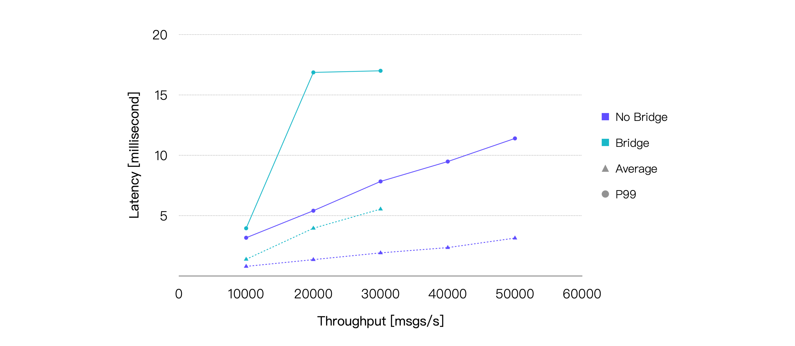
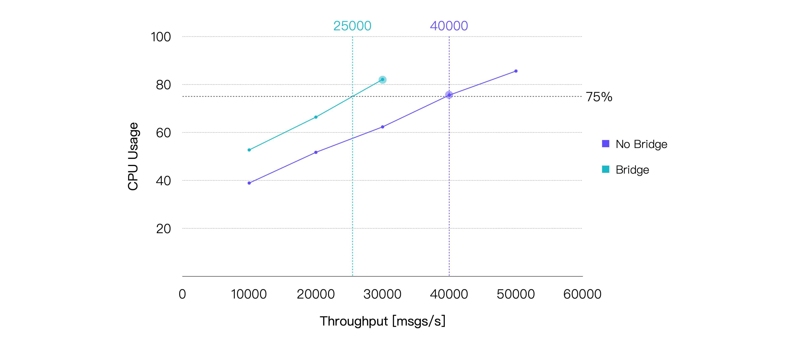

# EMQX Performance Reference

Following the test steps in [Performance Testing with XMeter Cloud](./benchmark-xmeter), we tested the performance change curve of EMQX in several typical scenarios. We can intuitively see the benchmark performance of EMQX in these scenarios, as well as the actual impact of factors such as QoS level and Payload size on MQTT performance.

## Test Environment

All tests in this section are based on the open-source edition of **EMQX v5.1.6** deployed on a single node. EMQX and XMeter Cloud have created a peering connection to eliminate the interference of external network latency. The specifications of the server running EMQX are as follows.

- **CPU**: 4vCPUs (Intel Xeon Platinum 8378A CPU @ 3.00GHz)
- **Memory**: 8 GiB
- **System Disk**: General Purpose SSD | 40 GiB
- **Maximum Bandwidth**: 8 Gbit/s
- **Maximum Packets Per Second**: 800,000 PPS
- **OS**: CentOS 7.9

Except for the fan-in scenario where XMeter Cloud used 20 test clients to send and receive messages, the number of test clients in other scenarios was 10.

## Test Scenarios and Results

### Scenario 1: Performance of EMQX with Different QoS

The higher the QoS level, the more complex the corresponding MQTT packet interaction process, so the system resources consumed to deliver the QoS message will be more. The performance overhead of different QoS is one of the hottest frequently asked questions.

In this scenario, 1,000 publishers and 1,000 subscribers used messages with a Payload size of 128 bytes for one-to-one communication. That is, there were a total of 1,000 topics, and each topic had one publisher and one subscriber.

We gradually increased the workload by increasing the message publishing rate, and EMQX ran for 5 minutes under each workload to ensure operational stability. We recorded the performance and resource consumption of EMQX under different QoS levels and different workloads, including but not limited to average message latency, P99 message latency, and average CPU usage.

The final test results are shown below:

> **Latency** is the time it takes for a message to be received from the time it is published. **Throughput** consists of message inbound throughput and outbound throughput.

As we can see, the higher the QoS level, the higher the average CPU usage under the same workload. So, under the same system resources, a higher QoS usually means relatively lower throughput.

If we take the workload at an average CPU usage rate of around 75% as the recommended daily load, then we can conclude: under the test hardware specifications and testing scenarios, the recommended load for QoS 0 is approximately 57K TPS, for QoS 1 is approximately 40K TPS, and for QoS 2 is approximately 24K TPS. Here are the performance data for the test points that are closest to 75% CPU usage:

| **QoS Level** | **Recommended Workload, TPS (In + Out)** | **Average CPU Usage, % (1 - Idle)** | **Average Memory Usage, %** | **Average Letancy, ms** | **P99 Letancy, ms** |
| :------------ | :------------------------------ | :---------------------------------- | :-------------------------- | :---------------------- | :------------------ |
| QoS 0         | 60K                             | 78.13                               | 6.27                        | 2.079                   | 8.327               |
| QoS 1         | 40K                             | 75.56                               | 6.82                        | 2.356                   | 9.485               |
| QoS 2         | 20K                             | 69.06                               | 6.39                        | 2.025                   | 8.702               |

### Scenario 2: Performance of EMQX with Different Payload Sizes

The larger the message payload, the more soft interruptions the OS needs to receive and send network packets, and the more computational resources EMQX needs to spend on serializing and deserializing packets. 

In most cases, the MQTT messages we send will not exceed 1KB. But in some scenarios, it is necessary to transmit larger messages. Thus we tested the performance impact of different Payload sizes.

Continue with one-to-one communication between 1,000 publishers and 1,000 subscribers. This time we set the QoS of the message to 1 and kept the publishing rate fixed at 20K msg/s. By increasing the Payload size to increase the test workload. EMQX ran for 5 minutes under each load to verify stability. We recorded the performance and resource usage of EMQX under each load. 

The results are shown below:

As the Payload increases, the CPU usage rate gradually rises, and the end-to-end latency of the messages also shows a relatively smooth increase. However, when the Payload size reaches 8KB, we can still obtain an average latency of less than 10 milliseconds and a P99 latency of less than 20 milliseconds.

| **Payload Size, KB** | **Recommended Workload, TPS (In + Out)** | **Average CPU Usage, % (1 - Idle)** | **Average Memory Usage, %** | **Average Letancy, ms** | **P99 Letancy, ms** |
| :------------------- | :---------------- | :---------------------------------- | :-------------------------- | :---------------------- | :------------------ |
| 1                    | 40K               | 75.9                                | 6.23                        | 3.282                   | 12.519              |
| 8                    | 40K               | 90.82                               | 9.38                        | 5.884                   | 17.435              |

So, in addition to the QoS level, we also need to pay attention to the Payload size. If the actual Payload size in your case is much larger than the value used here, this means that you would need the hardware with a higher configuration.

### Scenario 3: Performance of EMQX with Different Publish-Subscribe Models

MQTT's publish-subscribe mechanism allows us to easily adjust the publish and subscribe model to meet the business requirements, such as the fan-in model in which a large number of sensor devices act as publishers and a small number of back-end applications or even a single back-end application acts as a subscriber to store and analyze the sensor data, or fan-out scenarios in which there are a small number of publishers and a large number of subscribers for message broadcasting, or symmetric scenarios in which publishers and subscribers need to communicate one-to-one.

However, the performance of the MQTT Broker in different publish-subscribe scenarios is often slightly different, as we will see in the following tests.

In the fan-in scenario, we set up 2,000 publishers and 100 subscribers, and every 100 publisher’s messages are consumed by 5 subscribers in a shared subscription.

In the fan-out scenario, we set up 10 publishers and 2,000 subscribers, with each publisher's messages being consumed by 200 subscribers in a normal subscription. The symmetric scenario remains the same as before.

Since the inbound messages in the fan-out scenario are less than the other two scenarios, we set the total throughput to be the same or close to the same load and then compare them. For example, the fan-out scenario with 100 msg/s inbound and 20K msg/s outbound is equivalent to the symmetric scenario with 10K msgs/s inbound and 10K msgs/s outbound.

Keeping the QoS level of the message at 1 and the Payload size at 128 bytes, the final test results are as follows:

If we only consider message latency, the performance of the three scenarios is actually very close. And under the same load, the fan-out scenario always consumes less CPU. So if we take 75% CPU usage as the boundary, we can see quite intuitively that compared to the other two scenarios, fan-out can achieve a higher throughput.

| **Scene** | **Recommended Workload, TPS (In + Out)** | **Average CPU Usage, % (1 - Idle)** | **Average Memory Usage, %** | **Average Letancy, ms** | **P99 Letancy, ms** |
| :-------- | :------------------------------ | :---------------------------------- | :-------------------------- | :---------------------- | :------------------ |
| Fan-In    | 30K                             | 74.96                               | 6.71                        | 1.75                    | 7.651               |
| Fan-Out   | 50K                             | 71.25                               | 6.41                        | 3.493                   | 8.614               |
| Symmetric | 40K                             | 75.56                               | 6.82                        | 2.356                   | 9.485               |

### Scenario 4: Performance of EMQX with Bridging

MQTT bridging can bridge messages from one MQTT server to another, common use cases include bridging messages aggregated by edge gateways to servers in the cloud and letting messages flow between two MQTT clusters.

In this test scenario, messages published by 500 publishers connected to MQTT server 1 were bridged to MQTT server 2 and received by 500 subscribers connected to MQTT server 2. Meanwhile, messages published by another 500 publishers connected to MQTT server 2 were received by 500 subscribers connected to MQTT server 1.

This ensured that, with the same message publishing rate at the client, the inbound and outbound rate of messages in EMQX will be close to the symmetric scenario without bridging, so we can compare the performance differences between the two test cases.

Keeping the QoS level of the message as 1 and the Payload size as 128 bytes, the final test results are as follows:

Bridging introduces an additional relay in the process of message delivery, so the end-to-end latency of the message will increase. In addition, bridging also brings additional CPU consumption. Our test results have confirmed these two points. Taking the load when the average CPU usage is around 75%, which is about 25K TPS, as the recommended load for the bridging scenario under the hardware specifications of this test, the test results of the test point with the smallest difference in CPU usage are as follows:

| **Recommended Workload, TPS (In + Out)** | **Average CPU Usage, % (1 - Idle)** | **Average Memory Usage, %** | **Average Letancy, ms** | **P99 Letancy, ms** |
| :------------------------- | :---------------------------------- | :-------------------------- | :---------------------- | :------------------ |
| 30K                        | 82.09                               | 5.6                         | 5.547                   | 17.004              |
